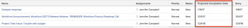

# Overview of the Projected Completion Date for projects, tasks, and issues

The Projected Completion Date is a real-time, calculated indicator of when the project, task, or issue will be completed. When&nbsp;the project, task, or issue is marked as Completed, the Projected Completion Date changes to&nbsp;the date of the&nbsp;Actual Completion Date.

The following sections describe how the Projected Completion Date is determined for projects, tasks, and issues,&nbsp;and how to locate it.

## Access requirements

You must have the following access to perform the steps in this article:

<table cellspacing="0"> 
 <col> 
 <col> 
 <tbody> 
  <tr> 
   <td role="rowheader">Adobe Workfront plan*</td> 
   <td> 
Any
 </td> 
  </tr> 
  <tr> 
   <td role="rowheader">Adobe Workfront license*</td> 
   <td> 
Review or higher
 
You must have a Plan license to create reports
 </td> 
  </tr> 
  <tr> 
   <td role="rowheader">Access level configurations*</td> 
   <td> 
View or higher access to&nbsp;Projects
 
You must have Edit access to&nbsp;Reports, Dashboards,&nbsp;Calendars to create a report
 
You must have Edit access to Filters, Views, Groupings to create a report or modify a list view
 
Note: If you still don't have access, ask your Workfront administrator if they set additional restrictions in your access level. For information on how a Workfront administrator can modify your access level, see <a href="../../../administration-and-setup/add-users/configure-and-grant-access/create-modify-access-levels.md" class="MCXref xref">Create or modify custom access levels</a>.
 </td> 
  </tr> 
  <tr> 
   <td role="rowheader">Object permissions</td> 
   <td> 
View or higher permissions to a project
 
For information on requesting additional access, see <a href="../../../workfront-basics/grant-and-request-access-to-objects/request-access.md" class="MCXref xref">Request access to objects in Adobe Workfront</a>.
 </td> 
  </tr> 
 </tbody> 
</table>

&#42;To find out what plan, license type, or access you have, contact your Workfront administrator.

## How Adobe Workfront determines the Projected Completion Date

The Projected Completion Date is a calculated field, and cannot be manually changed.

The criteria used to determine&nbsp;the Projected Completion Date differs, depending on the object you are viewing:

<ul> 
 <li>Projects: The Projected Completion Date for projects equates with the Projected Completion Date of the latest task on the project.</li> 
 <li>Tasks:&nbsp;The Projected Completion Date for tasks is determined based on the following criteria: 
  <ul>
   <li>Progress updates made on the task by the task assignee:&nbsp;Progress updates include changes to percent complete and changes of task status.</li>
   <li>
Commit Date: If the task assignee specifies a Commit Date, the Projected Completion Date changes to match the Commit Date.

For more information about Commit Dates, see&nbsp;the article <a href="../../../manage-work/projects/updating-work-in-a-project/overview-of-commit-dates.md" class="MCXref xref">Commit Date overview</a>.
</li>
   <li>
Predecessors: If there are no delays on the predecessor tasks, the Projected Completion Date should match the&nbsp;Planned Completion Date. As delays occur, dependent tasks show a Projected Completion Date greater than the Planned Completion Date.

For more information about the Planned Completion Date of tasks, see <a href="../../../manage-work/tasks/task-information/task-planned-completion-date.md" class="MCXref xref">Overview of the task Planned Completion Date</a>.
</li>
  </ul><note type="important">
   
When the predecessor of a task has an Actual Completion Date, the dependent tasks receive a Projected Completion Date as described in the following scenario: 

   
If the project has Task A, Task B, and Task C, and Task B is the successor of Task A, Task C is the successor of Task B and an Actual Completion Date is added to Task A, the Projected Completion Date is automatically recalculated for Task B (provided the Update Type of the project is set to Automatic and On Change), but it will not be recalculated for Task C. Currently, Workfront calculates the Projected Completion Date for tasks that are one level up or down from the updated Task, for performance reasons.&nbsp;

  </note></li> 
</ul>

* `Issues:`The issue Projected Completion Date is initially set to match the issue Planned Completion Date.

  If the issue&nbsp;assignee specifies a commit date, both the Projected Completion Date and the Planned Completion Date change to match the Commit Date.

  For more information about Commit Dates, see&nbsp;the article [Commit Date overview](../../../manage-work/projects/updating-work-in-a-project/overview-of-commit-dates.md).

## View the Projected Completion Date

You can view the Projected Completion Date of projects, tasks, and issues in reports. You can view the Projected Completion Date of projects and tasks in other areas of Workfront.&nbsp;

* [View the Projected Completion Date of a project](#viewing-the-projected-completion-date-of-a-project) 
* [View the Projected Completion Date of a task](#viewing-the-projected-completion-date-of-a-task) 
* [View the Projected Completion Date of an issue](#viewing-the-projected-completion-date-of-an-issue)

### View the Projected Completion Date of a&nbsp;project

1. Go to the project where you want to view the Projected Completion Date.
1. Click Project Details in the left panel. 
1. Locate the Projected Completion Date field in the Overview section.

### View the Projected Completion Date of a&nbsp;task

1. Go to the task where you want to view the Projected Completion Date.
1. Click Task Details in the left panel. 
1. Locate the Projected Completion Date field in the Overview section.

### View the Projected Completion Date of an&nbsp;issue

You can view the Projected Completion Date for issues only in an issue report or list view.&nbsp;Creating a list view is similar to creating the view in a report.

To create an issue report that includes the Projected Completion Date:

<ol> 
 <li value="1">Create an issue report, as described in the article <a href="../../../reports-and-dashboards/reports/creating-and-managing-reports/create-custom-report.md" class="MCXref xref">Create a custom report</a>.</li> 
 <li value="2">Select the Columns (View) tab.</li> 
 <li value="3">Click Add Column, and start typing Projected Completion Date in the Show in this column: field.</li> 
 <li value="4"> 
Select it when it appears in the list, under the Issue object.&nbsp;
 </li> 
 <li value="5"> 
Click Save + Close.
 
The Projected Completion Date&nbsp;column in the report is populated.&nbsp;
 
  
 </li> 
</ol>

