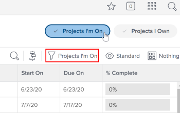

# Project Team overview {#project-team-overview}

A project team is a group of users associated with a project. Users listed under the `<MadCap:conditionalText data-mc-conditions="QuicksilverOrClassic.Quicksilver"> People area </MadCap:conditionalText>`of a project are the users who make up the project team. 

## Project Team members {#project-team-members}

You can assign users to a project team either manually or automatically. For more information see the section "Add users to a Project Team" in the article [Manage the Project Team](manage-project-team.md). 

## Notifications to Project Team members {#notifications-to-project-team-members}

Depending on what email notifications your *`Adobe Workfront administrator`* enables, users on a project team are notified of various actions on a project. For more information about enabling email notifications, see [Configure event notifications for everyone in the system](configure-event-notifications-for-everyone-in-the-system.md). 

>[!NOTE]
>
>Ensure you keep the project team membership updated in order to avoid sending notifications to users who do not need information about a project.

## Role-based approvals {#role-based-approvals}

To use role-based approvals on a project, users must be assigned to the project team and have the correct job role assigned in their user profile.

See the following articles for information on how to set a user up for role-based approvals: 

* [Manage the Project Team](manage-project-team.md) 
* [Edit a user's profile](edit-a-users-profile.md) 

If you don't want to require the user to be on the project team for role-based approvals, you can control this in approval settings. For more information, see [Configure global approval settings](establish-approval-settings.md).

## Projects I'm On filter {#projects-im-on-filter}

If a user is listed on the `<MadCap:conditionalText data-mc-conditions="QuicksilverOrClassic.Quicksilver"> People area</MadCap:conditionalText>` of a project, that project appears `<MadCap:conditionalText data-mc-conditions="QuicksilverOrClassic.Quicksilver"> in a list of projects when you apply the Projects I'm On filter in the Projects area</MadCap:conditionalText>`.

You can see if the Projects I'm On filter is selected in the Projects area header. You can apply it from the Filters panel or from the header.

>[!NOTE]
>
>If you are the creator of a project, the project remains `<MadCap:conditionalText data-mc-conditions="QuicksilverOrClassic.Quicksilver"> listed in the Projects I'm On list</MadCap:conditionalText>`, even if your name does not appear on the `<MadCap:conditionalText data-mc-conditions="QuicksilverOrClassic.Quicksilver"> People area</MadCap:conditionalText>` of the project or if your name has been removed from that `<MadCap:conditionalText data-mc-conditions="QuicksilverOrClassic.Quicksilver"> list</MadCap:conditionalText>`.

