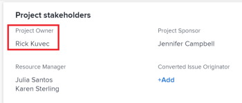

# Update project owners and sponsors {#update-project-owners-and-sponsors}

When you create a project in *`Adobe Workfront`*, you are automatically set as the Project&nbsp;Owner of the project. You can update this field with another user. You can also update the Project Sponsor field of a project. 

For information about projects owners and sponsors, see [Overview of project owners and sponsors](project-owners-and-sponsors.md). 

>[!TIP] {type="tip"}
>
>You can identify an owner and a sponsor for a template. When you create a project from that template, the Template Owner becomes the Project Owner and the Template Sponsor becomes the Project Sponsor.&nbsp;For information about editing templates, see [Edit project templates](edit-templates.md).

## Access requirements {#access-requirements}

You must have the following access to perform the steps in this article:

<table style="width: 100%;margin-left: 0;margin-right: auto;mc-table-style: url('../../../Resources/TableStyles/TableStyle-List-options-in-steps.css');" class="TableStyle-TableStyle-List-options-in-steps" cellspacing="0"> 
 <col class="TableStyle-TableStyle-List-options-in-steps-Column-Column1"> 
 <col class="TableStyle-TableStyle-List-options-in-steps-Column-Column2"> 
 <tbody> 
  <tr class="TableStyle-TableStyle-List-options-in-steps-Body-LightGray"> 
   <td class="TableStyle-TableStyle-List-options-in-steps-BodyE-Column1-LightGray" role="rowheader">Adobe Workfront plan*</td> 
   <td class="TableStyle-TableStyle-List-options-in-steps-BodyD-Column2-LightGray"> 
Any
 
&nbsp;
 </td> 
  </tr> 
  <tr class="TableStyle-TableStyle-List-options-in-steps-Body-MediumGray"> 
   <td class="TableStyle-TableStyle-List-options-in-steps-BodyE-Column1-MediumGray" role="rowheader">Adobe Workfront license*</td> 
   <td class="TableStyle-TableStyle-List-options-in-steps-BodyD-Column2-MediumGray"> 
Plan 
 </td> 
  </tr> 
  <tr class="TableStyle-TableStyle-List-options-in-steps-Body-LightGray"> 
   <td class="TableStyle-TableStyle-List-options-in-steps-BodyE-Column1-LightGray" role="rowheader">Access level configurations*</td> 
   <td class="TableStyle-TableStyle-List-options-in-steps-BodyD-Column2-LightGray"> 
Edit access to Projects
 
Note: If you still don't have access, ask your Workfront administrator if they set additional restrictions in your access level. For information on how a Workfront administrator can modify your access level, see <a href="create-modify-access-levels.md" class="MCXref xref">Create or modify custom access levels</a>.
 </td> 
  </tr> 
  <tr class="TableStyle-TableStyle-List-options-in-steps-Body-MediumGray"> 
   <td class="TableStyle-TableStyle-List-options-in-steps-BodyB-Column1-MediumGray" role="rowheader">Object permissions</td> 
   <td class="TableStyle-TableStyle-List-options-in-steps-BodyA-Column2-MediumGray"> 
Edit permissions to a project
 
For information on requesting additional access, see <a href="request-access.md" xmlns:MadCap="http://www.madcapsoftware.com/Schemas/MadCap.xsd" class="MCXref xref">Request access to objects in Adobe Workfront</a>.
 </td> 
  </tr> 
 </tbody> 
</table>

&#42;To find out what plan, license type, or access you have, contact your *`Workfront administrator`*.

## Update the Project Owner of a project {#update-the-project-owner-of-a-project}

1. Go to the project you want to update.
1.  `<MadCap:conditionalText xmlns:MadCap="http://www.madcapsoftware.com/Schemas/MadCap.xsd" data-mc-conditions="QuicksilverOrClassic.Quicksilver"> Click  Project&nbsp;Details in the left panel. </MadCap:conditionalText>`
1.  `<MadCap:conditionalText xmlns:MadCap="http://www.madcapsoftware.com/Schemas/MadCap.xsd" data-mc-conditions="QuicksilverOrClassic.Quicksilver"> Click&nbsp;the  Edit icon   in the upper-right corner of the Project&nbsp;Details area, then click&nbsp; Overview. </MadCap:conditionalText>` 
1.  Specify the name of a user for the `Project Owner` field.

   Only active users can be specified as Project Owners.

1.  `<MadCap:conditionalText xmlns:MadCap="http://www.madcapsoftware.com/Schemas/MadCap.xsd" data-mc-conditions="QuicksilverOrClassic.Quicksilver"> Click&nbsp; Save Changes. </MadCap:conditionalText>`

## Update the Project Sponsor of a project  {#update-the-project-sponsor-of-a-project}

1. Go to the Project you want to update.
1.  `<MadCap:conditionalText xmlns:MadCap="http://www.madcapsoftware.com/Schemas/MadCap.xsd" data-mc-conditions="QuicksilverOrClassic.Quicksilver"> Click  Project&nbsp;Details in the left panel. </MadCap:conditionalText>`
1.  `<MadCap:conditionalText xmlns:MadCap="http://www.madcapsoftware.com/Schemas/MadCap.xsd" data-mc-conditions="QuicksilverOrClassic.Quicksilver"> Click&nbsp;the  Edit icon   in the upper-right corner of the Project&nbsp;Details area, then click&nbsp; Overview. </MadCap:conditionalText>` 
1.  Specify the name of a user for the `Project Sponsor` field.

   Only active users can be specified as Project Sponsors.

1.   `<MadCap:conditionalText xmlns:MadCap="http://www.madcapsoftware.com/Schemas/MadCap.xsd" data-mc-conditions="QuicksilverOrClassic.Quicksilver"> Click&nbsp; Save Changes. </MadCap:conditionalText>`

   

