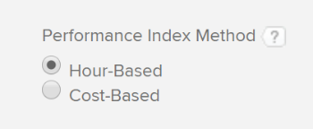
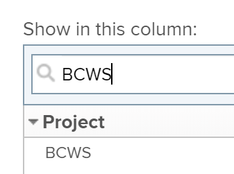

# Calculate Budgeted Cost of Work Scheduled (BCWS)

## Overview of Budgeted Cost of Work Scheduled (BCWS)

Also known as the Planned Value, the Budgeted Cost of Work Scheduled (BCWS) is a project performance metric that represents the amount of the task that should have completed at the time when this metric is calculated.

Adobe Workfront calculates the Budgeted Cost of Work Scheduled (BCWS) for both projects and tasks.

Consider the following when reviewing the values for the BCWS on a task or project:

* Workfront calculates the BCWS for a task based on your configuration for the Performance Index Method (PIM) of the project.

  You can configure your project to calculate the PIM using hours or cost and the BCWS is also calculated using the same values.

  For information about configuring how the BCWS is calculated, see the section [Configure how BCWS is calculated](#configur) in this article.

* Workfront calculates the BCWS for a project by adding all the BCWS values from all the parent tasks and individual tasks on the project.

  The values from children tasks are not added to the BCWS of the project.

## Access requirements

You must have the following access to perform the steps in this article:

<table cellspacing="0"> 
 <col> 
 <col> 
 <tbody> 
  <tr> 
   <td role="rowheader">Adobe Workfront plan*</td> 
   <td> <p>Any</p> </td> 
  </tr> 
  <tr> 
   <td role="rowheader">Adobe Workfront license*</td> 
   <td> <p>Plan </p> </td> 
  </tr> 
  <tr> 
   <td role="rowheader">Access level configurations*</td> 
   <td> <p>Edit access to Projects</p> <p>Note: If you still don't have access, ask your Workfront administrator if they set additional restrictions in your access level. For information on how a Workfront administrator can modify your access level, see <a href="../../../administration-and-setup/add-users/configure-and-grant-access/create-modify-access-levels.md" class="MCXref xref">Create or modify custom access levels</a>.</p> </td> 
  </tr> 
  <tr> 
   <td role="rowheader">Object permissions</td> 
   <td> <p>Manage permissions to the project</p> <p>For information on requesting additional access, see <a href="../../../workfront-basics/grant-and-request-access-to-objects/request-access.md" class="MCXref xref">Request access to objects in Adobe Workfront</a>.</p> </td> 
  </tr> 
 </tbody> 
</table>

&#42;To find out what plan, license type, or access you have, contact your Workfront administrator.

## Configure how BCWS is calculated

You can configure whether the BCWS is calculated in hours or costs by configuring how the Performance Index Method (PIM) of the project is calculated.

<ol> 
 <li value="1"> Go to a project and click Project Details in the left panel.</li> 
 <li value="2"> In the Finance area, locate the Performance Index Method field and double click it to edit it. <p>  </p> </li> 
 <li value="3"> <p>Select from the following options:</p> 
  <table cellspacing="0"> 
   <col> 
   <col> 
   <tbody> 
    <tr> 
     <td role="rowheader">Hour-Based</td> 
     <td>Workfront calculates the BCWS using the Planned Hours of the tasks.</td> 
    </tr> 
    <tr> 
     <td role="rowheader">Cost-Based</td> 
     <td>Workfront calculates the BCWS using the Planned Cost of the tasks.</td> 
    </tr> 
   </tbody> 
  </table> </li> 
 <li value="4"> Click Save Changes. <p>The BCWS of the tasks on the project is calculated using hours or costs.</p> </li> 
</ol>

## Calculate BCWS

Workfront calculates the Budgeted Cost of Work Scheduled (BCWS) for tasks or projects by using the following formulas:

* 

  ```
  Task BCWS = Planned Percent Complete x Task Budget
  ```

* 

  ```
  Project BCWS = SUM(BCWS values of all parent and individual tasks)
  ```

The following values are used in this calculation:

| Planned Percent Complete |This is what the percent complete of the task should be by looking at the amount of time passed between the beginning of the task and today. |
|---|---|
| Task Budget |This is the value for the Planned Hours or Planned Cost of the task. |

For example, if it is February 12 today, and a task is scheduled to last from February 10 to February 20, the task should be 20% complete today. If the Task Budget (Planned Cost) is $10,000, then the BCWS for the task is:

```
Task BCWS = 20% x $10,000 = $2,000
```

## Locate the BCWS for a project or a task

You can view the value of the Budgeted Cost of Work Scheduled in a report or list, by adding the BCWS column to your view.

<ol> 
 <li value="1">Go to a list of tasks or projects.</li> 
 <li value="2">Expand the <span class="bold">View</span> menu and select <span class="bold">New View</span> or <span class="bold">Customize View</span>.</li> 
 <li value="3">Click <span class="bold">Add Column</span>.</li> 
 <li value="4"> <p>In the <span class="bold">Show in this column:</span> field start typing <span class="bold">BCWS</span> and click to select it when it displays in the list.</p> <p>  </p> </li> 
 <li value="5">Click <span class="bold">Save View</span>.</li> 
 <li value="6">The <span class="bold">BCWS</span> field displays in the view.</li> 
</ol>

