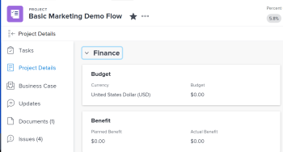
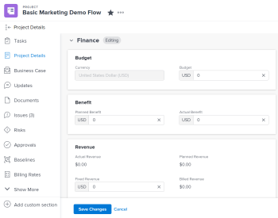

# Manage information in the project Finance area {#manage-information-in-the-project-finance-area}

You can view or edit the financial information of a project by accessing the Finance area of the Project Details `<MadCap:conditionalText data-mc-conditions="QuicksilverOrClassic.Quicksilver"> section</MadCap:conditionalText>`. There is a limited number of fields that you can view or edit in this area. For information about editing all information for a project see [Edit projects](edit-projects.md).

## Access requirements {#access-requirements}

You must have the following access to perform the steps in this article: 

<table style="width: 100%;margin-left: 0;margin-right: auto;mc-table-style: url('../../../Resources/TableStyles/TableStyle-List-options-in-steps.css');" class="TableStyle-TableStyle-List-options-in-steps" cellspacing="0"> 
 <col class="TableStyle-TableStyle-List-options-in-steps-Column-Column1"> 
 <col class="TableStyle-TableStyle-List-options-in-steps-Column-Column2"> 
 <tbody> 
  <tr class="TableStyle-TableStyle-List-options-in-steps-Body-LightGray"> 
   <td class="TableStyle-TableStyle-List-options-in-steps-BodyE-Column1-LightGray" role="rowheader">Adobe Workfront plan*</td> 
   <td class="TableStyle-TableStyle-List-options-in-steps-BodyD-Column2-LightGray"> 
Any
 </td> 
  </tr> 
  <tr class="TableStyle-TableStyle-List-options-in-steps-Body-MediumGray"> 
   <td class="TableStyle-TableStyle-List-options-in-steps-BodyE-Column1-MediumGray" role="rowheader">Adobe Workfront license*</td> 
   <td class="TableStyle-TableStyle-List-options-in-steps-BodyD-Column2-MediumGray"> 
Review or higher
 </td> 
  </tr> 
  <tr class="TableStyle-TableStyle-List-options-in-steps-Body-LightGray"> 
   <td class="TableStyle-TableStyle-List-options-in-steps-BodyE-Column1-LightGray" role="rowheader">Access level configurations*</td> 
   <td class="TableStyle-TableStyle-List-options-in-steps-BodyD-Column2-LightGray"> 
View or higher access to Projects and Financial Data
 
Edit access to Projects and&nbsp;Financial&nbsp;Data to edit financial information on the project
 
Note: If you still don't have access, ask your Workfront administrator if they set additional restrictions in your access level. For information on how a Workfront administrator can change your access level, see <a href="create-modify-access-levels.md" class="MCXref xref">Create or modify custom access levels</a>.
 </td> 
  </tr> 
  <tr class="TableStyle-TableStyle-List-options-in-steps-Body-MediumGray"> 
   <td class="TableStyle-TableStyle-List-options-in-steps-BodyB-Column1-MediumGray" role="rowheader">Object permissions</td> 
   <td class="TableStyle-TableStyle-List-options-in-steps-BodyA-Column2-MediumGray"> 
View permissions to a project or higher that include View Finance permissions
 
Manage permissions to the project that include Manage Finance to edit financial information for the project
 
For information on requesting additional access, see <a href="request-access.md" class="MCXref xref">Request access to objects in Adobe Workfront</a>.
 </td> 
  </tr> 
 </tbody> 
</table>

&#42;To find out what plan, license type, or access you have, contact your *`Workfront administrator`*.

## Overview of the Finance area {#overview-of-the-finance-area}

Consider the following when viewing or editing information in the Finance `<MadCap:conditionalText data-mc-conditions="QuicksilverOrClassic.Quicksilver"> area</MadCap:conditionalText>`:

* The financial information you can find on the Finance `<MadCap:conditionalText data-mc-conditions="QuicksilverOrClassic.Quicksilver"> area of Project Details</MadCap:conditionalText>`represents values that roll up to the project level from tasks, as well as information entered directly on the project. Some financial information can be managed at the project as well as the task level. 
* You must have View permissions on the project as well as access to Financial Data from your access level in order to be able to view the Finance `<MadCap:conditionalText data-mc-conditions="QuicksilverOrClassic.Quicksilver"> area </MadCap:conditionalText>`on a project. 
* You must have Manage permissions on the project as well as access to Financial Data from your access level in order to be able to edit the information on the Finance `<MadCap:conditionalText data-mc-conditions="QuicksilverOrClassic.Quicksilver"> area </MadCap:conditionalText>`. However, we recommend that only the Project Owner should edit the information on this `<MadCap:conditionalText data-mc-conditions="QuicksilverOrClassic.Quicksilver"> area </MadCap:conditionalText>`.

## View Finance information on a project {#view-finance-information-on-a-project}

1. Go to a project.
1.  Click `Project Details` in the left panel.
1.  Click the `Edit` icon  in the upper-right corner of the Details section, ` then click  `Finance``. 

   

   >[!NOTE]
   >
   >Depending on how your *`Workfront administrator`* configured your Layout Template, the Overview section might not be listed first, in which case it is collapsed. For information, see [Customize the Details view using a layout template](customize-details-view-layout-template.md). 

1.  View the following fields in the Finance `<MadCap:conditionalText data-mc-conditions="QuicksilverOrClassic.Quicksilver"> area </MadCap:conditionalText>`of the project:

<table style="width: 100%;mc-table-style: url('../../../Resources/TableStyles/TableStyle-List-options-in-steps.css');" class="TableStyle-TableStyle-List-options-in-steps" cellspacing="0"> 
 <col class="TableStyle-TableStyle-List-options-in-steps-Column-Column1"> 
 <col class="TableStyle-TableStyle-List-options-in-steps-Column-Column2"> 
 <tbody> 
  <tr class="TableStyle-TableStyle-List-options-in-steps-Body-LightGray"> 
   <td class="TableStyle-TableStyle-List-options-in-steps-BodyE-Column1-LightGray" role="rowheader">Performance Index Method</td> 
   <td class="TableStyle-TableStyle-List-options-in-steps-BodyD-Column2-LightGray"> Controls the method Workfront uses to calculate Earned Value metrics. It can be hours-based, or cost-based.  For more information about the PIM, see the article <a href="set-pim.md" class="MCXref xref">Set the Performance Index Method (PIM)</a></td> 
  </tr> 
  <tr class="TableStyle-TableStyle-List-options-in-steps-Body-MediumGray"> 
   <td class="TableStyle-TableStyle-List-options-in-steps-BodyE-Column1-MediumGray" role="rowheader">CPI/SPI/CSI</td> 
   <td class="TableStyle-TableStyle-List-options-in-steps-BodyD-Column2-MediumGray"> 
These are project performance metrics that show how your project is performing, at a given time. Their values are calculated based on the Performance Index Method. For more information see the following articles: 
 
    <ul> 
     <li> 
<a href="calculate-cpi.md" class="MCXref xref">Calculate Cost Performance Index (CPI)</a> 
 </li> 
     <li> 
<a href="calculate-spi.md" class="MCXref xref">Calculate Schedule Performance Index (SPI) </a> 
 </li> 
     <li> 
<a href="calculate-csi.md" class="MCXref xref">Calculate Cost Schedule Performance Index (CSI)</a> 
 </li> 
    </ul> </td> 
  </tr> 
  <tr class="TableStyle-TableStyle-List-options-in-steps-Body-LightGray"> 
   <td class="TableStyle-TableStyle-List-options-in-steps-BodyE-Column1-LightGray" role="rowheader">Estimate at Completion</td> 
   <td class="TableStyle-TableStyle-List-options-in-steps-BodyD-Column2-LightGray"> Projected total cost of your project, represented in hours if the Performance Index Method (PIM) is hours-based, and it is represented in a currency value, if the Performance Index Method (PIM) is cost-based. For more information about calculating the Estimate at Completion, see the article <a href="calculate-eac.md" class="MCXref xref">Calculate Estimate At Completion (EAC)</a></td> 
  </tr> 
  <tr class="TableStyle-TableStyle-List-options-in-steps-Body-MediumGray"> 
   <td class="TableStyle-TableStyle-List-options-in-steps-BodyE-Column1-MediumGray" role="rowheader">Budget</td> 
   <td class="TableStyle-TableStyle-List-options-in-steps-BodyD-Column2-MediumGray">This is the budget set for the project. This is manually specified by the Project Owner.</td> 
  </tr> 
  <tr class="TableStyle-TableStyle-List-options-in-steps-Body-LightGray"> 
   <td class="TableStyle-TableStyle-List-options-in-steps-BodyE-Column1-LightGray" role="rowheader">Fixed Cost</td> 
   <td class="TableStyle-TableStyle-List-options-in-steps-BodyD-Column2-LightGray">These are the fixed costs on the project, independent of other activities on the project. They are manually entered by the Project Owner.</td> 
  </tr> 
  <tr class="TableStyle-TableStyle-List-options-in-steps-Body-MediumGray"> 
   <td class="TableStyle-TableStyle-List-options-in-steps-BodyE-Column1-MediumGray" role="rowheader">Planned Cost</td> 
   <td class="TableStyle-TableStyle-List-options-in-steps-BodyD-Column2-MediumGray">The estimated cost of the project, based on Planned Hours and the rates associated with the task assignees (job roles or users).</td> 
  </tr> 
  <tr class="TableStyle-TableStyle-List-options-in-steps-Body-LightGray"> 
   <td class="TableStyle-TableStyle-List-options-in-steps-BodyE-Column1-LightGray" role="rowheader">Actual Cost</td> 
   <td class="TableStyle-TableStyle-List-options-in-steps-BodyD-Column2-LightGray">All of the costs accruing on the project. Actual Cost is the sum of all actual costs: labor cost (based on Actual Hours and the rates associated with the job roles or users logging them), expenses, and fixed costs, which can be associated with a project or task.</td> 
  </tr> 
  <tr class="TableStyle-TableStyle-List-options-in-steps-Body-MediumGray"> 
   <td class="TableStyle-TableStyle-List-options-in-steps-BodyE-Column1-MediumGray" role="rowheader">Fixed Revenue</td> 
   <td class="TableStyle-TableStyle-List-options-in-steps-BodyD-Column2-MediumGray">Set income expected based on the project schedule. Fixed Revenue is manually specified by the Project Owner.</td> 
  </tr> 
  <tr class="TableStyle-TableStyle-List-options-in-steps-Body-LightGray"> 
   <td class="TableStyle-TableStyle-List-options-in-steps-BodyE-Column1-LightGray" role="rowheader">Planned Revenue</td> 
   <td class="TableStyle-TableStyle-List-options-in-steps-BodyD-Column2-LightGray">Projected income expected based on the Planned Hours and the rates associated with the task assignees (job roles or users).</td> 
  </tr> 
  <tr class="TableStyle-TableStyle-List-options-in-steps-Body-MediumGray"> 
   <td class="TableStyle-TableStyle-List-options-in-steps-BodyE-Column1-MediumGray" role="rowheader">Actual Revenue</td> 
   <td class="TableStyle-TableStyle-List-options-in-steps-BodyD-Column2-MediumGray">Actual income from the project based on the Actual Hours and the rates associated with the task assignees (job roles or users).</td> 
  </tr> 
  <tr class="TableStyle-TableStyle-List-options-in-steps-Body-LightGray"> 
   <td class="TableStyle-TableStyle-List-options-in-steps-BodyE-Column1-LightGray" role="rowheader">Billed Revenue</td> 
   <td class="TableStyle-TableStyle-List-options-in-steps-BodyD-Column2-LightGray"> 
Revenue billed to clients or other parties which is captured in Billing Records. For more information about billing records, see the article <a href="create-billing-records.md" class="MCXref xref">Create billing records</a>. 
 </td> 
  </tr> 
  <tr class="TableStyle-TableStyle-List-options-in-steps-Body-MediumGray"> 
   <td class="TableStyle-TableStyle-List-options-in-steps-BodyE-Column1-MediumGray" role="rowheader">&nbsp;</td> 
   <td class="TableStyle-TableStyle-List-options-in-steps-BodyD-Column2-MediumGray">&nbsp;</td> 
  </tr> 
  <tr class="TableStyle-TableStyle-List-options-in-steps-Body-LightGray"> 
   <td class="TableStyle-TableStyle-List-options-in-steps-BodyB-Column1-LightGray" role="rowheader">&nbsp;</td> 
   <td class="TableStyle-TableStyle-List-options-in-steps-BodyA-Column2-LightGray">&nbsp;</td> 
  </tr> 
 </tbody> 
</table>

## Edit financial information on a project  {#edit-financial-information-on-a-project}

As a Project Owner, you can edit the information on the Finance subtab of a project. 

To edit information on the Project Finance subtab: 

1.  Go to a project which you are the owner of.

   >[!NOTE]
   >
   >You need Manage permissions to the project to perform the following steps. We also recommend that only the Project Owner should make changes to the Finance subtab of the project. 

1.  Click `Project Details` in the left panel.
1.  Click the `Edit` icon  in the upper-right corner of the Details section, ` then click  `Finance``. This opens the Finance area for editing.
1.   Edit any field that is available for editing, by single-clicking the field or click `+Add` to add information to an empty field.

   >[!TIP] {type="tip"}
   >
   >Fields are not available for editing if they are automatically calculated by *`Workfront`* or if you don't have editing permissions on them.

   

1.  Update any of the fields below. 

   >[!NOTE]
   >
   >Depending on how your *`Workfront administrator`* sets up our Layout Template, the fields in the Project&nbsp;Details section might be different in your environment. For information, see [Customize the Details view using a layout template](customize-details-view-layout-template.md).

<table style="width: 100%;mc-table-style: url('../../../Resources/TableStyles/TableStyle-List-options-in-steps.css');" class="TableStyle-TableStyle-List-options-in-steps" cellspacing="0"> 
 <col class="TableStyle-TableStyle-List-options-in-steps-Column-Column1"> 
 <col class="TableStyle-TableStyle-List-options-in-steps-Column-Column2"> 
 <tbody> 
  <tr class="TableStyle-TableStyle-List-options-in-steps-Body-LightGray"> 
   <td class="TableStyle-TableStyle-List-options-in-steps-BodyE-Column1-LightGray" role="rowheader">Performance Index Method</td> 
   <td class="TableStyle-TableStyle-List-options-in-steps-BodyD-Column2-LightGray"> 
Controls the method Workfront uses to calculate project performance metrics. This is set up at the system level by your administrator, but you can also edit it at the project level. Consider selecting one of the following options:
 
    <ul> 
     <li>Hour-Based:Workfront uses the Planned Hours in calculating the CPI and EAC of the project, and the EAC of the project displays as a number, in hours. </li> 
     <li>Cost-Based:Workfront uses the Planned Labor Cost in calculating the CPI and EAC of the project, and the EAC displays as a currency value. When you select this option, ensure that your task assignees (job roles or users) are associated with cost rates.</li> 
    </ul> </td> 
  </tr> 
  <tr class="TableStyle-TableStyle-List-options-in-steps-Body-MediumGray"> 
   <td class="TableStyle-TableStyle-List-options-in-steps-BodyE-Column1-MediumGray" role="rowheader">Estimate at Completion</td> 
   <td class="TableStyle-TableStyle-List-options-in-steps-BodyD-Column2-MediumGray"> 
Represents the projected total cost of your project or task when it completes. This is set up at the system level by your administrator, but you can also edit it at the project level. Consider selecting one of the following options:
 
    <ul> 
     <li>Calculate at Project Level: EAC for the parent task and project are determined by entering the actual hours/ actual labor cost into the EAC Formulas. This calculation includes Actual Hours/ costs and expenses added directly to the parent task or project.</li> 
     <li>Roll up from Tasks/ Subtasks: EAC for the parent task and project are determined by summing up the EAC for each child task. This calculation excludes Actual Hours/ costs and expenses added directly to the parent task or project.</li> 
    </ul> </td> 
  </tr> 
  <tr class="TableStyle-TableStyle-List-options-in-steps-Body-LightGray"> 
   <td class="TableStyle-TableStyle-List-options-in-steps-BodyE-Column1-LightGray" role="rowheader">Budget</td> 
   <td class="TableStyle-TableStyle-List-options-in-steps-BodyD-Column2-LightGray">Specify the budget for this project.</td> 
  </tr> 
  <tr class="TableStyle-TableStyle-List-options-in-steps-Body-MediumGray"> 
   <td class="TableStyle-TableStyle-List-options-in-steps-BodyE-Column1-MediumGray" role="rowheader">Fixed Cost </td> 
   <td class="TableStyle-TableStyle-List-options-in-steps-BodyD-Column2-MediumGray">Specify the fixed cost for this project. This should not include any labor or expense costs.</td> 
  </tr> 
  <tr class="TableStyle-TableStyle-List-options-in-steps-Body-LightGray"> 
   <td class="TableStyle-TableStyle-List-options-in-steps-BodyE-Column1-LightGray" role="rowheader">Fixed Revenue </td> 
   <td class="TableStyle-TableStyle-List-options-in-steps-BodyD-Column2-LightGray"> 
Specify the fixed revenue of this project. This should not include revenue coming from any billing records billed to partners or third parties.
 </td> 
  </tr> 
  <tr class="TableStyle-TableStyle-List-options-in-steps-Body-MediumGray"> 
   <td class="TableStyle-TableStyle-List-options-in-steps-BodyE-Column1-MediumGray" role="rowheader">Project Currency</td> 
   <td class="TableStyle-TableStyle-List-options-in-steps-BodyD-Column2-MediumGray"> 
Specify a currency for this project, if it is different from the default currency in your system. The default currency in your system is defined by your Workfront administrator. For more information about setting up exchange rates in Workfront, see the article <a href="set-up-exchange-rates.md" class="MCXref xref">Set up exchange rates</a>.
 </td> 
  </tr> 
  <tr class="TableStyle-TableStyle-List-options-in-steps-Body-LightGray"> 
   <td class="TableStyle-TableStyle-List-options-in-steps-BodyB-Column1-LightGray" role="rowheader">&nbsp;</td> 
   <td class="TableStyle-TableStyle-List-options-in-steps-BodyA-Column2-LightGray">&nbsp;</td> 
  </tr> 
 </tbody> 
</table>

1. Click `Save``<MadCap:conditionalText data-mc-conditions="QuicksilverOrClassic.Quicksilver"> Changes</MadCap:conditionalText>`.

