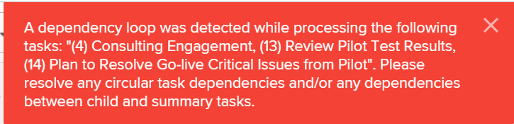

# Error Message: A Dependency Loop Was Detected  {#error-message-a-dependency-loop-was-detected}

## Problem {#problem}

You cannot create a predecessor relationship between two tasks because you get a dependency loop error.

## Cause {#cause}

Dependency loops happen when you have two or more tasks that depend on each other to be completed.&nbsp;

For example, Task 2 is a predecessor to Task 1, which means you must complete Task 2 before you can start working on Task 1.

If you try to make Task 1 a predecessor to Task 2, you get a dependency loop error because you cannot start Task 1 until Task 2 has been completed, but task 2 cannot be started until Task 1 is finished.

&nbsp;&nbsp;

## Solution {#solution}

`Workfront` does not allow you to create a predecessor relationship between tasks if it creates a dependency loop. In order to fix the dependency loop, you must reevaluate&nbsp;the predecessor relationship between the tasks listed in the error message.

&nbsp;
