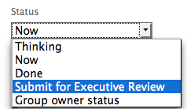

# Apply statuses to work that is associated with a group {#apply-statuses-to-work-that-is-associated-with-a-group}

If a project is associated with a group, you can apply both system-level statuses as well as a custom status associated with that group to the project, or tasks and issues on that project. For information about group statuses in  *`Adobe Workfront`*, see [Create or edit a status](create-or-edit-a-status.md).

>[!TIP] {type="tip"}
>
>You can associate only projects with groups.&nbsp;Issues and tasks inherit the group from the project they belong to. 

## Access requirements {#access-requirements}

You must have the following access to perform the steps in this article:

<table style="width: 100%;margin-left: 0;margin-right: auto;mc-table-style: url('../../../Resources/TableStyles/TableStyle-List-options-in-steps.css');" class="TableStyle-TableStyle-List-options-in-steps" cellspacing="0"> 
 <col class="TableStyle-TableStyle-List-options-in-steps-Column-Column1"> 
 <col class="TableStyle-TableStyle-List-options-in-steps-Column-Column2"> 
 <tbody> 
  <tr class="TableStyle-TableStyle-List-options-in-steps-Body-LightGray"> 
   <td class="TableStyle-TableStyle-List-options-in-steps-BodyE-Column1-LightGray" role="rowheader">Adobe Workfront plan*</td> 
   <td class="TableStyle-TableStyle-List-options-in-steps-BodyD-Column2-LightGray"> 
Any
 </td> 
  </tr> 
  <tr class="TableStyle-TableStyle-List-options-in-steps-Body-MediumGray"> 
   <td class="TableStyle-TableStyle-List-options-in-steps-BodyE-Column1-MediumGray" role="rowheader">Adobe Workfront license*</td> 
   <td class="TableStyle-TableStyle-List-options-in-steps-BodyD-Column2-MediumGray"> 
Plan 
 </td> 
  </tr> 
  <tr class="TableStyle-TableStyle-List-options-in-steps-Body-LightGray"> 
   <td class="TableStyle-TableStyle-List-options-in-steps-BodyE-Column1-LightGray" role="rowheader">Access level configurations*</td> 
   <td class="TableStyle-TableStyle-List-options-in-steps-BodyD-Column2-LightGray"> 
Edit access to Projects
 
Note: If you still don't have access, ask your Workfront administrator if they set additional restrictions in your access level. For information on how a Workfront administrator can modify your access level, see <a href="create-modify-access-levels.md" class="MCXref xref">Create or modify custom access levels</a>.
 </td> 
  </tr> 
  <tr class="TableStyle-TableStyle-List-options-in-steps-Body-MediumGray"> 
   <td class="TableStyle-TableStyle-List-options-in-steps-BodyB-Column1-MediumGray" role="rowheader">Object permissions</td> 
   <td class="TableStyle-TableStyle-List-options-in-steps-BodyA-Column2-MediumGray"> 
Manage permissions to the project
 
For information on requesting additional access, see <a href="request-access.md" class="MCXref xref">Request access to objects in Adobe Workfront</a>.
 </td> 
  </tr> 
 </tbody> 
</table>

&#42;To find out what plan, license type, or access you have, contact your *`Workfront administrator`*.

## Update Project Group and Status {#update-project-group-and-status}

When you update the Group for a project, the options available for the Status change, to match the group. 

1.  Go to a project, or create a new project, as described in [Create a project](create-project.md).
1. Click the `More` icon , then click `Edit`.

1. In the `Edit Project` box that displays, near the bottom of the `Overview` section, select the group in the `Group` drop-down menu.

1.  In the `Status` drop-down menu, select the custom status.

   >[!NOTE]
   >
   >If you select a different group in the `Group` drop-down menu, the custom statuses in the `Status` menu change automatically to correlate with the new group.
   >
   >
   >   >
   >

1. Select the status of the project. The custom statuses you created and applied to that group appear.

