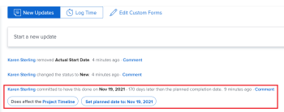

# Commit Date overview {#commit-date-overview}

The Commit Date is the date by which an user assigned to task or an issue commits to complete the task or the issue. This is different than the Planned Completion Date, as it is a more realistic estimate of the completion date given only by the user in charge of the work. For information about the Planned Completion Date, see [Overview of the project Planned Completion Date](project-planned-completion-date.md).

## Commit Date overview {#commit-date-overview-1}

Consider the following when working with commit dates:

* Only tasks and issues have a Commit Date.
* Commit dates are not automatically set by *`Adobe Workfront`*.  
  When you create a task or issue, there is no commit date assigned to the task or issue.

*  If you are assigned to a task or issue, you can set the Commit Date by doing one of the following:

    
    
    * Let *`Workfront`* set the Commit Date to match the existing Planned Completion Date of the task or issue by clicking Work On It, Start Issue, or Start Task on the task or issue. For information about replacing the Work On It button with a Start button, see ` [Replace the Work On It button with a Start button](work-on-it-button-to-start-button.md)`.
    
    * Manually set the Commit Date yourself according to when you believe the task or issue might be completed. This&nbsp;is your estimation&nbsp;and commitment, as the assignee, to the Project Manager&nbsp;that you will have the task or issue completed by a particular date.
    
    

>[!NOTE]
>
>You must be the Task&nbsp;Owner of a task to change the Commit Date. The following users cannot change the Commit Date of a task:
>
>
>
>* Project Owner
>* Project Sponsor
>* Resource Manager
>* System Administrator
>* Any other assignee on the task
>* Any other user with permissions to the task.
>
>
>For more information about the Task Owner, see the section [Edit tasks](edit-tasks.md#assignments) in the article [Edit tasks](edit-tasks.md).

## Notifications and updates triggered by changing the Commit Date {#notifications-and-updates-triggered-by-changing-the-commit-date}

When a task or issue assignee selects a Commit Date that is different than the Planned Completion Date set by the Project Owner, there are a number of notifications and updates that alert the Project Owner and other users of this change.

>[!NOTE]
>
>Changes made to the Commit Date do not automatically change the planned dates, and changes made to the planned dates do not automatically change the Commit Date.&nbsp;

Setting the Commit Date for a task or issue triggers the following changes:
`<li>  <ul>   <li> 
The Commit Date populates in the Update Stream of the task or issue.
 
  
 <note type="tip">    The change of the Commit Date displays in the Updates area of the task or issue when the     Workfront administrator enables this update in the Updates Feeds area in&nbsp;Setup.&nbsp;For information, see     <a href="system-tracked-update-feeds.md" class="MCXref xref">System-tracked updates</a>.   </note> </li>  </ul> </li>` 

*  The Projected Completion Date of the task or issue is set to the same date because the task now has a more accurate indication of when it is likely to be completed.  
  For more information about the Projected Completion Date, see [Overview of the Projected Completion Date for projects, tasks, and issues](project-projected-completion-date.md).

     

*  The Project Owner is notified in the notifications area and in the Updates tab of the task whether this change will impact the project timeline. 

  

  If a Project Owner does not want to accept the change, we recommend that they comment back to the user proposing a new date to ask them to change the Commit Date back to the original Planned Date, or select a new date. If a Project Owner accepts the change, they can manually adjust the Planned Completion Date to match the Commit Date offered by the user assigned to the item.

  The Project Owner can use the Commit Date to reset the Planned Completion Date. You do this by selecting the Set planned date to option in the Updates tab of the task. You must have access to manage the task and the project to accept this change.

  >[!NOTE]
  >
  >If you want to see how the timeline of the project is affected by accepting to change the Planned Completion Date of the task, click `Project Timeline`. This opens the Gantt Chart where you can evaluate the date changes.
  >
  >
  >  >
  >

For information about the additional functionality that is available when updating a work item, see&nbsp; [Update work](update-work.md).&nbsp;

For information about updating Commit Dates for tasks and issues, see [Update Commit Dates on tasks and issues](update-commit-date-on-tasks-and-issues.md).
