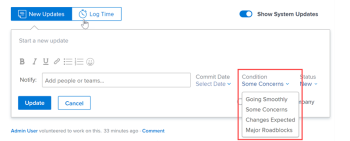

# Update Condition for tasks and issues {#update-condition-for-tasks-and-issues}

The Condition of a task or issue is a flag placed on it to indicate how it's going. This is different than the Status of the work item, which indicates the current stage of the development of the item. 

You can set the Condition of a task or an issue either automatically or manually. 

The *`Adobe Workfront administrator`* can create custom Conditions for your environment, as described in [Create or edit a custom condition](create-edit-custom-conditions.md)

You can manually update the Condition of a task or issue if you are assigned to it or if you have permissions to it, as described in the [Access requirements](#access) section of this article. 

## Access requirements {#access-requirements}

You must have the following access to perform the steps in this article:

<table style="width: 100%;margin-left: 0;margin-right: auto;mc-table-style: url('../../../Resources/TableStyles/TableStyle-List-options-in-steps.css');" class="TableStyle-TableStyle-List-options-in-steps" cellspacing="0"> 
 <col class="TableStyle-TableStyle-List-options-in-steps-Column-Column1"> 
 <col class="TableStyle-TableStyle-List-options-in-steps-Column-Column2"> 
 <tbody> 
  <tr class="TableStyle-TableStyle-List-options-in-steps-Body-LightGray"> 
   <td class="TableStyle-TableStyle-List-options-in-steps-BodyE-Column1-LightGray" role="rowheader">Adobe Workfront plan*</td> 
   <td class="TableStyle-TableStyle-List-options-in-steps-BodyD-Column2-LightGray"> 
Any
 </td> 
  </tr> 
  <tr class="TableStyle-TableStyle-List-options-in-steps-Body-MediumGray"> 
   <td class="TableStyle-TableStyle-List-options-in-steps-BodyE-Column1-MediumGray" role="rowheader">Adobe Workfront license*</td> 
   <td class="TableStyle-TableStyle-List-options-in-steps-BodyD-Column2-MediumGray"> 
Work or higher
 </td> 
  </tr> 
  <tr class="TableStyle-TableStyle-List-options-in-steps-Body-LightGray"> 
   <td class="TableStyle-TableStyle-List-options-in-steps-BodyE-Column1-LightGray" role="rowheader">Access level*</td> 
   <td class="TableStyle-TableStyle-List-options-in-steps-BodyD-Column2-LightGray"> 
View or higher access to projects
 
Edit access to tasks and issues 
 
Note: If you still don't have access, ask your Workfront administrator if they set additional restrictions in your access level. For information on how a Workfront administrator can change your access level, see <a href="create-modify-access-levels.md" class="MCXref xref">Create or modify custom access levels</a>.
 </td> 
  </tr> 
  <tr class="TableStyle-TableStyle-List-options-in-steps-Body-MediumGray"> 
   <td class="TableStyle-TableStyle-List-options-in-steps-BodyB-Column1-MediumGray" role="rowheader">Object permissions</td> 
   <td class="TableStyle-TableStyle-List-options-in-steps-BodyA-Column2-MediumGray"> 
Contribute or higher permissions on tasks and issues 
 
For information on requesting additional access, see <a href="request-access.md" class="MCXref xref">Request access to objects in Adobe Workfront</a>.
 </td> 
  </tr> 
 </tbody> 
</table>

&#42;To find out what plan, license type, or access you have, contact your *`Workfront administrator`*.

## Automatically update the Condition by updating the status {#automatically-update-the-condition-by-updating-the-status}

When you are assigned a task or issue and you click `Work On It` `, Start Task or Start Issue,` or update its status, the Condition of the task or issue automatically changes to the default Condition associated with `Going Smoothly`. 

For information about using a custom Condition as a default Condition, see the articles ` [Set a custom condition as the default for tasks and issues](set-custom-condition-default-tasks-issues.md)` and [Set a custom condition as the default for projects](set-custom-condition-default-projects.md). 

For information about changing the task status, see [Update task status](update-task-status.md).

For information about changing the issue status, see [Update issue status](update-issue-status.md).

For information about setting the Work On It button to a Start Task or Start Issue button, see [Replace the Work On It button with a Start button](work-on-it-button-to-start-button.md).

## Manually update the Condition {#manually-update-the-condition}

You must be assigned to a task or the issue or have Manage permissions to it to be able to set the Condition on it. 

Updating the Condition of a task or issue differs depending on whether you are assigned to it or not:

* You can update the Condition in the Updates tab or in a list of tasks or issues if you are assigned to them.
* You can update the Condition only in a list of tasks or issues if you are not assigned to them, but have Manage permissions to them. In this case, you cannot update the Condition in the Update tab of the task or issue.

To manually set the Condition of a task or an issue: 

1.  Go to a task or issue assigned to you for which you want to set the Condition.

   Or

   Go to a list of tasks or issues that you have Manage permissions to, but are not assigned to you. 

1. Change the Condition of the issue or task as follows:
    
    
    *  If you are assigned to the task or issue and have Manage permissions to it, on the `Updates` tab, click `Start a new update`, select the `Condition` that best reflects how the task is going, type your reason for changing the Condition in the `Start a new update` area (optional) , then click `Update`.
    
    
          
    

    
    *  If you have Manage permissions to the task or issue but are not assigned to it, perhaps as a project manager, add the `Condition` column to any view you use in a task or issue list, then set the `Condition` in inline edit and press Enter.
    
    
          
    

    
    
      For information about adding a column to a view, see [Views overview in Adobe Workfront](views-overview.md).
    
    
      >[!NOTE]
      >
      >`Conditions can be customized for your environment, so you` `may` ` find more than three options for Condition in your environment. The names of the Conditions might be different than the ones listed above. For information about customizing Conditions in *`Workfront`*, see [Create or edit a custom condition](create-edit-custom-conditions.md).`
    
    
      For information about the additional functionality that is available when updating a work item, see [Update work](update-work.md).
    
    
    

