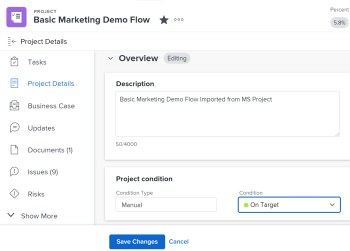

# Update Condition for a project  {#update-condition-for-a-project}

The Condition of a project is a flag placed on it to indicate whether the work associated with it is going smoothly or whether you have encountered any roadblocks. This is different than the Status of the project, which indicates whether you are actively working on it or not.&nbsp;

You can set the Condition of a project either automatically or manually. In order to change the Condition of a project manually, you must be the Project Owner or `have Manage rights to it.`

The *`Adobe Workfront administrator`* can create custom Conditions for your environment, as described in [Create or edit a custom condition](create-edit-custom-conditions.md).

## Access requirements {#access-requirements}

You must have the following access to perform the steps in this article:

<table style="width: 100%;margin-left: 0;margin-right: auto;mc-table-style: url('../../../Resources/TableStyles/TableStyle-List-options-in-steps.css');" class="TableStyle-TableStyle-List-options-in-steps" cellspacing="0"> 
 <col class="TableStyle-TableStyle-List-options-in-steps-Column-Column1"> 
 <col class="TableStyle-TableStyle-List-options-in-steps-Column-Column2"> 
 <tbody> 
  <tr class="TableStyle-TableStyle-List-options-in-steps-Body-LightGray"> 
   <td class="TableStyle-TableStyle-List-options-in-steps-BodyE-Column1-LightGray" role="rowheader">Adobe Workfront plan*</td> 
   <td class="TableStyle-TableStyle-List-options-in-steps-BodyD-Column2-LightGray"> 
Any
 </td> 
  </tr> 
  <tr class="TableStyle-TableStyle-List-options-in-steps-Body-MediumGray"> 
   <td class="TableStyle-TableStyle-List-options-in-steps-BodyE-Column1-MediumGray" role="rowheader">Adobe Workfront license*</td> 
   <td class="TableStyle-TableStyle-List-options-in-steps-BodyD-Column2-MediumGray"> 
Plan 
 </td> 
  </tr> 
  <tr class="TableStyle-TableStyle-List-options-in-steps-Body-LightGray"> 
   <td class="TableStyle-TableStyle-List-options-in-steps-BodyE-Column1-LightGray" role="rowheader">Access level configurations*</td> 
   <td class="TableStyle-TableStyle-List-options-in-steps-BodyD-Column2-LightGray"> 
Edit access to Projects
 
Note: If you still don't have access, ask your Workfront administrator if they set additional restrictions in your access level. For information on how a Workfront administrator can modify your access level, see <a href="create-modify-access-levels.md" class="MCXref xref">Create or modify custom access levels</a>.
 </td> 
  </tr> 
  <tr class="TableStyle-TableStyle-List-options-in-steps-Body-MediumGray"> 
   <td class="TableStyle-TableStyle-List-options-in-steps-BodyB-Column1-MediumGray" role="rowheader">Object permissions</td> 
   <td class="TableStyle-TableStyle-List-options-in-steps-BodyA-Column2-MediumGray"> 
Manage permissions to the project
 
For information on requesting additional access, see <a href="request-access.md" class="MCXref xref">Request access to objects in Adobe Workfront</a>.
 </td> 
  </tr> 
 </tbody> 
</table>

&#42;To find out what plan, license type, or access you have, contact your *`Workfront administrator`*.

## Automatically set the Condition  {#automatically-set-the-condition}

Automatically setting the Condition of a project is determined by the Condition Type of the project. The Condition Type must be set to Progress Status for *`Workfront`* to automatically set the Condition of the Project. 

Your *`Workfront`* or *`Group administrator`* determines the default of the Condition Type field for new projects in your system when setting project preferences in the Setup area.&nbsp;For more information, see [Configure system-wide project preferences](set-project-preferences.md).

When you create a project, the Condition of the project is automatically set to match the Progress Status of the project at that time. The Progress Status of the project is based on the progress of the tasks on the project. 

For information about project conditions and how they are calculated based on Progress Status, see [Project Progress Status overview](project-progress-status.md).

## Manually update the Condition for a project {#manually-update-the-condition-for-a-project}

If you set your project's Condition Type to&nbsp;Manual instead of Progress Status, you can manually update the Condition of a project. 

1. Go to the project for which you want to update the Condition. 
1.   `<MadCap:conditionalText data-mc-conditions="QuicksilverOrClassic.Quicksilver"> Click the  Project&nbsp;Details section.</MadCap:conditionalText>` 

      

1. Ensure that the `Condition Type` field is set to `Manual`. 

1. In the `Condition` field, select from the following options the one that matches your understanding of whether the work associated with it is going smoothly or whether there are any delays:
    
    
    * `On Target`
    * `At Risk`
    * `In Trouble`
    
    
   For more information about project conditions, see [Overview of Project Condition and Condition Type](project-condition-and-condition-type.md).

   >[!NOTE]
   >
   >`Conditions can be customized for your environment, so you` `may` ` find more than three options for Condition in your environment. The names of the Conditions might be different than the ones listed above. For information about customizing Conditions in *`Workfront`*, see [Create or edit a custom condition](create-edit-custom-conditions.md).`

1. Click `Save``<MadCap:conditionalText data-mc-conditions="QuicksilverOrClassic.Quicksilver"> Changes</MadCap:conditionalText>`. 

