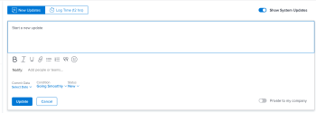

# Update issue status {#update-issue-status}

You can update the status of an issue to inform others about where the issue is and how it is progressing.

## Access requirements {#access-requirements}

You must have the following access to perform the steps in this article:

<table style="width: 100%;margin-left: 0;margin-right: auto;mc-table-style: url('../../../Resources/TableStyles/TableStyle-List-options-in-steps.css');" class="TableStyle-TableStyle-List-options-in-steps" cellspacing="0"> 
 <col class="TableStyle-TableStyle-List-options-in-steps-Column-Column1"> 
 <col class="TableStyle-TableStyle-List-options-in-steps-Column-Column2"> 
 <tbody> 
  <tr class="TableStyle-TableStyle-List-options-in-steps-Body-LightGray"> 
   <td class="TableStyle-TableStyle-List-options-in-steps-BodyE-Column1-LightGray" role="rowheader">Adobe Workfront plan*</td> 
   <td class="TableStyle-TableStyle-List-options-in-steps-BodyD-Column2-LightGray"> 
Any
 </td> 
  </tr> 
  <tr class="TableStyle-TableStyle-List-options-in-steps-Body-MediumGray"> 
   <td class="TableStyle-TableStyle-List-options-in-steps-BodyE-Column1-MediumGray" role="rowheader">Adobe Workfront license*</td> 
   <td class="TableStyle-TableStyle-List-options-in-steps-BodyD-Column2-MediumGray"> 
Request or higher
 </td> 
  </tr> 
  <tr class="TableStyle-TableStyle-List-options-in-steps-Body-LightGray"> 
   <td class="TableStyle-TableStyle-List-options-in-steps-BodyE-Column1-LightGray" role="rowheader">Access level configurations*</td> 
   <td class="TableStyle-TableStyle-List-options-in-steps-BodyD-Column2-LightGray"> 
Edit access to Issues
 
Note: If you still don't have access, ask your Workfront administrator if they set additional restrictions in your access level. For information on how a Workfront administrator can modify your access level, see <a href="create-modify-access-levels.md" class="MCXref xref">Create or modify custom access levels</a>.
 </td> 
  </tr> 
  <tr class="TableStyle-TableStyle-List-options-in-steps-Body-MediumGray"> 
   <td class="TableStyle-TableStyle-List-options-in-steps-BodyB-Column1-MediumGray" role="rowheader">Object permissions</td> 
   <td class="TableStyle-TableStyle-List-options-in-steps-BodyA-Column2-MediumGray"> 
Manage permissions to the issue
 
For information on requesting additional access, see <a href="request-access.md" class="MCXref xref">Request access to objects in Adobe Workfront</a>.
 </td> 
  </tr> 
 </tbody> 
</table>

&#42;To find out what plan, license type, or access you have, contact your *`Workfront administrator`*.

## Issue statuses {#issue-statuses}

The following are the default statuses for issues in *`Workfront`*: 

* New
* In Progress
* Awaiting Feedback
* On Hold
* Won't Resolve
* Reopened
* Closed
* Resolved

Your *`Adobe Workfront administrator`* can add custom statuses for issues for your organization. They can also make statuses available depending on the issue type. 

For more information about custom statuses and issue types, see the following articles:

* [Create or edit a status](create-or-edit-a-status.md) 
* [Create issues](create-issues.md) 

You can manually update issue statuses or you can let *`Workfront`* automatically update them when certain actions take place. 

## Manually update issue status {#manually-update-issue-status}

When you are updating an issue status, you can also add an explanation about the new status and change other issue information such as the commit date.

1. Go to an issue that you are assigned to for which you want to update the status.
1.  Click the `Status` field in the issue header and select a new status. 

   

1.  (Optional) Do any of the following to provide additional information about the update, then click `Update` or, if the issue has a status that equates with Complete, click `Done:`

    
    
    *  To add a note about the update, go to the `Updates``<MadCap:conditionalText data-mc-conditions="QuicksilverOrClassic.Quicksilver"> section </MadCap:conditionalText>`and click `Start a new update`, then type your note.
    
    
          
    

    
    * To notify certain users about the update, type their names in the `Notify` box that appears when you type a note about the update.
    * To update the condition of the issue, click `Condition`, then select the condition that best reflects the current condition of the issue. Select from the following options:    
        
        
        * Going Smoothly
        * Some Concerns
        * Major Roadblocks
        
        
    
    * To update the Commit Date of the issue, expand the `Commit Date` drop-down calendar, and select a new date.
    *  To provide a visual indication of issue completion, drag or double-click the bubble under `Percent Complete` in the header of the issue
    
    
      Or
    
    
      Click inside the bubble to enter a percentage. 
    
    
          
    

    
    
    

## Automatically update issue status {#automatically-update-issue-status}

*`Workfront`* automatically updates the existing status of an issue to a different status when the actions listed in the table below occur.

>[!NOTE]
>
>The statuses in the following table are default system statuses. Your *`Workfront administrator`* or a *`group administrator`* can rename the statuses in your instance of *`Workfront`*. For information about creating and managing statuses in *`Workfront`*, see [Create or edit a status](create-or-edit-a-status.md).

<table style="width: 100%;mc-table-style: url('../../../Resources/TableStyles/TableStyle-HeaderRow.css');" class="TableStyle-TableStyle-HeaderRow" cellspacing="15"> 
 <col class="TableStyle-TableStyle-HeaderRow-Column-Column1"> 
 <col class="TableStyle-TableStyle-HeaderRow-Column-Column1"> 
 <col class="TableStyle-TableStyle-HeaderRow-Column-Column1"> 
 <tbody> 
  <tr class="TableStyle-TableStyle-HeaderRow-Body-LightGray"> 
   <td class="TableStyle-TableStyle-HeaderRow-BodyE-Column1-LightGray" style="font-weight: bold;">Action</td> 
   <td class="TableStyle-TableStyle-HeaderRow-BodyE-Column1-LightGray" style="font-weight: bold;">Original Status</td> 
   <td class="TableStyle-TableStyle-HeaderRow-BodyD-Column1-LightGray" style="font-weight: bold;">New Status</td> 
  </tr> 
  <tr class="TableStyle-TableStyle-HeaderRow-Body-MediumGray"> 
   <td class="TableStyle-TableStyle-HeaderRow-BodyE-Column1-MediumGray">Update the issue percent complete to 100%</td> 
   <td class="TableStyle-TableStyle-HeaderRow-BodyE-Column1-MediumGray">New or In Progress</td> 
   <td class="TableStyle-TableStyle-HeaderRow-BodyD-Column1-MediumGray">Closed</td> 
  </tr> 
  <tr class="TableStyle-TableStyle-HeaderRow-Body-LightGray"> 
   <td class="TableStyle-TableStyle-HeaderRow-BodyE-Column1-LightGray">Update the issue percent complete from 100% to a lower number</td> 
   <td class="TableStyle-TableStyle-HeaderRow-BodyE-Column1-LightGray">Closed </td> 
   <td class="TableStyle-TableStyle-HeaderRow-BodyD-Column1-LightGray">In Progress</td> 
  </tr> 
  <tr class="TableStyle-TableStyle-HeaderRow-Body-MediumGray"> 
   <td class="TableStyle-TableStyle-HeaderRow-BodyE-Column1-MediumGray">Update the status of a resolving object attached to the issue</td> 
   <td class="TableStyle-TableStyle-HeaderRow-BodyE-Column1-MediumGray">Various statuses</td> 
   <td class="TableStyle-TableStyle-HeaderRow-BodyD-Column1-MediumGray"> 
Various statuses
 
For information about resolving objects and how they affect the status of issues, see the section "Synchronize the Status of the Resolvable Object with that of the Resolving Object" in the article <a href="resolving-and-resolvable-objects.md" class="MCXref xref">Overview of Resolving and Resolvable Objects </a>.
 </td> 
  </tr> 
  <tr class="TableStyle-TableStyle-HeaderRow-Body-LightGray" data-mc-conditions=""> 
   <td class="TableStyle-TableStyle-HeaderRow-BodyB-Column1-LightGray">Click the Start Issue button to accept working on an issue assigned to you </td> 
   <td class="TableStyle-TableStyle-HeaderRow-BodyB-Column1-LightGray">New </td> 
   <td class="TableStyle-TableStyle-HeaderRow-BodyA-Column1-LightGray"> 
Any status associated with the Start Issue button in your Home Team settings.  
 
For information about replacing the Work On It button with a Start Issue button, see <a href="work-on-it-button-to-start-button.md" class="MCXref xref">Replace the Work On It button with a Start button</a>.  
 
Tip: Clicking the Undo button  after clicking Start Issue reverts the status to New.  
 </td> 
  </tr> 
 </tbody> 
</table>

