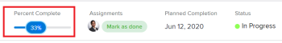

# View and update Percent Complete for tasks {#view-and-update-percent-complete-for-tasks}

You can update the percent complete for a task&nbsp;in any of the following ways:

* `In a task list:`You can update the percent complete of a task when the Percent Complete column is displayed.  
  For more information about inline editing, see [Inline edit items in a list in Adobe Workfront](inline-edit-objects.md).

* `In the Milestone view:`You can update the percent complete of a task when using the Milestone view on a project list or a project report. For more information, see [Use the Milestone view](use-milestone-view.md).

* `As you update the task:`&nbsp;You can update the percent complete option of a task when adding an update to the task.  

  >[!IMPORTANT] {type="important"}
  >
  >This option displays only after you enable the Show Percent Complete option.&nbsp;  
  >To enable the percent complete update bar for tasks, do the following:   
  
  >`<MadCap:conditionalText data-mc-conditions="QuicksilverOrClassic.Quicksilver"> 1. Go to the  Main menu>your name> More icon next to your name >  Edit > select  Show percent complete on update status. </MadCap:conditionalText>`  
  >  >
  >

*  `In the task header`: You can update the percent complete of a task in the task header. 

  

