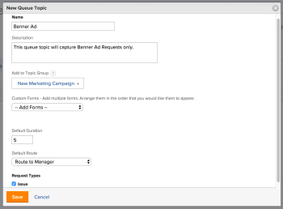

# Create Queue Topics {#create-queue-topics}

Queue Topics work in conjunction with Routing Rules to automatically assign incoming work to a user, job role, team, or to place it on a project. Queue Topics define the conditions that need to exist for the Routing Rule to be implemented.

There is no limit to the number of Queue Topics that can be assigned to a Topic Group or to a project. Queue Topics are a reportable object type.

## Access requirements {#access-requirements}

You must have the following:

<table style="width: 100%;margin-left: 0;margin-right: auto;mc-table-style: url('../../../Resources/TableStyles/TableStyle-List-options-in-steps.css');" class="TableStyle-TableStyle-List-options-in-steps" cellspacing="0"> 
 <col class="TableStyle-TableStyle-List-options-in-steps-Column-Column1"> 
 <col class="TableStyle-TableStyle-List-options-in-steps-Column-Column2"> 
 <tbody> 
  <tr class="TableStyle-TableStyle-List-options-in-steps-Body-LightGray"> 
   <td class="TableStyle-TableStyle-List-options-in-steps-BodyE-Column1-LightGray" role="rowheader">Adobe Workfront plan*</td> 
   <td class="TableStyle-TableStyle-List-options-in-steps-BodyD-Column2-LightGray"> 
Any 
 </td> 
  </tr> 
  <tr class="TableStyle-TableStyle-List-options-in-steps-Body-MediumGray"> 
   <td class="TableStyle-TableStyle-List-options-in-steps-BodyE-Column1-MediumGray" role="rowheader">Adobe Workfront license*</td> 
   <td class="TableStyle-TableStyle-List-options-in-steps-BodyD-Column2-MediumGray"> 
Plan 
 </td> 
  </tr> 
  <tr class="TableStyle-TableStyle-List-options-in-steps-Body-LightGray"> 
   <td class="TableStyle-TableStyle-List-options-in-steps-BodyE-Column1-LightGray" role="rowheader">Access level configurations*</td> 
   <td class="TableStyle-TableStyle-List-options-in-steps-BodyD-Column2-LightGray"> 
Edit access to Projects
 
Note: If you still don't have access, ask your Workfront administrator if they set additional restrictions in your access level. For information on how a Workfront administrator can modify your access level, see <a href="create-modify-access-levels.md" class="MCXref xref">Create or modify custom access levels</a>.
 </td> 
  </tr> 
  <tr class="TableStyle-TableStyle-List-options-in-steps-Body-MediumGray"> 
   <td class="TableStyle-TableStyle-List-options-in-steps-BodyB-Column1-MediumGray" role="rowheader">Object permissions</td> 
   <td class="TableStyle-TableStyle-List-options-in-steps-BodyA-Column2-MediumGray"> 
 Manage permissions to the project
 
For information on requesting additional access, see <a href="request-access.md" class="MCXref xref">Request access to objects in Adobe Workfront</a>.
 </td> 
  </tr> 
 </tbody> 
</table>

&#42;To find out what plan, license type, or access you have, contact your *`Workfront administrator`*

## Create a Queue Topic {#create-a-queue-topic}

1.  Create a Routing Rule, a Topic Group, and a custom form, if you plan to associate them with your Queue Topic.   
   For more information on how to create Routing Rules, Topic Groups or custom forms, refer to the following articles:

    
    
    * [Create Routing Rules](create-routing-rules.md) 
    * [Create Topic Groups](create-topic-groups.md) 
    * [Create or edit a custom form](create-or-edit-a-custom-form.md)   
    
    
    

1.  Go to the project you chose to enable as a Help Request Queue and where you want to create a new queue topic.  
   For more information on how to designate a project as a Help Request Queue, refer to the following article:  
   [Create a Request Queue](create-request-queue.md)

   You can organize related Queue Topics under a Topic Group or directly under the project designated as a Help Request Queue. This will provide the requestor a series of drop-down menus when making a request.  
   You can nest the Queue Topics directly under the project designated as a Help Request Queue, without a Topic Group. 

   For information about creating Topic Groups, see [Create Topic Groups](create-topic-groups.md).

1.  Click `Queue Topics` in the left panel. You might need to click `Show More`, then `Queue Topics`. 
1. Click `New Queue Topic`.
1. On the `New Queue Topic` form, specify the following:
1.  

<table style="width: 100%;mc-table-style: url('../../../Resources/TableStyles/TableStyle-List-options-in-steps.css');" class="TableStyle-TableStyle-List-options-in-steps" cellspacing="0"> 
 <col style="width: 205px;" class="TableStyle-TableStyle-List-options-in-steps-Column-Column1"> 
 <col style="width: 50%;" class="TableStyle-TableStyle-List-options-in-steps-Column-Column2"> 
 <tbody> 
  <tr class="TableStyle-TableStyle-List-options-in-steps-Body-LightGray"> 
   <td class="TableStyle-TableStyle-List-options-in-steps-BodyE-Column1-LightGray" role="rowheader">Name </td> 
   <td class="TableStyle-TableStyle-List-options-in-steps-BodyD-Column2-LightGray"> Name of the Queue Topic.</td> 
  </tr> 
  <tr class="TableStyle-TableStyle-List-options-in-steps-Body-MediumGray"> 
   <td class="TableStyle-TableStyle-List-options-in-steps-BodyE-Column1-MediumGray" role="rowheader">Description </td> 
   <td class="TableStyle-TableStyle-List-options-in-steps-BodyD-Column2-MediumGray">Describe the Request Queue. The description displays when users select the queue topic in the process of submitting a new request. </td> 
  </tr> 
  <tr class="TableStyle-TableStyle-List-options-in-steps-Body-LightGray"> 
   <td class="TableStyle-TableStyle-List-options-in-steps-BodyE-Column1-LightGray" role="rowheader">Add to Topic Group </td> 
   <td class="TableStyle-TableStyle-List-options-in-steps-BodyD-Column2-LightGray"> If there are no Topic Groups on the project, the name of the project will default as a Topic Group. If you want to create additional Topic Groups from here, select Create New Topic Group from the drop-down menu. </td> 
  </tr> 
  <tr class="TableStyle-TableStyle-List-options-in-steps-Body-MediumGray"> 
   <td class="TableStyle-TableStyle-List-options-in-steps-BodyE-Column1-MediumGray" role="rowheader">Custom Forms </td> 
   <td class="TableStyle-TableStyle-List-options-in-steps-BodyD-Column2-MediumGray">Select any custom forms you want to associate with the queue topic. You must create custom forms for issues before you can associate them with queue topics. For information about creating custom forms, see <a href="create-or-edit-a-custom-form.md" class="MCXref xref">Create or edit a custom form</a>.</td> 
  </tr> 
  <tr class="TableStyle-TableStyle-List-options-in-steps-Body-LightGray"> 
   <td class="TableStyle-TableStyle-List-options-in-steps-BodyE-Column1-LightGray" role="rowheader">Default Approval</td> 
   <td class="TableStyle-TableStyle-List-options-in-steps-BodyD-Column2-LightGray"> 
Associate an approval process with this queue topic. Only Issue Approval Processes are visible in this drop-down menu. All issues submitted to this queue will be associated with this Approval Process. Your Adobe Workfront administrator must define system-level Approval Processes before you can associate them with queue topics. A user with administrative access to Approval processes can also create group-specific approval processes. For more information about creating Approval Processes, see <a href="create-approval-processes.md" class="MCXref xref">Create an approval process</a>. 
 
    
 
     
Important: If the group of the project changes, the group-specific approval process attached to existing issues becomes a single-use approval process. For more information about how changes to the group of the project or changes in the approval process affect approval settings, see <a href="how-changes-affect-group-approvals.md" class="MCXref xref">How group and approval process changes affect assigned approval processes</a>.
 
     
Consider the following when adding approval processes to queue topics: 
 
     <ul style="list-style-type: circle;"> 
      <li>Only active approval processes display in the list. </li> 
      <li> 
System-wide and group-specific approval processes display in the list. An approval process associated with a group other than that of the project does not display in the list.
 </li> 
     </ul> 
    
 </td> 
  </tr> 
  <tr class="TableStyle-TableStyle-List-options-in-steps-Body-MediumGray"> 
   <td class="TableStyle-TableStyle-List-options-in-steps-BodyE-Column1-MediumGray" role="rowheader">Default Duration </td> 
   <td class="TableStyle-TableStyle-List-options-in-steps-BodyD-Column2-MediumGray">This is the default duration of the request and the Planned Completion Date of the request is calculated based on this value.</td> 
  </tr> 
  <tr class="TableStyle-TableStyle-List-options-in-steps-Body-LightGray"> 
   <td class="TableStyle-TableStyle-List-options-in-steps-BodyE-Column1-LightGray" role="rowheader">Default Route </td> 
   <td class="TableStyle-TableStyle-List-options-in-steps-BodyD-Column2-LightGray">Specify the routing rule you want to associate with the Queue Topic. You must create the routing rule before you can attach it to a Queue Topic.</td> 
  </tr> 
  <tr class="TableStyle-TableStyle-List-options-in-steps-Body-MediumGray"> 
   <td class="TableStyle-TableStyle-List-options-in-steps-BodyB-Column1-MediumGray" role="rowheader">Request Types </td> 
   <td class="TableStyle-TableStyle-List-options-in-steps-BodyA-Column2-MediumGray"> 
Choose what kind of requests this queue topic stores. The visible options are set on the Queue Details tab of the project. This is a required field. 
 
Note: Request&nbsp;Types display as a selection in the Requests area only if the Request Type is selected in both the Queue Details and the Queue Topic pages. For information about setting up the Queue Details area of a project, see <a href="create-request-queue.md" class="MCXref xref">Create a Request Queue</a>. 
 
Select from the following types:
 
    <ul> 
     <li>Bug Report</li> 
     <li>Change Order</li> 
     <li>Issue</li> 
     <li>Request</li> 
    </ul> 
Your Workfront administrator might have renamed some of these options. 
 </td> 
  </tr> 
 </tbody> 
</table>

1.  

1. Click `Save`.   
   The Queue Topic is now available to use and is visible in the Requests area of *`Workfront`*, after a Request Queue and a Topic Group are selected.

