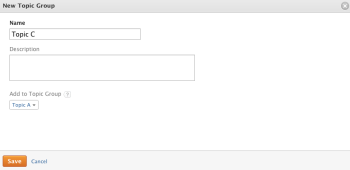

# Create Topic Groups

Topic Groups are associated with Request Queues. They allow you to layer your Request Queues in multiple categories, depending on the nature of the requests.

## Access requirements

You must have the following:

<table cellspacing="0"> 
 <col> 
 <col> 
 <tbody> 
  <tr> 
   <td role="rowheader"><em>Adobe Workfront</em> plan*</td> 
   <td> 
Any 
 </td> 
  </tr> 
  <tr> 
   <td role="rowheader"> 
<em>Adobe Workfront</em> license*
 </td> 
   <td> 
<em>Plan</em> 
 </td> 
  </tr> 
  <tr> 
   <td role="rowheader">Access level configurations*</td> 
   <td> 
Edit access to Projects
 
Note: If you still don't have access, ask your <em>Workfront administrator</em> if they set additional restrictions in your access level. For information on how a <em>Workfront administrator</em> can modify your access level, see <a href="../../../administration-and-setup/add-users/configure-and-grant-access/create-modify-access-levels.md" class="MCXref xref">Create or modify custom access levels</a>.
 </td> 
  </tr> 
  <tr> 
   <td role="rowheader">Object permissions</td> 
   <td> 
 Manage permissions to the project
 
For information on requesting additional access, see <a href="../../../workfront-basics/grant-and-request-access-to-objects/request-access.md" class="MCXref xref">Request access to objects in Adobe Workfront</a>.
 </td> 
  </tr> 
 </tbody> 
</table>

&#42;To find out what plan, license type, or access you have, contact your *Workfront administrator*

## Overview of Topic Groups

For example, if you have a Request Queue for Marketing Requests, you can have a Topic Group of "Mother's Day Campaign", with a second-level Topic Group of "Digital Media", and an additional second-level Topic Group of "Print Media." Then, you can have multiple Queue Topics inside each Topic Group. For example, "Banner Ad" and "Blog" can be Queue Topics for the "Digital Media" Topic Group.

For more information about how to create Request Queues, see [Create a Request Queue](../../../manage-work/requests/create-and-manage-request-queues/create-request-queue.md).

` `**Tips: **``

* You can create up to 10 tiers of Topic Groups within a Request Queue.
* There is no limit to the number of Queue Topics that can be associated with a topic group. 
* Topic groups are a reportable object.

## Create Topic Groups

We recommend that you create Topic Groups before you create a Queue Topic. However, a Topic Group can be created within in the Queue Topic builder. For more information about creating Queue Topics, see [Create Queue Topics](../../../manage-work/requests/create-and-manage-request-queues/create-queue-topics.md).

To create a Topic Group:

<ol> 
 <li value="1"> Go to the project that you published as a Help Request Queue. For more information about publishing a project as a Help Request Queue, see <a href="../../../manage-work/requests/create-and-manage-request-queues/create-request-queue.md" class="MCXref xref">Create a Request Queue</a>.</li> 
 <li value="2"> <draft-comment>
   
Click Topic Groups in the left panel. You might need to click Show More, then Topic Groups. 

  </draft-comment>
Click Topic Groups in the left panel. You might need to click Show More, then Topic Groups. 
 </li> 
 <li value="3"> Click New Topic Group. </li> 
 <li value="4"> Specify the following information: 
  <ul>
   <li>Name: The name is visible to users who submit requests to this request queue. </li>
   <li>Description: The description displays when users select the topic group in the process of submitting a new request. </li>
   <li>Add to Topic Group: You can add the new Topic Group to an existing Topic Group, or you can add it directly to the project published as a Help Request Queue. </li>
  </ul></li> 
 <li value="5"> Click Save. This creates a new Topic Group in your Request Queue. You can now select additional categories from the first drop-down menu under a Request Queue. For more information about submitting requests, see <a href="../../../manage-work/requests/create-requests/create-submit-requests.md" class="MCXref xref">Create and submit Adobe Workfront requests</a>.</li> 
</ol>

