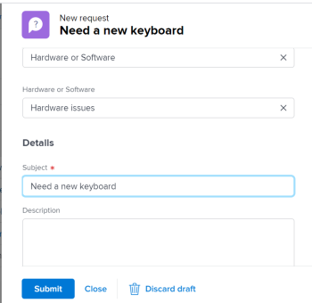

# Create requests from drafts

In addition to using the available drafts that *Workfront* suggests to you when you enter a new request, you can also access a draft request from the Drafts 

<!--
<MadCap:conditionalText data-mc-conditions="QuicksilverOrClassic.Quicksilver">
section
</MadCap:conditionalText>
-->

`<MadCap:conditionalText data-mc-conditions="QuicksilverOrClassic.Quicksilver"> section</MadCap:conditionalText>` and finish submitting it from there.

## Access requirements

You must have the following access to perform the steps in this article:

<table cellspacing="0"> 
 <col> 
 <col> 
 <tbody> 
  <tr> 
   <td role="rowheader"><em>Adobe Workfront</em> plan*</td> 
   <td> 
Any 
 </td> 
  </tr> 
  <tr> 
   <td role="rowheader"><em>Adobe Workfront</em> license*</td> 
   <td> 
<em>Request</em> or higher
 </td> 
  </tr> 
  <tr> 
   <td role="rowheader">Access level configurations*</td> 
   <td> 
Edit access to Issues
 
Note: If you still don't have access, ask your <em>Workfront administrator</em> if they set additional restrictions in your access level. For information on how a <em>Workfront administrator</em> can change your access level, see <a href="../../../administration-and-setup/add-users/configure-and-grant-access/create-modify-access-levels.md" class="MCXref xref">Create or modify custom access levels</a>.
 </td> 
  </tr> 
 </tbody> 
</table>

&#42;To find out what plan, license type, or access you have, contact your *Workfront administrator*.

## Prerequisites for creating requests from drafts

You must do the following before you can create a request from a draft:&nbsp;

* Start creating a request. This saves the request as a draft automatically in the Drafts 

  <!--
  <MadCap:conditionalText data-mc-conditions="QuicksilverOrClassic.Quicksilver">
  section
  </MadCap:conditionalText>
  -->

  `<MadCap:conditionalText data-mc-conditions="QuicksilverOrClassic.Quicksilver"> section</MadCap:conditionalText>`.

  For information about creating requests, see [Create and submit Adobe Workfront requests](../../../manage-work/requests/create-requests/create-submit-requests.md).

## Create requests from drafts

<ol> 
 <li value="1"> <draft-comment>
   
Click the Main Menu icon  in the upper-right corner of <em>Workfront</em>.

  </draft-comment>
Click the Main Menu icon  in the upper-right corner of <em>Workfront</em>.
 </li> 
 <li value="2"> <draft-comment>
   
Click&nbsp;Requests > Drafts.

  </draft-comment>
Click&nbsp;Requests > Drafts.
 
A draft for each queue topic of each request queue displays in this list. 
 <draft-comment>
   
  

  </draft-comment>
  
 </li> 
 <li value="3"> 
Review the information about each draft in the following columns of the Drafts list:
 
  <table cellspacing="0"> 
   <col> 
   <col> 
   <tbody> 
    <tr> 
     <td role="rowheader">Subject</td> 
     <td>This is the name you gave your request as you started to create it. </td> 
    </tr> 
    <tr> 
     <td role="rowheader">Path</td> 
     <td>The name of the request queue, topic groups, and queue topics where you originally intended to submit the request.</td> 
    </tr> 
    <tr> 
     <td role="rowheader">Entry Date</td> 
     <td>The date when you initiated creating the request.</td> 
    </tr> 
    <tr> 
     <td role="rowheader">Last Update Date</td> 
     <td>The last of your last update. If you did not update it since you first started the request the&nbsp;Entry Date and the Last Update Date should be the same. </td> 
    </tr> 
   </tbody> 
  </table> </li> 
 <li value="4">(Optional) Click Filter by request type in the upper-right corner of the list of drafts, then select the request queue that contains the drafts you want to display. </li> 
 <li value="5">Click the name of a draft to open it. </li> 
 <li value="6"> 
Update the information for the request as described in <a href="../../../manage-work/requests/create-requests/create-submit-requests.md" class="MCXref xref">Create and submit Adobe Workfront requests</a>.
 </li> 
 <li value="7">(Optional and conditional)&nbsp;At any point during entering the request, click&nbsp;Discard <draft-comment>
   draft
  </draft-comment>draft if you want to delete the draft. This deletes the draft which cannot be recovered. For more information about deleting drafts, see <a href="../../../manage-work/requests/create-requests/delete-request-draft.md" class="MCXref xref">Delete a request draft</a>. </li> <draft-comment>
  <li value="8" data-mc-conditions="QuicksilverOrClassic.Quicksilver">(Optional)&nbsp;Click Cancel in the lower-left corner of the page if you want to revert your action and keep the draft.</li>
 </draft-comment>
 <li value="8" data-mc-conditions="QuicksilverOrClassic.Quicksilver">(Optional)&nbsp;Click Cancel in the lower-left corner of the page if you want to revert your action and keep the draft.</li> 
 <li value="9"> 
After completing the information for the request, do one of the following:
 
  <ul> 
   <li> 
Click <draft-comment>
      Submit
     </draft-comment>Submit if you are ready to submit the request. The request is saved in the <draft-comment>
      <MadCap:conditionalText data-mc-conditions="QuicksilverOrClassic.Quicksilver">
       Submitted section
      </MadCap:conditionalText>
     </draft-comment><MadCap:conditionalText data-mc-conditions="QuicksilverOrClassic.Quicksilver">
      Submitted section
     </MadCap:conditionalText>. Depending on the Routing Rule of the Request Queue, this request might be routed to a different project than the one designated&nbsp;as a Request Queue. For information about routing rules, see <a href="../../../manage-work/requests/create-and-manage-request-queues/create-routing-rules.md" class="MCXref xref">Create Routing Rules</a>. 
 
Or
 
 <draft-comment>
      <MadCap:conditionalText data-mc-conditions="QuicksilverOrClassic.Quicksilver">
       C
       lick Close if you are not quite ready to submit it and you might come back and finish it later.
      </MadCap:conditionalText>
     </draft-comment><MadCap:conditionalText data-mc-conditions="QuicksilverOrClassic.Quicksilver">
      C
      lick Close if you are not quite ready to submit it and you might come back and finish it later.
     </MadCap:conditionalText> Your request is saved in the Drafts <draft-comment>
      <MadCap:conditionalText data-mc-conditions="QuicksilverOrClassic.Quicksilver">
       section 
      </MadCap:conditionalText>
     </draft-comment><MadCap:conditionalText data-mc-conditions="QuicksilverOrClassic.Quicksilver">
      section 
     </MadCap:conditionalText> and it will be available to you next time you submit a request for this request queue. 
 <draft-comment>
     
  

    </draft-comment>
  
 
When you submit the request, the draft is deleted and cannot be restored. 
 </li> 
  </ul> </li> 
</ol>

