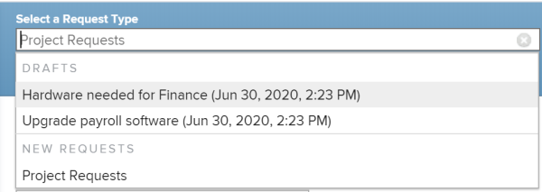
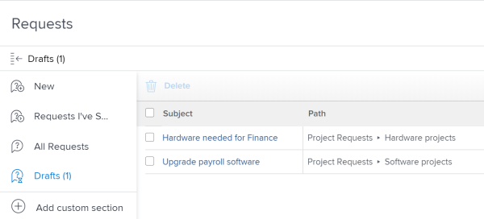

# Create and submit `Workfront` requests  {#create-and-submit-workfront-requests}

The highlighted information on this page refers to functionality not yet generally available. It is available only in the Preview Sandbox environment.

Planned work is represented in `Workfront` by projects and tasks. However, you might work in an environment where unplanned work, in the form of random requests, can come in at any time. `Workfront` provides a workflow to accommodate this type of environment through the use of Request Queues.&nbsp;

After you create a request in a Request Queue, you can either assign it to be completed or you can convert it to a task or a project.   
For more information about converting issues to a task or project, see the article [Convert issues](convert-issues.md).

## Prerequisites for using Request Queues {#prerequisites-for-using-request-queues}

As a `Workfront administrator`, you must create Request Queues and make them available to users&nbsp;before users can use this functionality. A user with a Planner license and with Edit access to Projects and Manage permissions to a specific project can also create Request Queues.&nbsp;

For information about how to create Requests Queues, see the article [Create a Request Queue](create-request-queue.md).

You must create the following components of a Request Queue:

* A project in Current status, published as a Help Request&nbsp;Queue.
* Queue Topics. For more information, see the article [Create Queue Topics](create-queue-topics.md).
* Routing Rules. For more information, see the article [Create Routing Rules](create-routing-rules.md).
* (Optional) Topic Groups. For more information, see the article [Create Topic Groups](create-topic-groups.md).
* (Optional) Request custom form. For more information, see the article [Create a Custom Form](create-a-custom-form.md).
* (Optional) Request approval process. For more information, see the article [Create and edit approval processes](create-approval-processes.md).

## Create requests in the `Workfront` web app {#create-requests-in-the-workfront-web-app}

When you create a request in the `Workfront` web app, `Workfront` saves the request as a draft as soon as you have selected your queue topic and start updating information on the request form. You can continue submitting the request, or you can complete as much information as you have available and save the request in the Drafts area to finish it later. `Workfront` saves one draft for each queue topic. 

>[!IMPORTANT] {type="important"}
>
>Consider the following when working with drafts:
>
>
>
>* `Workfront` does not create draft requests when you submit them from a third party application, like the `Workfront` mobile app, email, or any another application. When you submit a request from outside the `Workfront` web app the request is saved in the All&nbsp;Requests or Requests I've Submitted `<MadCap:conditionalText data-mc-conditions="QuicksilverOrClassic.Quicksilver"> sections</MadCap:conditionalText>`. 
>
>* If the structure of a request queue changes, you can no longer access existing drafts.&nbsp;For example, if a queue topic is removed, or a topic group is added, the saved drafts are no longer accessible. 
>
>

* [Create requests in the New requests area](#create) 
* [Create requests from drafts](#create2) 
* [Delete a request draft](#delete) 

### Create requests in the New requests area {#create-requests-in-the-new-requests-area}

When you create a request in the New request area, you can do one of the following:

* Create a request from scratch
* Use an existing draft and submit it as a new request

To create a new request in the New requests area: 

1.  Click the **Main Menu** icon  in the upper-right corner of `Workfront`.
1.  Click&nbsp;**Requests**. The **New **request section displays by default. 
1.  In the **Select a Request Type** drop-down menu, do one of the following:

    
    
    *   (Conditional) Select an available draft from the **Drafts** section. The three most recent drafts from three different queue topics display by default. This area displays only if you have saved drafts before without submitting them. 
    
    
          
    

    
    
      Or
    
    *  Choose the Request Queue for your request. 
    
    
      The first 200 requests queues display by default, in alphabetical order. 
    
    
      The name of the Request Queue is the name of the project, which has been published as a Help Request Queue. 
    
    
      For more information about how to publish a project as a Help&nbsp;Request Queue, see the article [Create a Request Queue](create-request-queue.md).
    
    
    

1. (Optional) If your Request Queue includes Topic Groups, select the name of the Topic Group in the first drop-down field.   
   You can have up to 10 tiers of Topic Groups built into&nbsp;your Request Queue.   
   For more information about how to create Topic Groups, see the article [Create Topic Groups](create-topic-groups.md).

1. Select the Queue Topic from the following drop-down menu.  
   For more information about creating Queue Topics, see the article [Create Queue Topics](create-queue-topics.md).

1.  (Conditional) Do one of the following: 

    
    
    * If you create the request for the first time, a draft is automatically saved for you in the Drafts area. Continue entering your request. 
    *  If you have started a request for this queue topic before and you did not submit it when you first created it, a draft of your request is saved in the Drafts area. Click **Use Draft** if you want to continue editing the draft
    
    
      Or
    
    
      Click **Replace Draft** to delete it and start a new request. `Workfront` saves one draft per queue topic. 
    
    
      A new draft is automatically saved for you in the Drafts `<MadCap:conditionalText data-mc-conditions="QuicksilverOrClassic.Quicksilver"> section</MadCap:conditionalText>`. 
    
    
    

1. Depending on what fields the system administrator enabled in the **New Issue Fields** section of the **Queue Details**&nbsp;sub-tab on the project, you might find&nbsp;any of the following fields when you submit a new request:  

<table style="width: 100%;mc-table-style: url('../../../Resources/TableStyles/TableStyle-List-options-in-steps.css');" class="TableStyle-TableStyle-List-options-in-steps" cellspacing="0">
 <col style="width: 201px;" class="TableStyle-TableStyle-List-options-in-steps-Column-Column1">
 <col style="width: 50%;" class="TableStyle-TableStyle-List-options-in-steps-Column-Column2">
 <thead>
  <tr>
   <th class="TableStyle-TableStyle-List-options-in-steps-HeadH-Column1-">&nbsp;</th>
   <th class="TableStyle-TableStyle-List-options-in-steps-HeadG-Column2-">&nbsp;</th>
  </tr>
 </thead>
 <tbody>
  <tr class="TableStyle-TableStyle-List-options-in-steps-Body-LightGray">
   <td class="TableStyle-TableStyle-List-options-in-steps-BodyE-Column1-LightGray"><b>Subject</b></td>
   <td class="TableStyle-TableStyle-List-options-in-steps-BodyD-Column2-LightGray">Specify a name for your request. This is a mandatory field.</td>
  </tr>
  <tr class="TableStyle-TableStyle-List-options-in-steps-Body-MediumGray">
   <td class="TableStyle-TableStyle-List-options-in-steps-BodyE-Column1-MediumGray"><b>Description</b></td>
   <td class="TableStyle-TableStyle-List-options-in-steps-BodyD-Column2-MediumGray">Specify a description for your request.</td>
  </tr>
  <tr class="TableStyle-TableStyle-List-options-in-steps-Body-LightGray">
   <td class="TableStyle-TableStyle-List-options-in-steps-BodyE-Column1-LightGray"><b>URL</b></td>
   <td class="TableStyle-TableStyle-List-options-in-steps-BodyD-Column2-LightGray">Specify a URL that might relate to your request.</td>
  </tr>
  <tr class="TableStyle-TableStyle-List-options-in-steps-Body-MediumGray">
   <td class="TableStyle-TableStyle-List-options-in-steps-BodyE-Column1-MediumGray"><b>Priority</b></td>
   <td class="TableStyle-TableStyle-List-options-in-steps-BodyD-Column2-MediumGray">
Specify a priority for your request. The priority should define how fast you think this request should be resolved. The default&nbsp;options are: 

    <ul>
     <li value="1">None</li>
     <li value="2">Low </li>
     <li value="3">Normal</li>
     <li value="4">High</li>
     <li value="5">Urgent</li>
    </ul>
Your system administrator can modify the names of priorities.
</td>
  </tr>
  <tr class="TableStyle-TableStyle-List-options-in-steps-Body-LightGray">
   <td class="TableStyle-TableStyle-List-options-in-steps-BodyE-Column1-LightGray"><b>Severity</b></td>
   <td class="TableStyle-TableStyle-List-options-in-steps-BodyD-Column2-LightGray">
Specify a severity for your request. The severity should define the impact this request has on your work should it not be resolved in time. The default&nbsp;options are:

    <ul>
     <li value="1">Cosmetic</li>
     <li value="2">Causes Confusion</li>
     <li value="3">Bug with workaround</li>
     <li value="4">Bug with no workaround</li>
     <li value="5">Fatal error</li>
    </ul>
Your system administrator can modify the names of severities.
</td>
  </tr>
  <tr class="TableStyle-TableStyle-List-options-in-steps-Body-MediumGray">
   <td class="TableStyle-TableStyle-List-options-in-steps-BodyE-Column1-MediumGray"><b>Primary Contact</b></td>
   <td class="TableStyle-TableStyle-List-options-in-steps-BodyD-Column2-MediumGray">The Primary Contact of a request defaults to you, as you are the point person to address any questions pertaining to the request. However, you can change this to any other Workfront user.</td>
  </tr>
  <tr class="TableStyle-TableStyle-List-options-in-steps-Body-LightGray">
   <td class="TableStyle-TableStyle-List-options-in-steps-BodyE-Column1-LightGray"><b>Assigned To</b></td>
   <td class="TableStyle-TableStyle-List-options-in-steps-BodyD-Column2-LightGray">Specify the name of a user who this request should be assigned to. We recommend using Routing Rules for your Request Queues so that they can be automatically routed to the appropriate resources.</td>
  </tr>
  <tr class="TableStyle-TableStyle-List-options-in-steps-Body-MediumGray">
   <td class="TableStyle-TableStyle-List-options-in-steps-BodyE-Column1-MediumGray"><b>Job Role</b></td>
   <td class="TableStyle-TableStyle-List-options-in-steps-BodyD-Column2-MediumGray">Specify the name of a job role that the request should be assigned to.&nbsp;We recommend using Routing Rules for your Request Queues so that they can be automatically routed to the appropriate resources.</td>
  </tr>
  <tr class="TableStyle-TableStyle-List-options-in-steps-Body-LightGray">
   <td class="TableStyle-TableStyle-List-options-in-steps-BodyE-Column1-LightGray"><b>Team</b></td>
   <td class="TableStyle-TableStyle-List-options-in-steps-BodyD-Column2-LightGray">Specify the name of a team that the request should be assigned to.&nbsp;We recommend using Routing Rules for your Request Queues so that they can be automatically routed to the appropriate resources.</td>
  </tr>
  <tr class="TableStyle-TableStyle-List-options-in-steps-Body-MediumGray">
   <td class="TableStyle-TableStyle-List-options-in-steps-BodyE-Column1-MediumGray"><b>Planned Hours</b></td>
   <td class="TableStyle-TableStyle-List-options-in-steps-BodyD-Column2-MediumGray">Estimate how many hours it would take for this request to complete.</td>
  </tr>
  <tr class="TableStyle-TableStyle-List-options-in-steps-Body-LightGray">
   <td class="TableStyle-TableStyle-List-options-in-steps-BodyE-Column1-LightGray"><b>Planned Start Date</b></td>
   <td class="TableStyle-TableStyle-List-options-in-steps-BodyD-Column2-LightGray">Specify the date when work on this request should start.</td>
  </tr>
  <tr class="TableStyle-TableStyle-List-options-in-steps-Body-MediumGray">
   <td class="TableStyle-TableStyle-List-options-in-steps-BodyE-Column1-MediumGray"><b>Planned Completion Date</b></td>
   <td class="TableStyle-TableStyle-List-options-in-steps-BodyD-Column2-MediumGray">Specify the date when you would like for this request to be resolved.</td>
  </tr>
  <tr class="TableStyle-TableStyle-List-options-in-steps-Body-LightGray">
   <td class="TableStyle-TableStyle-List-options-in-steps-BodyE-Column1-LightGray"><b>Status</b></td>
   <td class="TableStyle-TableStyle-List-options-in-steps-BodyD-Column2-LightGray">The default status of a new request is "New." Your system administrator might have changed the name of this&nbsp;status. You can also change the status to something else from this drop-down menu.</td>
  </tr>
  <tr class="TableStyle-TableStyle-List-options-in-steps-Body-MediumGray">
   <td class="TableStyle-TableStyle-List-options-in-steps-BodyB-Column1-MediumGray"><b>Documents</b></td>
   <td class="TableStyle-TableStyle-List-options-in-steps-BodyA-Column2-MediumGray">
Add documents to your request. 

Documents that you upload to Workfront are stored for 24 hours in a drafted request. After that, you must reattach them when you return to edit and submit the draft. Documents that are linked from other drives are saved on the draft permanently. 
</td>
  </tr>
 </tbody>
</table>

1. (Optional) If your `Workfront administrator` associated a custom form with the Request Queue or with the Queue Topic, specify the fields inside the custom form.   
   Custom forms are different for every `Workfront` instance.&nbsp;

1.  Click **Submit Request** if you are ready to submit the request

   Or

   Click&nbsp;**Cancel** if you are not quite ready to submit it and you might come back to finish it later. Your request is saved in the Drafts area and it will be available to you next time you submit a request for this queue topic. 

   When you submit the request, the draft is automatically deleted and cannot be restored. 
   This creates a request in `Workfront`. Depending on the Routing Rule of the Request Queue, this request can be routed to a different project than the one designated&nbsp;as a Request Queue.  
   For more information about addressing incoming requests, see the article [Manage Work and Team Requests](manage-work-and-team-requests.md).

   For information about locating submitted `or drafted` requests, see [Locate submitted requests](locate-submitted-requests.md). 

### Create requests from drafts {#create-requests-from-drafts}

In addition to using the available drafts that `Workfront` suggests to you when you enter a new request in the New requests area, you can also access a draft request from the Drafts area and finish submitting it from there. 

1.  Click the **Main Menu** icon  in the upper-right corner of `Workfront`.
1.  Click&nbsp;**Requests**>**Drafts**.

   A draft for each queue topic of each request queue displays in this list. 

   

1. Click the name of a draft to open it. 
1.  Update the information for the request as described in steps 7-9 in the section [Create requests in the New requests area](#create) in this article and submit the request or save it again as a draft. 

   For information about locating submitted `or drafted` requests, see [Locate submitted requests](locate-submitted-requests.md). 

### Delete a request draft {#delete-a-request-draft}

You can delete drafted requests if you no longer find them relevant. Deleted draft requests cannot be recovered. 

1.  Click the **Main Menu** icon  in the upper-right corner of `Workfront`.
1.  Click&nbsp;**Requests**, then click **Drafts** in the left panel.

   A draft for each queue topic of each request queue displays in this list. 

1. Select a draft in the list, then click **Delete** at the top of the list.
1.  Click **Yes,&nbsp;Delete it**. 

   The draft is deleted and cannot be recovered. 

## Create requests from outside of `Workfront` {#create-requests-from-outside-of-workfront}

After your `Workfront administrator` creates the Request Queue, you can share the URL of that request queue outside of `Workfront`, or&nbsp;embed it in other applications you use in your organization.&nbsp;

You can share a Request Queue by doing one of the following:

* Using a Direct Access URL to the request.
* Embedding the code of the Request Queue into an iframe.&nbsp;

For information about the Direct Access URL and the Embed Code field, see the article [Create a Request Queue](create-request-queue.md).

## Create requests by emailing into `Workfront` {#create-requests-by-emailing-into-workfront}

If your Request Queue is enabled to receive requests through email, you can email your requests directly to the email associated with the Request Queue.&nbsp; 

For information about how to enable a Request Queue to receive requests through email, see the article Overview of the Queue Details tab in a project.

## Create requests using the Outlook&nbsp;client {#create-requests-using-the-outlook-client}

You can submit requests using the Outlook client. You can create a new request or you can convert an email into a request.&nbsp;

For information about submitting requests using the Outlook client, see the article `<MadCap:conditionalText data-mc-conditions="QuicksilverOrClassic.Quicksilver"> <a href="https://experience.workfront.com/s/article/Creating-a-Workfront-Request-from-an-Outlook-Email-371931497">Creating a Workfront Request from an Outlook Email</a>.</MadCap:conditionalText>`

## Create requests by using the `Workfront` mobile app {#create-requests-by-using-the-workfront-mobile-app}

You can submit requests using the mobile app on your smartphone. You can create a new request&nbsp;and submit it to the Request Queues you have access to see in the web application.&nbsp;

For information about submitting requests&nbsp;through the mobile app, see the [Requests](workfront-for-android.md#requests) section in the article [Workfront for Android](https://experience.workfront.com/s/article/Workfront-for-Android-820125263). Or, see the [Requests](workfront-for-ios.md#requests) section in the article [Workfront for iOS](https://experience.workfront.com/s/article/Workfront-for-iOS-1673366871).

## Create requests from other applications {#create-requests-from-other-applications}

You can submit requests using any applications that have been integrated with `Workfront`:&nbsp;

* You can build a custom integration between `Workfront` and another application that allows you to submit requests to `Workfront` from the other application.  
  For more information about custom `Workfront` integrations, see the article [Workfront integrations](workfront-integrations.md).

* You can submit requests from Salesforce if you have installed the `Workfront` app for Salesforce.  
  For information about submitting requests from Salesforce using our `Workfront` app for Salesforce, see the article`<MadCap:conditionalText data-mc-conditions="QuicksilverOrClassic.Quicksilver">  <a href="https://experience.workfront.com/s/article/Submitting-Workfront-Requests-from-Salesforce-Objects-670771275">Submitting Workfront Requests from Salesforce Object</a>s.</MadCap:conditionalText>`

## Locate submitted requests {#locate-submitted-requests}

For information about locating submitted `or drafted` requests, see [Locate submitted requests](locate-submitted-requests.md). 
