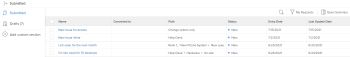

# Locate submitted requests

You can locate the following types of requests that you or someone else submitted, or requests you started but you never finished submitting. You can locate these requests in the following areas of *Adobe Workfront*:

<ul> <draft-comment>
  <li data-mc-conditions="QuicksilverOrClassic.Quicksilver"> 
Submitted section: All requests that you or someone else submitted and you have access to at least View. 
 </li>
 </draft-comment>
 <li data-mc-conditions="QuicksilverOrClassic.Quicksilver"> 
Submitted section: All requests that you or someone else submitted and you have access to at least View. 
 </li> 
 <li> 
Draft <draft-comment>
    <MadCap:conditionalText data-mc-conditions="QuicksilverOrClassic.Quicksilver">
     section 
    </MadCap:conditionalText>
   </draft-comment><MadCap:conditionalText data-mc-conditions="QuicksilverOrClassic.Quicksilver">
    section 
   </MadCap:conditionalText>: All requests that you started but you never finished and you never submitted. For more information about draft requests, see <a href="../../../manage-work/requests/create-requests/create-submit-requests.md" class="MCXref xref">Create and submit Adobe Workfront requests</a>.
 <note type="tip">
   You can only view your own draft requests. 
  </note> </li> 
</ul>

## Access requirements

You must have the following to perform the steps in this article:

<table cellspacing="0"> 
 <col> 
 <col> 
 <tbody> 
  <tr> 
   <td role="rowheader"><em>Adobe Workfront</em> plan*</td> 
   <td> 
Any 
 </td> 
  </tr> 
  <tr> 
   <td role="rowheader"><em>Adobe Workfront</em> licenses overview*</td> 
   <td> 
<em>Request</em> or higher
 </td> 
  </tr> 
  <tr> 
   <td role="rowheader">Access level configurations*</td> 
   <td> 
Edit access to Issues
 
Note: If you still don't have access, ask your <em>Workfront administrator</em> if they set additional restrictions in your access level. For information on how a <em>Workfront administrator</em> can modify your access level, see <a href="../../../administration-and-setup/add-users/configure-and-grant-access/create-modify-access-levels.md" class="MCXref xref">Create or modify custom access levels</a>.
 </td> 
  </tr> 
  <tr> 
   <td role="rowheader">Object permissions</td> 
   <td> 
View permissions on the requests or higher
 
For information on requesting additional access, see <a href="../../../workfront-basics/grant-and-request-access-to-objects/request-access.md" class="MCXref xref">Request access to objects in Adobe Workfront</a>.
 </td> 
  </tr> 
 </tbody> 
</table>

&#42;To find out what plan, license type, or access you have, contact your *Workfront administrator*.

## Locate submitted requests

<!--

<h2>Locate submitted requests in Production</h2>

To locate requests that you or other users have submitted <draft-comment>
<MadCap:conditionalText data-mc-conditions="QuicksilverOrClassic.Quicksilver">
in the Production environment
</MadCap:conditionalText>
</draft-comment><MadCap:conditionalText data-mc-conditions="QuicksilverOrClassic.Quicksilver">
in the Production environment
</MadCap:conditionalText>:

<ol>
<li value="1"> 
Go to the Requests area in the Global Navigation Bar.
 
Click the Main Menu icon  in the upper-right corner of <em>Adobe Workfront</em>.
 </li>
<li value="2"> 
Click&nbsp;Requests I've Submitted <draft-comment>
<MadCap:conditionalText data-mc-conditions="QuicksilverOrClassic.Quicksilver">
in the left panel
</MadCap:conditionalText>
</draft-comment><MadCap:conditionalText data-mc-conditions="QuicksilverOrClassic.Quicksilver">
in the left panel
</MadCap:conditionalText> to view all the requests that you have submitted. 
 
Or Click&nbsp;All Requests&nbsp;to view all requests that other users have submitted and which you have permissions to at least View. 
 
You can display up to 100 requests in the Requests I've Submitted and All Requests <draft-comment>
<MadCap:conditionalText data-mc-conditions="QuicksilverOrClassic.Quicksilver">
sections
</MadCap:conditionalText>
</draft-comment><MadCap:conditionalText data-mc-conditions="QuicksilverOrClassic.Quicksilver">
sections
</MadCap:conditionalText>. Requests that are pending approval do not display.
 </li>
<li value="3">Click the&nbsp;Open&nbsp;subtab to view requests that are open. Requests without an Actual Completion Date or whose resolving object does not have an Actual Completion Date are listed in the Open subtab.</li>
<li value="4">Click the&nbsp;Complete subtab to view requests that have been completed.  Requests with an Actual Completion Date or whose resolving object has an Actual Completion Date are listed in the Complete subtab. Once a request receives an Actual Completion Date, it stays in the Recently Completed area for 10 business days. After that, it is moved to the Completed area.  For information about resolving and resolvable objects, see the article <a href="../../../manage-work/issues/convert-issues/resolving-and-resolvable-objects.md" class="MCXref xref">Overview of Resolving and Resolvable Objects </a>.</li>
<li value="5">(Optional) Select an option from the Sort by drop-down menu to sort the requests by the following criteria:&nbsp;
<ul>
<li>
Assigned To: Requests are sorted alphabetically by the name of the assignee using the following criteria:&nbsp;

<ul>
<li>All requests assigned to users are sorted first, in the order of the users' names.</li>
<li>Requests assigned to job roles are sorted secondly, in the order of the job roles' names and are listed after all the requests assigned to users.</li>
<li>Requests that are assigned to teams are sorted last, in the order of the teams' names and are listed after all the requests assigned to users and those assigned to job roles.</li>
<li>All unassigned requests are listed last, in the order of their Entry Date. </li>
</ul></li>
<li>Submitted On: Requests are sorted chronologically by the date when they were submitted.</li>
<li>Recently Updated (this is the default): Requests are sorted chronologically by the date of their last update.</li>
<li>Name: Requests are sorted alphabetically by name.&nbsp;</li>
<li>Priority: Requests are sorted in the order of their priority.</li>
<li>Queue: Requests are sorted alphabetically by the name of the requests queue where they were submitted.&nbsp;</li>
<li>Status: Requests are sorted alphabetically by their status.&nbsp;</li>
</ul></li>
<li value="6"> 
Click Draft Requests to view all drafted requests. <em>Workfront</em> saves an unlimited number of drafts for each request queue in this folder. When you enter a new request for a queue topic that already has a draft, you will be prompted to use an existing draft. For more information about drafted requests, see the <a href="#create-requests-in-the-web-app" class="MCXref xref">Locate submitted requests</a> section in this article. 
 </li>
</ol>

-->

## Locate submitted requests in Production

To locate requests that you or other users have submitted `<MadCap:conditionalText data-mc-conditions="QuicksilverOrClassic.Quicksilver"> in the Production environment</MadCap:conditionalText>`:

<ol> 
 <li value="1"> 
Go to the Requests area in the Global Navigation Bar.
 
Click the Main Menu icon  in the upper-right corner of <em>Adobe Workfront</em>.
 </li> 
 <li value="2"> 
Click&nbsp;Requests I've Submitted <MadCap:conditionalText data-mc-conditions="QuicksilverOrClassic.Quicksilver">
    in the left panel
   </MadCap:conditionalText> to view all the requests that you have submitted. 
 
Or Click&nbsp;All Requests&nbsp;to view all requests that other users have submitted and which you have permissions to at least View. 
 
You can display up to 100 requests in the Requests I've Submitted and All Requests <MadCap:conditionalText data-mc-conditions="QuicksilverOrClassic.Quicksilver">
    sections
   </MadCap:conditionalText>. Requests that are pending approval do not display.
 </li> 
 <li value="3">Click the&nbsp;Open&nbsp;subtab to view requests that are open. Requests without an Actual Completion Date or whose resolving object does not have an Actual Completion Date are listed in the Open subtab.</li> 
 <li value="4">Click the&nbsp;Complete subtab to view requests that have been completed.  Requests with an Actual Completion Date or whose resolving object has an Actual Completion Date are listed in the Complete subtab. Once a request receives an Actual Completion Date, it stays in the Recently Completed area for 10 business days. After that, it is moved to the Completed area.  For information about resolving and resolvable objects, see the article <a href="../../../manage-work/issues/convert-issues/resolving-and-resolvable-objects.md" class="MCXref xref">Overview of Resolving and Resolvable Objects </a>.</li> 
 <li value="5">(Optional) Select an option from the Sort by drop-down menu to sort the requests by the following criteria:&nbsp; 
  <ul>
   <li>
Assigned To: Requests are sorted alphabetically by the name of the assignee using the following criteria:&nbsp;

    <ul>
     <li>All requests assigned to users are sorted first, in the order of the users' names.</li>
     <li>Requests assigned to job roles are sorted secondly, in the order of the job roles' names and are listed after all the requests assigned to users.</li>
     <li>Requests that are assigned to teams are sorted last, in the order of the teams' names and are listed after all the requests assigned to users and those assigned to job roles.</li>
     <li>All unassigned requests are listed last, in the order of their Entry Date. </li>
    </ul></li>
   <li>Submitted On: Requests are sorted chronologically by the date when they were submitted.</li>
   <li>Recently Updated (this is the default): Requests are sorted chronologically by the date of their last update.</li>
   <li>Name: Requests are sorted alphabetically by name.&nbsp;</li>
   <li>Priority: Requests are sorted in the order of their priority.</li>
   <li>Queue: Requests are sorted alphabetically by the name of the requests queue where they were submitted.&nbsp;</li>
   <li>Status: Requests are sorted alphabetically by their status.&nbsp;</li>
  </ul></li> 
 <li value="6"> 
Click Draft Requests to view all drafted requests. <em>Workfront</em> saves an unlimited number of drafts for each request queue in this folder. When you enter a new request for a queue topic that already has a draft, you will be prompted to use an existing draft. For more information about drafted requests, see the <a href="#create-requests-in-the-web-app" class="MCXref xref">Locate submitted requests</a> section in this article. 
 </li> 
</ol>

<!--

To locate requests that you or other users have submitted:

<ol>
<li value="1"> 
Click the Main Menu icon  in the upper-right corner of <em>Adobe Workfront</em>.
 </li>
<li value="2"> 
Click&nbsp;Submitted in the left panel to view all submitted requests. 
 
You can view up to 2000 requests and they may display on multiple pages.
 <note type="tip">
You cannot customize the columns in the Submitted request list.
</note> 
  
 </li>
<li value="3"> 
The following columns display by default:

<table cellspacing="0">
<col>
<col>
<tbody>
<tr>
<td role="rowheader">Name</td>
<td> 
The name of the request.
 
Click the name of a request to open it. 
 <note type="tip">
If the issue was not preserved when it was converted to a task or a project, the name of the issue is dimmed and can no longer be clicked. For information about converting issues, see
<a href="../../../manage-work/issues/convert-issues/convert-issues.md" class="MCXref xref">Overview of converting issues in Adobe Workfront</a>.
</note> </td>
</tr>
<tr>
<td role="rowheader">Converted to</td>
<td> 
The name of the resolving object which can be a task or project that the request was converted to. 
 
Click the name of the task or project to open them. 
 
If the request was not converted, this field is empty. 
 </td>
</tr>
<tr>
<td role="rowheader">Path</td>
<td>The name of the request queue, topic groups, and queue topics where the request was originally submitted. </td>
</tr>
<tr>
<td role="rowheader">Status</td>
<td>The current status of the request or of the resolving object (task or project)</td>
</tr>
<tr>
<td role="rowheader">Entry Date</td>
<td>The date when the request was submitted or the date when the resolving object was created if the request was deleted when converted. </td>
</tr>
<tr>
<td role="rowheader">Last Update Date</td>
<td> 
The date when the request was updated last.
 
The Submitted request list is sorted by this field, by default. 
 </td>
</tr>
</tbody>
</table> </li>
<li value="4"> 
(Optional) Click the header of a column to sort by it.

Tip: </b>">
<b>Tip: </b>

When you navigate away from the Submitted requests list, the selected sorting option is preserved. 

 </li>
<li value="5"> 
(Optional) Select a request in the list , then click the Open Summary icon  to open the Summary panel and display additional information about the request, add comments, documents, or assign it. For information about the Summary panel, see <a href="../../../workfront-basics/the-new-workfront-experience/summary-overview.md" class="MCXref xref">Summary overview in the new Adobe Workfront experience</a>. 
 <note type="tip">
If the Summary panel is already opened, the Open&nbsp;Summary icon changes to Close Summary.
</note> </li>
<li value="6"> 
(Optional and conditional) Click the X icon in the upper-right corner or the Close Summary icon  to close the Summary Panel. 
 
If an issue was converted to a task or project and the issue was deleted in the conversion process, the Summary panel is blank. For information about converting issues, see <a href="../../../manage-work/issues/convert-issues/convert-issues.md" class="MCXref xref">Overview of converting issues in Adobe Workfront</a>. 
 </li>
<li value="7"> 
From the Filter icon  in the top right of the list, select any of the following filters: 

<table cellspacing="0">
<col>
<col>
<tbody>
<tr>
<td role="rowheader">All</td>
<td>All submitted requests, regardless of status or who submitted them.</td>
</tr>
<tr>
<td role="rowheader">Open</td>
<td> 
All submitted requests that are currently open, regardless of who submitted them. Only requests you have at least permissions to view display here if you did not submit them yourself. 
 
Requests without an Actual Completion Date or whose resolving object does not have an Actual Completion Date are listed in the Open subtab.
 <note type="tip">
Requests that are in any status that does not equate with Closed are considered open.
</note> </td>
</tr>
<tr>
<td role="rowheader">My Requests</td>
<td>Requests you submitted regardless of their status. </td>
</tr>
<tr>
<td role="rowheader">My Open&nbsp;Requests</td>
<td> 
Requests you submitted that are still open. 
 
Requests without an Actual Completion Date or whose resolving object does not have an Actual Completion Date are listed in the My Open Requests subtab.&nbsp;
 <note type="tip">
Requests that are not in a status that equates with Closed are considered open.
</note> </td>
</tr>
</tbody>
</table> </li>
<li value="8"> 
(Optional) Click the Filter page icon at the top of the list to search for a request by name. The list updates with results that match your search criteria. 
 </li> <draft-comment>
<li value="9" data-mc-conditions="QuicksilverOrClassic.Draft mode">Click the&nbsp;Complete subtab to view requests that have been completed.  Requests with an Actual Completion Date or whose resolving object has an Actual Completion Date are listed in the Complete subtab. Once a request receives an Actual Completion Date, it stays in the Recently Completed area for 10 business days. After that, it is moved to the Completed area.  For information about resolving and resolvable objects, see the article <a href="../../../manage-work/issues/convert-issues/resolving-and-resolvable-objects.md" class="MCXref xref">Overview of Resolving and Resolvable Objects </a>.</li>
</draft-comment>
<li value="9" data-mc-conditions="QuicksilverOrClassic.Draft mode">Click the&nbsp;Complete subtab to view requests that have been completed.  Requests with an Actual Completion Date or whose resolving object has an Actual Completion Date are listed in the Complete subtab. Once a request receives an Actual Completion Date, it stays in the Recently Completed area for 10 business days. After that, it is moved to the Completed area.  For information about resolving and resolvable objects, see the article <a href="../../../manage-work/issues/convert-issues/resolving-and-resolvable-objects.md" class="MCXref xref">Overview of Resolving and Resolvable Objects </a>.</li> <draft-comment>
<li value="10" data-mc-conditions="QuicksilverOrClassic.Draft mode">(Optional) Select an option from the Sort by drop-down menu to sort the requests by the following criteria:&nbsp;
<ul>
<li>
Assigned To: Requests are sorted alphabetically by the name of the assignee using the following criteria:&nbsp;

<ul>
<li>All requests assigned to users are sorted first, in the order of the users' names.</li>
<li>Requests assigned to job roles are sorted secondly, in the order of the job roles' names and are listed after all the requests assigned to users.</li>
<li>Requests that are assigned to teams are sorted last, in the order of the teams' names and are listed after all the requests assigned to users and those assigned to job roles.</li>
<li>All unassigned requests are listed last, in the order of their Entry Date. </li>
</ul></li>
<li>Submitted On: Requests are sorted chronologically by the date when they were submitted.</li>
<li>Recently Updated (this is the default): Requests are sorted chronologically by the date of their last update.</li>
<li>Name: Requests are sorted alphabetically by name.&nbsp;</li>
<li>Priority: Requests are sorted in the order of their priority.</li>
<li>Queue: Requests are sorted alphabetically by the name of the requests queue where they were submitted.&nbsp;</li>
<li>Status: Requests are sorted alphabetically by their status.&nbsp;</li>
</ul></li>
</draft-comment>
<li value="10" data-mc-conditions="QuicksilverOrClassic.Draft mode">(Optional) Select an option from the Sort by drop-down menu to sort the requests by the following criteria:&nbsp;
<ul>
<li>
Assigned To: Requests are sorted alphabetically by the name of the assignee using the following criteria:&nbsp;

<ul>
<li>All requests assigned to users are sorted first, in the order of the users' names.</li>
<li>Requests assigned to job roles are sorted secondly, in the order of the job roles' names and are listed after all the requests assigned to users.</li>
<li>Requests that are assigned to teams are sorted last, in the order of the teams' names and are listed after all the requests assigned to users and those assigned to job roles.</li>
<li>All unassigned requests are listed last, in the order of their Entry Date. </li>
</ul></li>
<li>Submitted On: Requests are sorted chronologically by the date when they were submitted.</li>
<li>Recently Updated (this is the default): Requests are sorted chronologically by the date of their last update.</li>
<li>Name: Requests are sorted alphabetically by name.&nbsp;</li>
<li>Priority: Requests are sorted in the order of their priority.</li>
<li>Queue: Requests are sorted alphabetically by the name of the requests queue where they were submitted.&nbsp;</li>
<li>Status: Requests are sorted alphabetically by their status.&nbsp;</li>
</ul></li>
<li value="11"> 
Click Drafts to view all drafted requests. <em>Workfront</em> saves an unlimited number of drafts for each request queue in this folder. When you enter a new request for a queue topic that already has a draft, you will be prompted to use an existing draft. For more information, see <a href="../../../manage-work/requests/create-requests/create-requests-from-drafts.md" class="MCXref xref">Create requests from drafts</a>. 
 </li>
</ol>

-->

To locate requests that you or other users have submitted:

<ol> 
 <li value="1"> 
Click the Main Menu icon  in the upper-right corner of <em>Adobe Workfront</em>.
 </li> 
 <li value="2"> 
Click&nbsp;Submitted in the left panel to view all submitted requests. 
 
You can view up to 2000 requests and they may display on multiple pages.
 <note type="tip">
   You cannot customize the columns in the Submitted request list. 
  </note> 
  
 </li> 
 <li value="3"> 
The following columns display by default:
 
  <table cellspacing="0"> 
   <col> 
   <col> 
   <tbody> 
    <tr> 
     <td role="rowheader">Name</td> 
     <td> 
The name of the request.
 
Click the name of a request to open it. 
 <note type="tip">
       If the issue was not preserved when it was converted to a task or a project, the name of the issue is dimmed and can no longer be clicked. For information about converting issues, see 
       <a href="../../../manage-work/issues/convert-issues/convert-issues.md" class="MCXref xref">Overview of converting issues in Adobe Workfront</a>. 
      </note> </td> 
    </tr> 
    <tr> 
     <td role="rowheader">Converted to</td> 
     <td> 
The name of the resolving object which can be a task or project that the request was converted to. 
 
Click the name of the task or project to open them. 
 
If the request was not converted, this field is empty. 
 </td> 
    </tr> 
    <tr> 
     <td role="rowheader">Path</td> 
     <td>The name of the request queue, topic groups, and queue topics where the request was originally submitted. </td> 
    </tr> 
    <tr> 
     <td role="rowheader">Status</td> 
     <td>The current status of the request or of the resolving object (task or project)</td> 
    </tr> 
    <tr> 
     <td role="rowheader">Entry Date</td> 
     <td>The date when the request was submitted or the date when the resolving object was created if the request was deleted when converted. </td> 
    </tr> 
    <tr> 
     <td role="rowheader">Last Update Date</td> 
     <td> 
The date when the request was updated last.
 
The Submitted request list is sorted by this field, by default. 
 </td> 
    </tr> 
   </tbody> 
  </table> </li> 
 <li value="4"> 
(Optional) Click the header of a column to sort by it.
 
  
Tip: </b>">
   <b>Tip: </b> 
   
When you navigate away from the Submitted requests list, the selected sorting option is preserved. 
 
  
 </li> 
 <li value="5"> 
(Optional) Select a request in the list , then click the Open Summary icon  to open the Summary panel and display additional information about the request, add comments, documents, or assign it. For information about the Summary panel, see <a href="../../../workfront-basics/the-new-workfront-experience/summary-overview.md" class="MCXref xref">Summary overview in the new Adobe Workfront experience</a>. 
 <note type="tip">
   If the Summary panel is already opened, the Open&nbsp;Summary icon changes to Close Summary. 
  </note> </li> 
 <li value="6"> 
(Optional and conditional) Click the X icon in the upper-right corner or the Close Summary icon  to close the Summary Panel. 
 
If an issue was converted to a task or project and the issue was deleted in the conversion process, the Summary panel is blank. For information about converting issues, see <a href="../../../manage-work/issues/convert-issues/convert-issues.md" class="MCXref xref">Overview of converting issues in Adobe Workfront</a>. 
 </li> 
 <li value="7"> 
From the Filter icon  in the top right of the list, select any of the following filters: 
 
  <table cellspacing="0"> 
   <col> 
   <col> 
   <tbody> 
    <tr> 
     <td role="rowheader">All</td> 
     <td>All submitted requests, regardless of status or who submitted them.</td> 
    </tr> 
    <tr> 
     <td role="rowheader">Open</td> 
     <td> 
All submitted requests that are currently open, regardless of who submitted them. Only requests you have at least permissions to view display here if you did not submit them yourself. 
 
Requests without an Actual Completion Date or whose resolving object does not have an Actual Completion Date are listed in the Open subtab.
 <note type="tip">
       Requests that are in any status that does not equate with Closed are considered open.
      </note> </td> 
    </tr> 
    <tr> 
     <td role="rowheader">My Requests</td> 
     <td>Requests you submitted regardless of their status. </td> 
    </tr> 
    <tr> 
     <td role="rowheader">My Open&nbsp;Requests</td> 
     <td> 
Requests you submitted that are still open. 
 
Requests without an Actual Completion Date or whose resolving object does not have an Actual Completion Date are listed in the My Open Requests subtab.&nbsp;
 <note type="tip">
       Requests that are not in a status that equates with Closed are considered open.
      </note> </td> 
    </tr> 
   </tbody> 
  </table> </li> 
 <li value="8"> 
(Optional) Click the Filter page icon at the top of the list to search for a request by name. The list updates with results that match your search criteria. 
 </li> 
 <li value="9" data-mc-conditions="QuicksilverOrClassic.Draft mode">Click the&nbsp;Complete subtab to view requests that have been completed.  Requests with an Actual Completion Date or whose resolving object has an Actual Completion Date are listed in the Complete subtab. Once a request receives an Actual Completion Date, it stays in the Recently Completed area for 10 business days. After that, it is moved to the Completed area.  For information about resolving and resolvable objects, see the article <a href="../../../manage-work/issues/convert-issues/resolving-and-resolvable-objects.md" class="MCXref xref">Overview of Resolving and Resolvable Objects </a>.</li> 
 <li value="10" data-mc-conditions="QuicksilverOrClassic.Draft mode">(Optional) Select an option from the Sort by drop-down menu to sort the requests by the following criteria:&nbsp; 
  <ul>
   <li>
Assigned To: Requests are sorted alphabetically by the name of the assignee using the following criteria:&nbsp;

    <ul>
     <li>All requests assigned to users are sorted first, in the order of the users' names.</li>
     <li>Requests assigned to job roles are sorted secondly, in the order of the job roles' names and are listed after all the requests assigned to users.</li>
     <li>Requests that are assigned to teams are sorted last, in the order of the teams' names and are listed after all the requests assigned to users and those assigned to job roles.</li>
     <li>All unassigned requests are listed last, in the order of their Entry Date. </li>
    </ul></li>
   <li>Submitted On: Requests are sorted chronologically by the date when they were submitted.</li>
   <li>Recently Updated (this is the default): Requests are sorted chronologically by the date of their last update.</li>
   <li>Name: Requests are sorted alphabetically by name.&nbsp;</li>
   <li>Priority: Requests are sorted in the order of their priority.</li>
   <li>Queue: Requests are sorted alphabetically by the name of the requests queue where they were submitted.&nbsp;</li>
   <li>Status: Requests are sorted alphabetically by their status.&nbsp;</li>
  </ul></li> 
 <li value="11"> 
Click Drafts to view all drafted requests. <em>Workfront</em> saves an unlimited number of drafts for each request queue in this folder. When you enter a new request for a queue topic that already has a draft, you will be prompted to use an existing draft. For more information, see <a href="../../../manage-work/requests/create-requests/create-requests-from-drafts.md" class="MCXref xref">Create requests from drafts</a>. 
 </li> 
</ol>

&nbsp;

&nbsp;

&nbsp;
