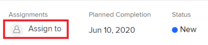
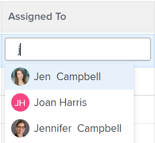
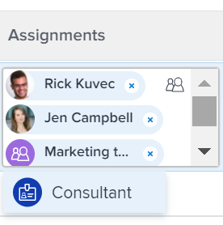

# Assign tasks {#assign-tasks}

You can assign tasks to users, roles, and teams to indicate who is responsible for completing the tasks. You can assign a task to more than one resource at a time. 

` `**Tip: **`` You can assign multiple users, or job roles, and you can assign only one team. `You can assign only active users, `job roles`, and teams.`

`If a user, `job role`, or a team was assigned before they were deactivated, they remain assigned to the work item. In this case, we recommend the following:` 

*  `Reassign the work item to active resources.` 
*  `Associate the users in a deactivated team with an active team and reassign the work item to the active team.` 

The number of users assigned to a task and the schedule of the task Owner can modify the planned dates of a task which results in changing the timeline of the project. For information about the impact of assigning multiple users to a task, see [Overview of modifying task assignments](modify-task-assignments-overview.md). 

In addition to this article, we recommend that you read the following articles for more information about assigning tasks:

* [Overview of modifying task assignments](modify-task-assignments-overview.md) 
* [Smart assignments overview](smart-assignments.md) 
* [Make smart assignments](make-smart-assignments.md) 
* [Create advanced assignments](create-advanced-assignments.md) 
* [Modify multiple user assignments in a task list](modify-multiple-assignments-in-task-list.md) 
* [Edit tasks](edit-tasks.md) 
* [Plan a project overview](plan-project.md) 
* [Overview of the project Planned Completion Date](project-planned-completion-date.md) 
* [Configure system-wide project preferences](set-project-preferences.md) 
* [Overview of assigning work in the Adobe Workfront Workload Balancer](assign-work-in-workload-balancer.md) 

## Access requirements {#access-requirements}

You must have the following access to perform the steps in this article:

<table style="width: 100%;margin-left: 0;margin-right: auto;mc-table-style: url('../../../Resources/TableStyles/TableStyle-List-options-in-steps.css');" class="TableStyle-TableStyle-List-options-in-steps" cellspacing="0"> 
 <col class="TableStyle-TableStyle-List-options-in-steps-Column-Column1"> 
 <col class="TableStyle-TableStyle-List-options-in-steps-Column-Column2"> 
 <tbody> 
  <tr class="TableStyle-TableStyle-List-options-in-steps-Body-LightGray"> 
   <td class="TableStyle-TableStyle-List-options-in-steps-BodyE-Column1-LightGray" role="rowheader">Adobe Workfront plan*</td> 
   <td class="TableStyle-TableStyle-List-options-in-steps-BodyD-Column2-LightGray"> 
Any
 </td> 
  </tr> 
  <tr class="TableStyle-TableStyle-List-options-in-steps-Body-MediumGray"> 
   <td class="TableStyle-TableStyle-List-options-in-steps-BodyE-Column1-MediumGray" role="rowheader">Adobe Workfront license*</td> 
   <td class="TableStyle-TableStyle-List-options-in-steps-BodyD-Column2-MediumGray"> 
Work or higher
 </td> 
  </tr> 
  <tr class="TableStyle-TableStyle-List-options-in-steps-Body-LightGray"> 
   <td class="TableStyle-TableStyle-List-options-in-steps-BodyE-Column1-LightGray" role="rowheader">Access level configurations*</td> 
   <td class="TableStyle-TableStyle-List-options-in-steps-BodyD-Column2-LightGray"> 
Edit access to Projects and Tasks
 
View or higher access to Users
 
Note: If you still don't have access, ask your Workfront administrator if they set additional restrictions in your access level. For information on how a Workfront administrator can modify your access level, see <a href="create-modify-access-levels.md" class="MCXref xref">Create or modify custom access levels</a>.
 </td> 
  </tr> 
  <tr class="TableStyle-TableStyle-List-options-in-steps-Body-MediumGray"> 
   <td class="TableStyle-TableStyle-List-options-in-steps-BodyB-Column1-MediumGray" role="rowheader">Object permissions</td> 
   <td class="TableStyle-TableStyle-List-options-in-steps-BodyA-Column2-MediumGray"> 
Contribute or higher permissions to tasks
 
For information on requesting additional access, see <a href="request-access.md" class="MCXref xref">Request access to objects in Adobe Workfront</a>.
 </td> 
  </tr> 
 </tbody> 
</table>

&#42;To find out what plan, license type, or access you have, contact your *`Workfront administrator`*.

## Considerations for multiple assignments to job roles, teams, and users {#considerations-for-multiple-assignments-to-job-roles-teams-and-users}

Users can have more than one job role associated with their profile. For information about associating users with job roles, see [Edit a user's profile](edit-a-users-profile.md). 

Tasks or issues are usually first assigned to one or multiple job roles or to a team. When projects are ready to start, they might need to also be assigned to users.   
If a task or an issue is assigned to one or multiple roles and then you also assign a user, *`Adobe Workfront`* decides which job role to associate with the additional user (if any)&nbsp;according to the following rules:

*  If there is only one job role assigned and it matches the user's Primary Role, then the task or issue is assigned only to the user fulfilling their&nbsp;Primary Role. 
*  If there are multiple roles assigned and at least one of the roles matches the user's secondary roles, then the task or issue is assigned to the user fulfilling one of their Other Roles — which *`Workfront`* selects at random if there are multiple matches — as well as any additional roles that are assigned.
*  If there is one or more job roles assigned and there are no matches to the user's roles, then the task or issue is assigned to both&nbsp;the role or roles as well as to the user. 

If a task or an issue is assigned to a team and you also assign a user, the task or issue remains assigned to both the team and the user. 

##  

## Assign a single task {#assign-a-single-task}

1. Go to a task that you want to assign.
1.  Click `Assign to` in the upper-right corner of the task header, in the `Assignments` area

   Or

   Click the name of the current assignments, if the task is already assigned. 

   

1.  Do one of the following:

    
    
    *  Start typing the name of a user, role, or team that you want to assign, then click it when it appears on the list.
    
    
          
    

    
    * (Conditional) Click one of the names in the `Suggested Assignments` list, if this list displays. For more information, see [Smart assignments overview](smart-assignments.md). 
    
    * Click `Assign to me` to assign it to yourself
    *  Click `Advanced Assignments`
    
    
      For information about how to make advanced assignments, see [Create advanced assignments](create-advanced-assignments.md).
    
    
    

1.  Click `Save`. 
1.  (Optional) Click the `X icon` next to the name of the assignments in the Assignments area on the header of the task to remove an assignment.

## Assign a task in a list {#assign-a-task-in-a-list}

You can assign tasks in a list or a report when any of the assignments fields are visible in the list's view. This is a faster way to assign tasks. This article describes how to modify assignments for one task in a list.&nbsp;For information about modifying multiple assignments for multiple tasks in a list, see [Modify multiple user assignments in a task list](modify-multiple-assignments-in-task-list.md). 

Depending on which field is visible in the view, you can assign the following entities to the task: 

To assign tasks in a list: 

1.  Go to a list of tasks that has the Assigned To, Assigned, or Assignments fields in the view.
1.  (Optional) Click the `Plan Mode` icon  and select one of the following options:

   For more information about saving tasks as you edit them in a list, see [Edit tasks in a list](edit-tasks-in-a-list.md).

1.  To assign tasks do one of the following:

    
    
    *  Click inside the `Assigned To` or `Assigned` fields and start typing the name of an active user that you want to assign to the task, then click it when it displays in the list.
    
    
          
    

    
    *  Click inside the `Assignments` field and start typing the name of an active user, `job role`, or team that you want to assign to the task, then click it when it displays in the list.
    
    
          
    

    
    
    

1.  After adding your assignees to the task, press Enter or click anywhere on the page to save your changes if you selected Autosave. Otherwise, click `Save`. 

## Assign multiple tasks to a user  {#assign-multiple-tasks-to-a-user}

1. Go to a list of tasks that you want to assign in bulk. 
1.  (Conditional) Ensure that the `Autosave` option is selected if you are on a list of tasks under a project.

   >[!IMPORTANT] {type="important"}
   >
   >You cannot edit tasks in bulk when saving tasks manually on a project.

1.  Select several tasks in the tasks list. 
1.  Click the `Edit icon` . 

   The `Edit Tasks` dialog box opens.

1.  In the `Assignments` area, select the `Assignee` box, then start typing the name of a user, job role, or team that you want to assign to all the tasks. 

   >[!IMPORTANT] {type="important"}
   >
   >If any of the tasks is already assigned, the resources you indicate here are added to the tasks instead of replacing the existing resources on the tasks. 

1. (Optional) Select the radio button in the `Task Owner` column to indicate which resource is the primary assignee or the Owner of the task, when you assign more than one resource to the task. This is not available for teams. 
1.  (Conditional) Specify the `Allocation %` for each resource assigned to the task if all the tasks you selected have a Duration Type of Effort Driven or Calculated Assignment. This indicates how much of their time these resources should spend on completing the task. This is only available for users and job roles. 

   Or 

   Specify the amount of `Hours` for each resource assigned to the task if all the tasks you selected have a Duration Type of Simple. The total of all hours for all resources should equal the number of Planned Hours for the task. 

   >[!IMPORTANT] {type="important"}
   >
   >You cannot specify the allocation percentage or the number of hours per resource if the tasks you selected have different Duration Types or of the tasks you selected have different Duration Types.

   For information about Duration Type on tasks, see [Overview of Task Duration and Duration Type](task-duration-and-duration-type.md).

1. (Optional) Select a role that the user should fulfill on the task from the `Pick a role` drop-down menu in the `Assignee's Role` column when you assign users to tasks. If you do not select a role, *`Workfront`* automatically selects the user's Primary Role. 

1. (Optional) If you want to remove existing assignees from all tasks do one of the following:
    
    
    1. Start typing the name of a user, role, or team you want to remove from the task, then select it when it appears on the list and click `Remove Assignee` to remove more assignees.
    1. Click `Remove All Existing Assignees` to remove all assignees from all selected tasks.
    
    
1. Click `Save Changes`.
1. (Optional and conditional) When the Assigned to or the Assignments fields display in your list of tasks, click inside one of these columns for a task, then click the `X icon` next to the name of an assignee to remove it from the task. 

