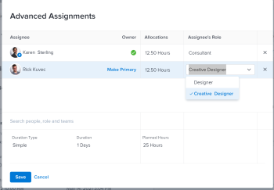
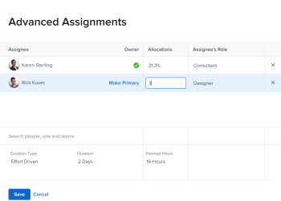

# Create advanced assignments

You can manage task or issue assignments by using Advanced Assignments.

You can adjust the following assignment information when making advanced assignments:

* Assign users to the task or issue (this can be accomplished outside of an advanced assignment).
* Adjust and redistribute the number of hours each assignee is allocated.
* Determine which user should be designated as the owner of the task or issue.
* Specify which role each user is fulfilling when working on the task or issue.

>[!NOTE]
>
>When assigning users to work, their availability according to their schedules affects the Planned and Projected Dates of tasks and issues. For information about schedules, see [Create a schedule](../../../administration-and-setup/set-up-workfront/configure-timesheets-schedules/create-schedules.md).

## Access requirements

You must have the following access to perform the steps in this article:

<table cellspacing="0"> 
 <col> 
 <col> 
 <tbody> 
  <tr> 
   <td role="rowheader"><em>Adobe Workfront</em> plan*</td> 
   <td> 
Any
 </td> 
  </tr> 
  <tr> 
   <td role="rowheader"><em>Adobe Workfront</em> license*</td> 
   <td> 
<em>Work</em> or higher
 </td> 
  </tr> 
  <tr> 
   <td role="rowheader">Access level configurations*</td> 
   <td> 
Edit access to&nbsp;Tasks and Issues
 
Note: If you still don't have access, ask your <em>Workfront administrator</em> if they set additional restrictions in your access level. For information on how a <em>Workfront administrator</em> can modify your access level, see <a href="../../../administration-and-setup/add-users/configure-and-grant-access/create-modify-access-levels.md" class="MCXref xref">Create or modify custom access levels</a>.
 </td> 
  </tr> 
  <tr> 
   <td role="rowheader">Object permissions</td> 
   <td> 
Contribute or higher permissions to a the task or issue
 
For information on requesting additional access, see <a href="../../../workfront-basics/grant-and-request-access-to-objects/request-access.md" class="MCXref xref">Request access to objects in Adobe Workfront</a>.
 </td> 
  </tr> 
 </tbody> 
</table>

&#42;To find out what plan, license type, or access you have, contact your *Workfront administrator*.

## Make advanced assignments

<ol> 
 <li value="1">Go to the project where you want to assign a task or an issue. </li> 
 <li value="2"> <draft-comment>
   
Click Tasks or Issues in the left panel, then click the name of a task or issue in the list. 

  </draft-comment>
Click Tasks or Issues in the left panel, then click the name of a task or issue in the list. 
 <note type="tip">
   You can make advanced assignments directly on the task or issue list if there are two or more people assigned. Click inside the 
   Assignments field on the same line as the task or issue, then click the 
   People icon to open the Advanced Assignments window. Skip to step 5 to continue creating advanced assignments.
    
   <draft-comment>
    
   </draft-comment>
   
  </note> </li> 
 <li value="3"> <draft-comment>
   
Click Assign to in the Assignments field in the header of the task or issue. 

  </draft-comment>
Click Assign to in the Assignments field in the header of the task or issue. 
 <draft-comment>
   
Or

  </draft-comment>
Or
 <draft-comment>
   
Click the name of the assignments if the task or issue is already assigned. 

  </draft-comment>
Click the name of the assignments if the task or issue is already assigned. 
 </li> 
 <li value="4"> <draft-comment>
   
Click Advanced. 

  </draft-comment>
Click Advanced. 
 </li> 
 <li value="5"> <draft-comment>
   
In the Search people, role and teams field, start typing the name of a user, role, or team then click the name when it appears in the drop-down list. 

  </draft-comment>
In the Search people, role and teams field, start typing the name of a user, role, or team then click the name when it appears in the drop-down list. 
 <note type="note">
    If the user's name contains a special character, you must include the special character in the search field. 
  </note> </li> 
 <li value="6"> <draft-comment>
   
(Optional) Continue adding assignees in the Search people, role or teams box to add multiple resources to the task or issue.

  </draft-comment>
(Optional) Continue adding assignees in the Search people, role or teams box to add multiple resources to the task or issue.
 
  
Tip: </b>">
   <b>Tip: </b> 
   
You can assign multiple users or job roles, and you can assign only one team. You can assign only active users, job roles, and teams.
 
   
If a user, job role, or a team was assigned before they were deactivated, they remain assigned to the work item. In this case, we recommend the following: 
 
   <ul> 
    <li> 
Reassign the work item to active resources. 
 </li> 
    <li> 
Associate the users in a deactivated team with an active team and reassign the work item to the active team. 
 </li> 
   </ul> 
  
 </li> 
 <li value="7"> 
For each user in the Assignee column, specify the following information:
 
  <ul> <draft-comment>
    <li data-mc-conditions="QuicksilverOrClassic.Quicksilver"> 
Owner: Hover over the name of the assignee and click Make Primary in the Owner field if you want to mark the assignee as the Task Owner. A green checkbox indicates that the specified user is the Primary Contact of the task or issue. <em>Adobe Workfront</em> marks the first user or job role that you assign to a task or issue as the Owner or Primary Assignment. A team cannot be designated the Primary Owner of a task or issue. 
 <note type="important">
      Depending on how your 
      <em>Workfront administrator</em> 
      or <em>group administrator</em> set up your project preferences, 
      <em>Workfront</em> might use the schedule of the task owner to calculate the timeline of the task when you have multiple users assigned to the task. For information about multiple task assignees, see the "Assign multiple users to a task" section in the article 
      <a href="../../../manage-work/tasks/assign-tasks/assign-tasks.md" class="MCXref xref">Assign tasks</a>. 
     </note> </li>
   </draft-comment>
   <li data-mc-conditions="QuicksilverOrClassic.Quicksilver"> 
Owner: Hover over the name of the assignee and click Make Primary in the Owner field if you want to mark the assignee as the Task Owner. A green checkbox indicates that the specified user is the Primary Contact of the task or issue. <em>Adobe Workfront</em> marks the first user or job role that you assign to a task or issue as the Owner or Primary Assignment. A team cannot be designated the Primary Owner of a task or issue. 
 <note type="important">
     Depending on how your 
     <em>Workfront administrator</em> 
     or <em>group administrator</em> set up your project preferences, 
     <em>Workfront</em> might use the schedule of the task owner to calculate the timeline of the task when you have multiple users assigned to the task. For information about multiple task assignees, see the "Assign multiple users to a task" section in the article 
     <a href="../../../manage-work/tasks/assign-tasks/assign-tasks.md" class="MCXref xref">Assign tasks</a>. 
    </note> </li> 
   <li> 
 <draft-comment>
      <MadCap:conditionalText data-mc-conditions="QuicksilverOrClassic.Quicksilver">
        Allocations 
      </MadCap:conditionalText>
     </draft-comment><MadCap:conditionalText data-mc-conditions="QuicksilverOrClassic.Quicksilver">
       Allocations 
     </MadCap:conditionalText>: When the Duration Type of a task is Simple, specify the number of hours each user or job role should be assigned to the task. The sum of all assigned hours for each user is equal to the number in the Planned Hours field at the bottom of the <draft-comment>
      <MadCap:conditionalText data-mc-conditions="QuicksilverOrClassic.Quicksilver">
       Allocations
      </MadCap:conditionalText>
     </draft-comment><MadCap:conditionalText data-mc-conditions="QuicksilverOrClassic.Quicksilver">
      Allocations
     </MadCap:conditionalText> column. In all other cases, specify the percentage of time (or allocation)&nbsp;that you want the assignee to spend solving the task or issue. 
 
    
Tips: </b>">
     <b>Tips: </b> 
     <ul> 
      <li> 
After you manually modify assignment allocations on tasks, the Planned Hours of the tasks might update accordingly. For more information, see the section "Update task Planned Hours when managing user allocations" in the article<a href="../../../manage-work/tasks/task-information/planned-hours.md" class="MCXref xref">Planned Hours overview</a>.
 </li> 
      <li> 
You cannot manually modify assignment allocations on issues. 
 </li> 
      <li> 
You cannot manually modify allocations for teams assigned to tasks.
 </li> 
     </ul> 
    
 </li> 
   <li> 
Assignee's Role: Select the role the user should use when fulfilling this assignment. <draft-comment>
      <MadCap:conditionalText data-mc-conditions="QuicksilverOrClassic.Quicksilver">
       The Primary Role of the user displays by default. Click in the Assignee's Role box to select another role. 
      </MadCap:conditionalText>
     </draft-comment><MadCap:conditionalText data-mc-conditions="QuicksilverOrClassic.Quicksilver">
      The Primary Role of the user displays by default. Click in the Assignee's Role box to select another role. 
     </MadCap:conditionalText><draft-comment>
      <MadCap:conditionalText data-mc-conditions="QuicksilverOrClassic.Quicksilver">
        When you assign the task or the issue to a role first, and then add a user who can fulfill that role as a second assignment, the list of suggested users is filtered for the users who can fulfill the roles already assigned to the task and issue. 
      </MadCap:conditionalText>
     </draft-comment><MadCap:conditionalText data-mc-conditions="QuicksilverOrClassic.Quicksilver">
       When you assign the task or the issue to a role first, and then add a user who can fulfill that role as a second assignment, the list of suggested users is filtered for the users who can fulfill the roles already assigned to the task and issue. 
     </MadCap:conditionalText>
 <draft-comment>
     
  

    </draft-comment>
  
 </li> <draft-comment>
    <li data-mc-conditions="QuicksilverOrClassic.Quicksilver">Duration Type: This is only available for tasks. Click the name of the Duration Type and select a Duration Type from the drop-down menu. For information about Duration Types, see <a href="../../../manage-work/tasks/taskdurtn/task-duration-and-duration-type.md" class="MCXref xref">Overview of Task Duration and Duration Type</a>.</li>
   </draft-comment>
   <li data-mc-conditions="QuicksilverOrClassic.Quicksilver">Duration Type: This is only available for tasks. Click the name of the Duration Type and select a Duration Type from the drop-down menu. For information about Duration Types, see <a href="../../../manage-work/tasks/taskdurtn/task-duration-and-duration-type.md" class="MCXref xref">Overview of Task Duration and Duration Type</a>.</li> 
   <li> <draft-comment>
     
Duration: You can update this field for a task when you have Manage permissions to the task. 

    </draft-comment>
Duration: You can update this field for a task when you have Manage permissions to the task. 
 <draft-comment>
     
For more information, see <a href="../../../manage-work/tasks/taskdurtn/task-duration-and-duration-type.md" class="MCXref xref">Overview of Task Duration and Duration Type</a>. When bulk editing assignment information, a similar dialogue box appears to assign users, hours, allocation, and task owner.

    </draft-comment>
For more information, see <a href="../../../manage-work/tasks/taskdurtn/task-duration-and-duration-type.md" class="MCXref xref">Overview of Task Duration and Duration Type</a>. When bulk editing assignment information, a similar dialogue box appears to assign users, hours, allocation, and task owner.
 </li> 
   <li> <draft-comment>
     
Planned Hours: When the Duration Type is Calculated Assignment or Simple, update the number of Planned Hours. The allocation percentages or the hours for each resource are distributed evenly as a result. <em>Workfront</em> calculates the Planned Hours when the Duration Type is Calculated Work or Effort Driven. For more information, see <a href="../../../manage-work/tasks/taskdurtn/task-duration-and-duration-type.md" class="MCXref xref">Overview of Task Duration and Duration Type</a>.

    </draft-comment>
Planned Hours: When the Duration Type is Calculated Assignment or Simple, update the number of Planned Hours. The allocation percentages or the hours for each resource are distributed evenly as a result. <em>Workfront</em> calculates the Planned Hours when the Duration Type is Calculated Work or Effort Driven. For more information, see <a href="../../../manage-work/tasks/taskdurtn/task-duration-and-duration-type.md" class="MCXref xref">Overview of Task Duration and Duration Type</a>.
 <draft-comment>
     
 <draft-comment>
       
      </draft-comment> 

    </draft-comment>
  
 </li> 
  </ul> </li> 
 <li value="8"> <draft-comment>
   
Click Save. 

  </draft-comment>
Click Save. 
 </li> 
</ol>

