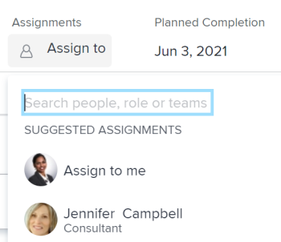

# Make smart assignments {#make-smart-assignments}

You can use smart assignments to identify who the best user is to complete the work. Smart assignments are suggestions for users that *`Adobe Workfront`* presents to you when you assign work items to resources based on an algorithm that determines the most appropriate resource for the job. For information about smart assignments, see [Smart assignments overview](smart-assignments.md). 


## Access requirements {#access-requirements}

You must have the following access to perform the steps in this article:

<table style="width: 100%;margin-left: 0;margin-right: auto;mc-table-style: url('../../../Resources/TableStyles/TableStyle-List-options-in-steps.css');" class="TableStyle-TableStyle-List-options-in-steps" cellspacing="0"> 
 <col class="TableStyle-TableStyle-List-options-in-steps-Column-Column1"> 
 <col class="TableStyle-TableStyle-List-options-in-steps-Column-Column2"> 
 <tbody> 
  <tr class="TableStyle-TableStyle-List-options-in-steps-Body-LightGray"> 
   <td class="TableStyle-TableStyle-List-options-in-steps-BodyE-Column1-LightGray" role="rowheader"><span class="mc-variable WFVariables.FullProdNameWF variable varname">Adobe Workfront</span> plan*</td> 
   <td class="TableStyle-TableStyle-List-options-in-steps-BodyD-Column2-LightGray"> <p>Any</p> </td> 
  </tr> 
  <tr class="TableStyle-TableStyle-List-options-in-steps-Body-MediumGray"> 
   <td class="TableStyle-TableStyle-List-options-in-steps-BodyE-Column1-MediumGray" role="rowheader"><span class="mc-variable WFVariables.FullProdNameWF variable varname">Adobe Workfront</span> license*</td> 
   <td class="TableStyle-TableStyle-List-options-in-steps-BodyD-Column2-MediumGray"> <p><span class="mc-variable WFVariables.WFLicense-Work variable varname">Work</span> or higher</p> </td> 
  </tr> 
  <tr class="TableStyle-TableStyle-List-options-in-steps-Body-LightGray"> 
   <td class="TableStyle-TableStyle-List-options-in-steps-BodyE-Column1-LightGray" role="rowheader">Access level configurations*</td> 
   <td class="TableStyle-TableStyle-List-options-in-steps-BodyD-Column2-LightGray"> <p>Edit access to Tasks and Issues</p> <p>View or higher access to&nbsp;Projects</p> <p>Note: If you still don't have access, ask your <span class="mc-variable WFVariables.AdminWF variable varname">Workfront administrator</span> if they set additional restrictions in your access level. For information on how a <span class="mc-variable WFVariables.AdminWF variable varname">Workfront administrator</span> can modify your access level, see <a href="create-modify-access-levels.md" class="MCXref xref">Create or modify custom access levels</a>.</p> </td> 
  </tr> 
  <tr class="TableStyle-TableStyle-List-options-in-steps-Body-MediumGray"> 
   <td class="TableStyle-TableStyle-List-options-in-steps-BodyB-Column1-MediumGray" role="rowheader">Object permissions</td> 
   <td class="TableStyle-TableStyle-List-options-in-steps-BodyA-Column2-MediumGray"> <p>Contribute or higher permissions with the ability to make assignments on tasks and issues</p> <p>For information on requesting additional access, see <a href="request-access.md" class="MCXref xref">Request access to objects in Adobe Workfront</a>.</p> </td> 
  </tr> 
 </tbody> 
</table>

&#42;To find out what plan, license type, or access you have, contact your *`Workfront administrator`*.


## Make smart assignments {#make-smart-assignments-1}

Smart assignments are available in most locations where you can make assignments in *`Workfront`*.


1.  Go to an issue or a task and click one of the following fields to edit them: &nbsp;&nbsp;

    
    
    *  A task or issue list or report 
    *  A task or issue header
    *  The task or issue Summary panel
    *  The Assignments field for an item listed in the Home area
    *  Resource Scheduling
    *  *`Workload Balancer`* 
    
    

1.  Place your cursor in the assignment field, and wait for two seconds. The ```<MadCap:conditionalText data-mc-conditions="QuicksilverOrClassic.Quicksilver"> <span class="bold">Suggestions</span> or  <span class="bold">Suggested Assignments</span></MadCap:conditionalText>` list displays.


   


   Users displayed in this list are the smart assignment suggestions for the task or the issue.


   For more information about where the smart assignments display, see the "Locate smart assignment suggestions" section in the article [Smart assignments overview](smart-assignments.md) . 

1.  Select the user in the recommendations list by clicking their name. `<MadCap:conditionalText data-mc-conditions="QuicksilverOrClassic.Quicksilver"> Clicking  <span class="bold">Assign to me</span> assigns the work item to yourself. </MadCap:conditionalText>`


   >[!TIP] {type="tip"}
   >
   >If there are no suggestions, the suggestion list does not open. 


1.  (Optional) If you do not want to use one of the recommended users from the smart assignments list, start typing the name of the desired user and select the name when it appears in the list.
1.  Click `Enter` to make the assignment. 


   The selected user is assigned to the task or issue. 


