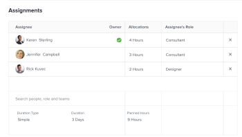

# Manage allocation hours on tasks

When assigning users or roles to a task, they are allocated to work a certain number of hours to complete the task. You can manually modify the amount of hours that each user or job role is allocated when they are assigned to a task when the task&nbsp;Duration&nbsp;Type is Simple.

## Access requirements

You must have the following access to perform the steps in this article:

<table cellspacing="0"> 
 <col> 
 <col> 
 <tbody> 
  <tr> 
   <td role="rowheader"><em>Adobe Workfront</em> plan*</td> 
   <td> 
Any
 </td> 
  </tr> 
  <tr> 
   <td role="rowheader"><em>Adobe Workfront</em> license*</td> 
   <td> 
<em>Work</em> or higher
 </td> 
  </tr> 
  <tr> 
   <td role="rowheader">Access level configurations*</td> 
   <td> 
Edit access to Tasks
 
Note: If you still don't have access, ask your <em>Workfront administrator</em> if they set additional restrictions in your access level. For information on how a <em>Workfront administrator</em> can modify your access level, see <a href="../../../administration-and-setup/add-users/configure-and-grant-access/create-modify-access-levels.md" class="MCXref xref">Create or modify custom access levels</a>.
 </td> 
  </tr> 
  <tr> 
   <td role="rowheader">Object permissions</td> 
   <td> 
Contribute or higher permissions to the task
 
Edit permissions to update allocation hours in the Edit Task box
 
For information on requesting additional access, see <a href="../../../workfront-basics/grant-and-request-access-to-objects/request-access.md" class="MCXref xref">Request access to objects in Adobe Workfront</a>.
 </td> 
  </tr> 
 </tbody> 
</table>

&#42;To find out what plan, license type, or access you have, contact your *Workfront administrator*.

## Considerations for modifying the allocation hours for a task

>[!IMPORTANT]
>
>After you manually modify assignment allocations on tasks, the Planned Hours of the tasks might update accordingly. For more information, see the section "Update task Planned Hours when managing user allocations" in the article [Planned Hours overview](../../../manage-work/tasks/task-information/planned-hours.md).

* The total of hours allocated to individual resources assigned to the task represents the Planned Hours of the task. 
* If there is one user or role assignment to a task, the amount of hours allocated to the user or role matches the Planned Hours of the task.
* In the case of multiple assignments, each user or job role is assigned an equal amount of hours to work on the task, by default, if the task Duration Type is Simple. For more information, see the following articles:

  * [Overview of Task Duration and Duration Type](../../../manage-work/tasks/taskdurtn/task-duration-and-duration-type.md) 
  * [Duration Type overview: Simple](../../../manage-work/tasks/taskdurtn/simple-duration-type.md)

* When the task has a Simple Duration&nbsp;Type, you can manually change the amount of allocated hours for each user or job role to indicate that some of the task assignees might have more time to work on a task than others. 
* You cannot modify the amount of hours allocated to teams assigned to tasks.
* You cannot manually modify the user or job role allocation for issues. 
* You can also manage daily, weekly, or monthly allocations of users to tasks or issues by using the *Workload Balancer*. For more information, see [Manage user allocations in the Workload Balancer](../../../resource-mgmt/workload-balancer/manage-user-allocations-workload-balancer.md).

## Modify the allocation hours for a task

<ol> 
 <li value="1">Go to a task for whose assignments you want to change the allocation hours.</li> 
 <li value="2"> <draft-comment>
   
Click the More menu  next to the name of the task, then click Edit, then Assignments.

  </draft-comment>
Click the More menu  next to the name of the task, then click Edit, then Assignments.
 <draft-comment>
   
Or

  </draft-comment>
Or
 <draft-comment>
   
Click the Assignments area in the task header, then click&nbsp;Advanced.

  </draft-comment>
Click the Assignments area in the task header, then click&nbsp;Advanced.
 </li> 
 <li value="3"> <draft-comment>
   
Ensure that the Duration&nbsp;Type of the task is Simple.

  </draft-comment>
Ensure that the Duration&nbsp;Type of the task is Simple.
 </li> 
 <li value="4"> 
Modify the <draft-comment>
    Allocations
   </draft-comment>Allocations for each task assignee. These are overall allocations for each assignments to this task, for the entire duration of the task. This might also update the overall Planned Hours of the task. 
 <draft-comment>
   
  

  </draft-comment>
  
 </li> 
 <li value="5">Click Save.</li> 
</ol>

