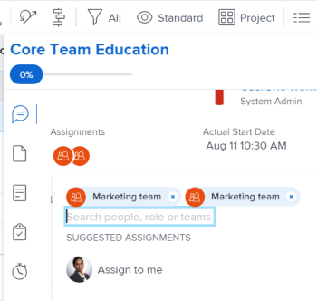

# Smart assignments overview {#smart-assignments-overview}

When managing task and issues assignments, you can use smart assignments to identify who the best user is to complete the work. Smart assignments are suggestions that *`Adobe Workfront`* presents to you when you assign work items to resources based on an algorithm that determines the most appropriate resource for the job.

>[!NOTE]
>
>Smart assignments do not take into account the availability of the user. However, their availability according to their schedules affects the Planned and Projected Dates of tasks and issues when they are assigned. For information about schedules, see the article [Create a schedule](create-schedules.md).

This article contains general information about smart assignments. For information about using smart assignments to assign tasks and issues to users, see [Make smart assignments](make-smart-assignments.md). 

## Smart assignments overview {#smart-assignments-overview-1}

Consider the following when working with smart assignments: 

*  The algorithm works independently for tasks and issues. This means that the list of suggested users for issues might differ from the list of suggested users for a task because *`Workfront`* builds the lists according to criteria pertaining to issues and tasks separately. 
*   Smart assignments do not recommend job roles or teams. Instead, they are suggestions of users who are best fit to complete a task or an issue. 
*  The suggested assignments are always active users. 
*  The user listed first should be the best match for the task.

## Locate smart assignment suggestions {#locate-smart-assignment-suggestions}

You can view smart assignments in the following areas where you can assign tasks or issues: 

*  A task or issue list or report 

  

*  A task or issue header

  

*  The task or issue Summary panel

  

*  The Assignments field for an item listed in the Home area

  

*  Resource Scheduling

  

*  *`Workload Balancer`* 

  

## Smart assignments criteria {#smart-assignments-criteria}

Smart assignments display the top fifty recommendations based on a proprietary algorithm. 

Users are recommended in the smart assignments drop-down list based on a combination of the following criteria (listed in order from most important to least important):

*  Users assigned to other work items in the past 30 days by the user making the assignment. The first 50 users that match this criteria display. The user that is most often assigned displays first. 

  If the work item is assigned to a team or a role, the list of suggested users is filtered further taking into account the existing assignments below. In this case, only the following users display in the list of suggestions: 

    
    
    * Users whose Home Team is the team assigned to the work item. 
    *  Users whose Primary Role is the role assigned to the work item. 
    
    
      >[!TIP] {type="tip"}
      >
      >If you’re not part of any team and there is no role or team assigned on the task or issue, *`Workfront`* displays all the users assigned for the last 30 days, up to 50 users.
    
    
    
    
    

