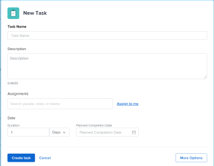
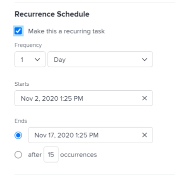
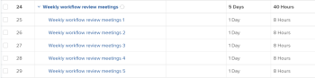

# Create recurring tasks

You can create recurring tasks for tasks you have to repeat as part of a single project.

For general information about recurring tasks, including the impact of editing an existing recurring task, see [Recurring tasks overview](../../../manage-work/tasks/manage-tasks/recurring-tasks-overview.md).

## Access requirements

You must have the following access to perform the steps in this article:

<table cellspacing="0"> 
 <col> 
 <col> 
 <tbody> 
  <tr> 
   <td role="rowheader"><em>Adobe Workfront</em> plan*</td> 
   <td> 
Any
 </td> 
  </tr> 
  <tr> 
   <td role="rowheader"><em>Adobe Workfront</em> license*</td> 
   <td> 
<em>Work</em> or higher
 </td> 
  </tr> 
  <tr> 
   <td role="rowheader">Access level configurations*</td> 
   <td> 
Edit access to Tasks and Projects
 
Note: If you still don't have access, ask your <em>Workfront administrator</em> if they set additional restrictions in your access level. For information about access to tasks, see <a href="../../../administration-and-setup/add-users/configure-and-grant-access/grant-access-tasks.md" class="MCXref xref">Grant access to tasks</a>. For information on how a <em>Workfront administrator</em> can change your access level, see <a href="../../../administration-and-setup/add-users/configure-and-grant-access/create-modify-access-levels.md" class="MCXref xref">Create or modify custom access levels</a>. 
 </td> 
  </tr> 
  <tr> 
   <td role="rowheader">Object permissions</td> 
   <td> 
Contribute permissions to the project with ability to Add Tasks or higher
 
When you create a task you automatically receive Manage permissions to the task
 
 For information about task permissions, see <a href="../../../workfront-basics/grant-and-request-access-to-objects/share-a-task.md" class="MCXref xref">Share a task in&nbsp;Adobe Workfront</a>. 
 
For information on requesting additional permissions, see <a href="../../../workfront-basics/grant-and-request-access-to-objects/request-access.md" class="MCXref xref">Request access to objects in Adobe Workfront</a>.
 </td> 
  </tr> 
 </tbody> 
</table>

&#42;To find out what plan, license type, or access you have, contact your *Workfront administrator*.

## Create a recurring task

>[!NOTE]
>
>You cannot create a recurring task by modifying an existing task. You must create a task from scratch.

<!--

<ol>
<li value="1"> 
Go to the project where you want to create a recurring task, then click the Tasks section in the left panel.
 </li>
<li value="2"> 
Click New Task.
 
The New Task dialog box displays.
 
  
 </li>
<li value="3"> 
Click More Options then enter a name for the task in the Task Name field.
 </li>
<li value="4"> 
 Continue updating the task the same way you would if you added a new task. For more information about adding a new task, see <a href="../../../manage-work/tasks/create-tasks/create-tasks-in-project.md" class="MCXref xref">Create tasks in a project</a>
 </li>
<li value="5"> 
Click Overview in the left panel.
 </li>
<li value="6"> 
Scroll down to the Recurrence Schedule section, then select the Make this a recurring task option.
 
  
 </li>
<li value="7"> 
In the Frequency drop-down list, select the number of time units when you want the task to occur and the type of time units.&nbsp;Select from the following options: 

<table cellspacing="0">
<col>
<col>
<thead>
<tr>
<th>Recurrence Type</th>
<th>Description</th>
</tr>
</thead>
<tbody>
<tr>
<td role="rowheader">Day </td>
<td> 
The task repeats every day, every 2 days, every 3 days, and so forth, depending on the cadence that you select. You can configure tasks to repeat up to every 6th day. The default setting is 1 Day. 
 </td>
</tr>
<tr>
<td role="rowheader">Working Day </td>
<td> 
 The task repeats every working day, every 2 working days, every 3 working days, and so forth, depending on the cadence that you select. You can configure tasks to repeat up to every 6th working day.
 
This option uses the default schedule that is defined by the system administrator, as described in <a href="../../../administration-and-setup/set-up-workfront/configure-timesheets-schedules/create-schedules.md" class="MCXref xref">Create a schedule</a>.
 </td>
</tr>
<tr>
<td role="rowheader">Week </td>
<td> 
 The task repeats every week, every 2 weeks, every 3 weeks, and so forth, depending on the cadence that you select.
 
In the Repeats field, select the day of the week when you want each task to occur. You can select multiple days. 
 </td>
</tr>
<tr>
<td role="rowheader">Month </td>
<td> 
The task repeats every month, every 2 months, every 3 months, and so forth, depending on the cadence that you select. You can select between 1 and 12 months. 
 
In the Repeats field, select from the following options when you want the task to occur:

<ul>
<li> 
every month on day <month date> 
 
You can select days from 1 to 30 or you can select last. For example, you can select "every month on the 30th". 
 </li>
<li> 
every month on the <number> <day of the week> 
 
In the first drop-down menu, you can select a number between 1 and 4 for the number of the week in the month, or you can select "last". 
 
In the second drop-down menu, you can select any day of the week. 
 
For example, you can select "every month on the 2nd Tuesday". 
 </li>
</ul> </td>
</tr>
</tbody>
</table> <note type="note">
If you have a Schedule Exception associated with the project's schedule, recurring tasks can't start during the exception. Recurring tasks that occur during the schedule exception are scheduled to start on the first business day that follows the exception. For more information on schedule exceptions, see the article
<a href="../../../administration-and-setup/set-up-workfront/configure-timesheets-schedules/create-schedules.md" class="MCXref xref">Create a schedule</a>.
</note> </li>
<li value="8"> 
In the Starts field, select the date and time when you want the recurring tasks to begin. 
 </li>
<li value="9"> 
In the Ends field, select the date and the time when you want the recurring tasks to complete
 
Or
 
Select after <number>&nbsp;occurrences to indicate how many times the recurring task should occur. <em>Workfront</em> creates the same number of recurrences for the tasks as the number you indicate in this field. 
 </li>
<li value="10"> 
Click Create Task.
 
The task list displays. The recurring task is created as a parent, and all the recurrences are its children. <em>Workfront</em> auto-generated the names of the children tasks, using the name you entered for the parent followed by a number. For more information about what fields are auto-filled from the parent recurring task, see <a href="../../../manage-work/tasks/manage-tasks/recurring-tasks-overview.md" class="MCXref xref">Recurring tasks overview</a>. 
 
  
 </li>
<li value="11"> 
(Optional) Modify each recurring task as you would any other task in the project.
 
For example, you can add assignments, predecessors, durations, and modify any other information about the task, including custom fields. 
 <note type="important">
Modifying the parent recurrence after the children have been modified individually may cause different information between the children or between the children and the parent.&nbsp;For more information, see
<a href="../../../manage-work/tasks/manage-tasks/recurring-tasks-overview.md" class="MCXref xref">Recurring tasks overview</a>.
</note> </li>
</ol>

-->

<ol> 
 <li value="1"> 
Go to the project where you want to create a recurring task, then click the Tasks section in the left panel.
 </li> 
 <li value="2"> 
Click New Task.
 
The New Task dialog box displays.
 
  
 </li> 
 <li value="3"> 
Click More Options then enter a name for the task in the Task Name field.
 </li> 
 <li value="4"> 
 Continue updating the task the same way you would if you added a new task. For more information about adding a new task, see <a href="../../../manage-work/tasks/create-tasks/create-tasks-in-project.md" class="MCXref xref">Create tasks in a project</a>
 </li> 
 <li value="5"> 
Click Overview in the left panel.
 </li> 
 <li value="6"> 
Scroll down to the Recurrence Schedule section, then select the Make this a recurring task option.
 
  
 </li> 
 <li value="7"> 
In the Frequency drop-down list, select the number of time units when you want the task to occur and the type of time units.&nbsp;Select from the following options: 
 
  <table cellspacing="0"> 
   <col> 
   <col> 
   <thead> 
    <tr> 
     <th>Recurrence Type</th> 
     <th>Description</th> 
    </tr> 
   </thead> 
   <tbody> 
    <tr> 
     <td role="rowheader">Day </td> 
     <td> 
The task repeats every day, every 2 days, every 3 days, and so forth, depending on the cadence that you select. You can configure tasks to repeat up to every 6th day. The default setting is 1 Day. 
 </td> 
    </tr> 
    <tr> 
     <td role="rowheader">Working Day </td> 
     <td> 
 The task repeats every working day, every 2 working days, every 3 working days, and so forth, depending on the cadence that you select. You can configure tasks to repeat up to every 6th working day.
 
This option uses the default schedule that is defined by the system administrator, as described in <a href="../../../administration-and-setup/set-up-workfront/configure-timesheets-schedules/create-schedules.md" class="MCXref xref">Create a schedule</a>.
 </td> 
    </tr> 
    <tr> 
     <td role="rowheader">Week </td> 
     <td> 
 The task repeats every week, every 2 weeks, every 3 weeks, and so forth, depending on the cadence that you select.
 
In the Repeats field, select the day of the week when you want each task to occur. You can select multiple days. 
 </td> 
    </tr> 
    <tr> 
     <td role="rowheader">Month </td> 
     <td> 
The task repeats every month, every 2 months, every 3 months, and so forth, depending on the cadence that you select. You can select between 1 and 12 months. 
 
In the Repeats field, select from the following options when you want the task to occur:
 
      <ul> 
       <li> 
every month on day <month date> 
 
You can select days from 1 to 30 or you can select last. For example, you can select "every month on the 30th". 
 </li> 
       <li> 
every month on the <number> <day of the week> 
 
In the first drop-down menu, you can select a number between 1 and 4 for the number of the week in the month, or you can select "last". 
 
In the second drop-down menu, you can select any day of the week. 
 
For example, you can select "every month on the 2nd Tuesday". 
 </li> 
      </ul> </td> 
    </tr> 
   </tbody> 
  </table> <note type="note">
   If you have a Schedule Exception associated with the project's schedule, recurring tasks can't start during the exception. Recurring tasks that occur during the schedule exception are scheduled to start on the first business day that follows the exception. For more information on schedule exceptions, see the article 
   <a href="../../../administration-and-setup/set-up-workfront/configure-timesheets-schedules/create-schedules.md" class="MCXref xref">Create a schedule</a>.
  </note> </li> 
 <li value="8"> 
In the Starts field, select the date and time when you want the recurring tasks to begin. 
 </li> 
 <li value="9"> 
In the Ends field, select the date and the time when you want the recurring tasks to complete
 
Or
 
Select after <number>&nbsp;occurrences to indicate how many times the recurring task should occur. <em>Workfront</em> creates the same number of recurrences for the tasks as the number you indicate in this field. 
 </li> 
 <li value="10"> 
Click Create Task.
 
The task list displays. The recurring task is created as a parent, and all the recurrences are its children. <em>Workfront</em> auto-generated the names of the children tasks, using the name you entered for the parent followed by a number. For more information about what fields are auto-filled from the parent recurring task, see <a href="../../../manage-work/tasks/manage-tasks/recurring-tasks-overview.md" class="MCXref xref">Recurring tasks overview</a>. 
 
  
 </li> 
 <li value="11"> 
(Optional) Modify each recurring task as you would any other task in the project.
 
For example, you can add assignments, predecessors, durations, and modify any other information about the task, including custom fields. 
 <note type="important">
   Modifying the parent recurrence after the children have been modified individually may cause different information between the children or between the children and the parent.&nbsp;For more information, see 
   <a href="../../../manage-work/tasks/manage-tasks/recurring-tasks-overview.md" class="MCXref xref">Recurring tasks overview</a>. 
  </note> </li> 
</ol>

