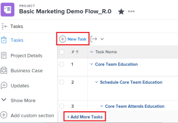
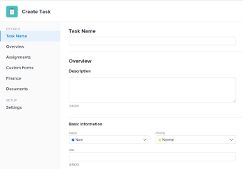
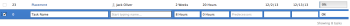

# Create tasks in a project

You can create tasks in a project only after you created the project.

For example, after creating a project, you might want to add tasks and modify them to organize the project plan. For more information about creating a project, see [Create a project](../../../manage-work/projects/create-projects/create-project.md).

For information about creating personal tasks that are not in a project, see the "Create a personal task" section in the article [Create work items from the Home area](../../../workfront-basics/using-home/using-the-home-area/create-work-items-in-home.md).

This article describes how you create tasks from scratch. You can also create tasks in the following ways:

* By copying or duplicating existing tasks.&nbsp;For information, see [Copy and duplicate tasks](../../../manage-work/tasks/manage-tasks/copy-and-duplicate-tasks.md).
* By moving tasks from one project to another.&nbsp;For information, see [Move tasks](../../../manage-work/tasks/manage-tasks/move-tasks.md).

## Access requirements

You must have the following access to perform the steps in this article:

<table cellspacing="0"> 
 <col> 
 <col> 
 <tbody> 
  <tr> 
   <td role="rowheader"><em>Adobe Workfront</em> plan*</td> 
   <td> 
Any
 </td> 
  </tr> 
  <tr> 
   <td role="rowheader"> 
<em>Adobe Workfront</em> license*
 </td> 
   <td> 
<em>Work</em> or higher
 </td> 
  </tr> 
  <tr> 
   <td role="rowheader">Access level configurations*</td> 
   <td> 
Edit access to Tasks and Projects
 
Note: If you still don't have access, ask your <em>Workfront administrator</em> if they set additional restrictions in your access level. For information about access to tasks, see <a href="../../../administration-and-setup/add-users/configure-and-grant-access/grant-access-tasks.md" class="MCXref xref">Grant access to tasks</a>. For information on how a <em>Workfront administrator</em> can change your access level, see <a href="../../../administration-and-setup/add-users/configure-and-grant-access/create-modify-access-levels.md" class="MCXref xref">Create or modify custom access levels</a>. 
 </td> 
  </tr> 
  <tr> 
   <td role="rowheader">Object permissions</td> 
   <td> 
Contribute permissions to the project with ability to Add Tasks or higher
 
When you create a task you automatically receive Manage permissions to the task
 
 For information about task permissions, see <a href="../../../workfront-basics/grant-and-request-access-to-objects/share-a-task.md" class="MCXref xref">Share a task in&nbsp;Adobe Workfront</a>. 
 
For information on requesting additional permissions, see <a href="../../../workfront-basics/grant-and-request-access-to-objects/request-access.md" class="MCXref xref">Request access to objects in Adobe Workfront</a>.
 </td> 
  </tr> 
 </tbody> 
</table>

&#42;To find out what plan, license type, or access you have, contact your *Workfront administrator*.

<!--

<h2>Create tasks in a project</h2>
<ol>
<li value="1">Go to the project where you want to create a task.</li>
<li value="2">Click Tasks in the left panel. </li>
<li value="3"> 
(Conditional) If you are currently viewing the task list in an agile view, click the List View icon  in the upper-right corner to display the task list. 
 </li>
<li value="4"> 
(Optional) Click the Plan Mode icon  and select Manual Save, then select either Standard or Timeline Planning. This disables the Autosave option which is enabled by default. 
 <draft-comment>

  

</draft-comment>
  
 <note type="tip">
You can reverse your changes when you select Manual Save.
</note> </li>
<li value="5"> 
Create a new task by doing one of the following: 

<ul>
<li> 
Click New Task at the top of the task list
 </li>
<li> 
Click Add More Tasks at the bottom of the task list
 </li>
</ul> 
 <draft-comment>

</draft-comment> 
 </li>
<li value="6"> 
(Conditional)&nbsp;If you clicked New Task do the following:

<ol>
<li value="1"> 
Specify any of the fields on the limited list of fields inside the New Task box, then click&nbsp;Create Task if you want to quickly create a task.
 
Or
 
To update all fields for the task, click More Options to open the Create Task box.
 
 <draft-comment>

</draft-comment> 
 
The Create Task box opens. 
 
  
 
&nbsp;
 <note type="note">
Depending on how your
<em>Workfront administrator</em> sets up our Layout Template, the fields in the Create Task box might display different fields in your environment. For information, see
<a href="../../../administration-and-setup/customize-workfront/use-layout-templates/customize-details-view-layout-template.md" class="MCXref xref">Customize the Details view using a layout template</a>.
</note> </li>
<li value="2"> 
Specify information for the following areas in the left panel of the Create Task box:

<ul>
<li> 
Task Name
 </li>
<li> 
Overview
 </li>
<li> 
Assignments
 </li>
<li> 
Custom&nbsp;Forms
 </li>
<li> 
Finance
 </li>
<li> 
Settings
 
For information about defining all task-related fields on a task, see <a href="../../../manage-work/tasks/manage-tasks/edit-tasks.md" class="MCXref xref">Edit tasks</a>. 
 </li>
</ul> </li>
<li value="3"> 
(Conditional and optional) If you want the task to be recurring, update the Recurrence Frequency field. For more information about creating recurring tasks, see <a href="../../../manage-work/tasks/create-tasks/create-recurring-tasks.md" class="MCXref xref">Create recurring tasks</a>.
 </li>
<li value="4"> 
(Optional) Click Documents in the left panel to attach a document to the new task, then click Add or link files to add a document to the task from your computer, another service, or to link documents and folders from your computer or another service.
 </li>
</ol> </li>
<li value="7"> 
(Conditional) If you clicked Add More Tasks in step 5, start entering the task information using in-line editing, then press Enter.
 
We recommend using this option especially when adding multiple tasks to the list. 
 
  
 </li>
<li value="8"> 
(Conditional) Do one of the following:

<ul>
<li> 
If you clicked New Task in step 5, click Create task to save your changes and add the new task to your project..
 </li>
<li> 
If you clicked Add More Tasks in step 5 do the following:

<ol style="list-style-type: lower-alpha;">
<li value="1"> 
Click anywhere in the browser to submit your changes, or press Enter.
 </li>
<li value="2"> 
 (Optional) In the task list, select the newly created task, then click Indent. 
 
This makes the new task a child or subtask of the previous task. 
 
For more information about children tasks, see <a href="../../../manage-work/tasks/task-information/tasks-overview.md" class="MCXref xref">Tasks overview</a>. 
 </li>
<li value="3"> 
(Conditional) If you disabled the Autosave option after pressing Add More Tasks, you may do the following: 

<ul>
<li> 
Click Undo at any time to reverse your last change, or Cancel to reverse all the changes you made to the task list. 
 </li>
<li> 
If you previously clicked Undo, click Redo to re-apply the last change you canceled.
 </li>
<li>Click Save to save your changes to the task list. </li>
</ul> </li>
</ol> </li>
</ul> </li>
</ol>

-->

## Create tasks in a project

<ol> 
 <li value="1">Go to the project where you want to create a task.</li> 
 <li value="2">Click Tasks in the left panel. </li> 
 <li value="3"> 
(Conditional) If you are currently viewing the task list in an agile view, click the List View icon  in the upper-right corner to display the task list. 
 </li> 
 <li value="4"> 
(Optional) Click the Plan Mode icon  and select Manual Save, then select either Standard or Timeline Planning. This disables the Autosave option which is enabled by default. 
 
  
 <note type="tip">
   You can reverse your changes when you select Manual Save.
  </note> </li> 
 <li value="5"> 
Create a new task by doing one of the following: 
 
  <ul> 
   <li> 
Click New Task at the top of the task list
 </li> 
   <li> 
Click Add More Tasks at the bottom of the task list
 </li> 
  </ul> 
  
 </li> 
 <li value="6"> 
(Conditional)&nbsp;If you clicked New Task do the following:
 
  <ol> 
   <li value="1"> 
Specify any of the fields on the limited list of fields inside the New Task box, then click&nbsp;Create Task if you want to quickly create a task.
 
Or
 
To update all fields for the task, click More Options to open the Create Task box.
 
  
 
The Create Task box opens. 
 
  
 
&nbsp;
 <note type="note">
     Depending on how your 
     <em>Workfront administrator</em> sets up our Layout Template, the fields in the Create Task box might display different fields in your environment. For information, see 
     <a href="../../../administration-and-setup/customize-workfront/use-layout-templates/customize-details-view-layout-template.md" class="MCXref xref">Customize the Details view using a layout template</a>.
    </note> </li> 
   <li value="2"> 
Specify information for the following areas in the left panel of the Create Task box:
 
    <ul> 
     <li> 
Task Name
 </li> 
     <li> 
Overview
 </li> 
     <li> 
Assignments
 </li> 
     <li> 
Custom&nbsp;Forms
 </li> 
     <li> 
Finance
 </li> 
     <li> 
Settings
 
For information about defining all task-related fields on a task, see <a href="../../../manage-work/tasks/manage-tasks/edit-tasks.md" class="MCXref xref">Edit tasks</a>. 
 </li> 
    </ul> </li> 
   <li value="3"> 
(Conditional and optional) If you want the task to be recurring, update the Recurrence Frequency field. For more information about creating recurring tasks, see <a href="../../../manage-work/tasks/create-tasks/create-recurring-tasks.md" class="MCXref xref">Create recurring tasks</a>.
 </li> 
   <li value="4"> 
(Optional) Click Documents in the left panel to attach a document to the new task, then click Add or link files to add a document to the task from your computer, another service, or to link documents and folders from your computer or another service.
 </li> 
  </ol> </li> 
 <li value="7"> 
(Conditional) If you clicked Add More Tasks in step 5, start entering the task information using in-line editing, then press Enter.
 
We recommend using this option especially when adding multiple tasks to the list. 
 
  
 </li> 
 <li value="8"> 
(Conditional) Do one of the following:
 
  <ul> 
   <li> 
If you clicked New Task in step 5, click Create task to save your changes and add the new task to your project..
 </li> 
   <li> 
If you clicked Add More Tasks in step 5 do the following:
 
    <ol style="list-style-type: lower-alpha;"> 
     <li value="1"> 
Click anywhere in the browser to submit your changes, or press Enter.
 </li> 
     <li value="2"> 
 (Optional) In the task list, select the newly created task, then click Indent. 
 
This makes the new task a child or subtask of the previous task. 
 
For more information about children tasks, see <a href="../../../manage-work/tasks/task-information/tasks-overview.md" class="MCXref xref">Tasks overview</a>. 
 </li> 
     <li value="3"> 
(Conditional) If you disabled the Autosave option after pressing Add More Tasks, you may do the following: 
 
      <ul> 
       <li> 
Click Undo at any time to reverse your last change, or Cancel to reverse all the changes you made to the task list. 
 </li> 
       <li> 
If you previously clicked Undo, click Redo to re-apply the last change you canceled.
 </li> 
       <li>Click Save to save your changes to the task list. </li> 
      </ul> </li> 
    </ol> </li> 
  </ul> </li> 
</ol>

