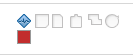

# Associate milestones with tasks {#associate-milestones-with-tasks}

You can associate milestones with tasks to indicate when important steps in the lifetime of the project are reached. 

## Access requirements {#access-requirements}

You must have the following access to perform the steps in this article:

<table style="width: 100%;margin-left: 0;margin-right: auto;mc-table-style: url('../../../Resources/TableStyles/TableStyle-List-options-in-steps.css');" class="TableStyle-TableStyle-List-options-in-steps" cellspacing="0"> 
 <col class="TableStyle-TableStyle-List-options-in-steps-Column-Column1"> 
 <col class="TableStyle-TableStyle-List-options-in-steps-Column-Column2"> 
 <tbody> 
  <tr class="TableStyle-TableStyle-List-options-in-steps-Body-LightGray"> 
   <td class="TableStyle-TableStyle-List-options-in-steps-BodyE-Column1-LightGray" role="rowheader">Adobe Workfront plan*</td> 
   <td class="TableStyle-TableStyle-List-options-in-steps-BodyD-Column2-LightGray"> 
Any
 </td> 
  </tr> 
  <tr class="TableStyle-TableStyle-List-options-in-steps-Body-MediumGray"> 
   <td class="TableStyle-TableStyle-List-options-in-steps-BodyE-Column1-MediumGray" role="rowheader">Adobe Workfront license*</td> 
   <td class="TableStyle-TableStyle-List-options-in-steps-BodyD-Column2-MediumGray"> 
Work or higher
 </td> 
  </tr> 
  <tr class="TableStyle-TableStyle-List-options-in-steps-Body-LightGray"> 
   <td class="TableStyle-TableStyle-List-options-in-steps-BodyE-Column1-LightGray" role="rowheader">Access level configurations*</td> 
   <td class="TableStyle-TableStyle-List-options-in-steps-BodyD-Column2-LightGray"> 
Edit access to Tasks
 
Note: If you still don't have access, ask your Workfront administrator if they set additional restrictions in your access level. For information on how a Workfront administrator can modify your access level, see <a href="create-modify-access-levels.md" class="MCXref xref">Create or modify custom access levels</a>.
 </td> 
  </tr> 
  <tr class="TableStyle-TableStyle-List-options-in-steps-Body-MediumGray"> 
   <td class="TableStyle-TableStyle-List-options-in-steps-BodyB-Column1-MediumGray" role="rowheader">Object permissions</td> 
   <td class="TableStyle-TableStyle-List-options-in-steps-BodyA-Column2-MediumGray"> 
Manage permissions to the task
 
For information on requesting additional access, see <a href="request-access.md" class="MCXref xref">Request access to objects in Adobe Workfront</a>.
 </td> 
  </tr> 
 </tbody> 
</table>

&#42;To find out what plan, license type, or access you have, contact your *`Workfront administrator`*.

## Prerequisites {#prerequisites}

Before you can associate a milestone with a task, the following must exist: 

*  The *`Workfront administrator`* must create a milestone path, as described in [Create a milestone path](create-milestone-path.md).

*  In order to associate a milestone path with a project, the project must be in Planning or Current status.

>[!TIP] {type="tip"}
>
>To get the best overview of the progress of milestones in your projects using the Milestone view, you should create parent tasks and associate them with each major phase of your project. Then, associate these parent tasks with each of the milestones of your milestone path.

## Associate a milestone with a task {#associate-a-milestone-with-a-task}

1.  Go to a project, then click the `More` icon , then `Edit`. 
1. Using the `Settings` section, set the milestone path to be used on the project. 
1. Click `Save`. 
1.  Go to a task, then click the `More` icon , then `Edit`. 
1.  After a milestone path is associated with a project, tasks can be assigned a milestone.

   Tasks and Milestones have a 1:1 relationship. You cannot attach the same milestone to multiple tasks. Each task can be linked to a single milestone, or each milestone can be mapped to one task.

1.  Click  `Save`.
1.  (Optional) In a list of tasks, add the `Status Icons` column to identify which tasks have milestones.

   

1.  (Optional) In a list of projects, select the `Milestone` view to identify the progress of your milestone tasks. 

   

