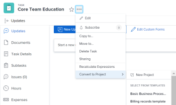

#  Convert a task to a project {#convert-a-task-to-a-project}

When a task in a project requires a larger amount of effort to complete than you originally planned, you can convert it to a project. 

## Access requirements {#access-requirements}

You must have the following access to perform the steps in this article:

<table style="width: 100%;margin-left: 0;margin-right: auto;mc-table-style: url('../../../Resources/TableStyles/TableStyle-List-options-in-steps.css');" class="TableStyle-TableStyle-List-options-in-steps" cellspacing="0"> 
 <col class="TableStyle-TableStyle-List-options-in-steps-Column-Column1"> 
 <col class="TableStyle-TableStyle-List-options-in-steps-Column-Column2"> 
 <tbody> 
  <tr class="TableStyle-TableStyle-List-options-in-steps-Body-LightGray"> 
   <td class="TableStyle-TableStyle-List-options-in-steps-BodyE-Column1-LightGray" role="rowheader">Adobe Workfront plan*</td> 
   <td class="TableStyle-TableStyle-List-options-in-steps-BodyD-Column2-LightGray"> 
Any
 </td> 
  </tr> 
  <tr class="TableStyle-TableStyle-List-options-in-steps-Body-MediumGray"> 
   <td class="TableStyle-TableStyle-List-options-in-steps-BodyE-Column1-MediumGray" role="rowheader">Adobe Workfront license*</td> 
   <td class="TableStyle-TableStyle-List-options-in-steps-BodyD-Column2-MediumGray"> 
Plan 
 </td> 
  </tr> 
  <tr class="TableStyle-TableStyle-List-options-in-steps-Body-LightGray"> 
   <td class="TableStyle-TableStyle-List-options-in-steps-BodyE-Column1-LightGray" role="rowheader">Access level configurations*</td> 
   <td class="TableStyle-TableStyle-List-options-in-steps-BodyD-Column2-LightGray"> 
Edit access to Tasks and&nbsp;Projects
 
View or higher access to&nbsp;Templates, when converting to a project using a template
 
Note: If you still don't have access, ask your Workfront administrator if they set additional restrictions in your access level. For information on how a Workfront administrator can modify your access level, see <a href="create-modify-access-levels.md" class="MCXref xref">Create or modify custom access levels</a>.
 </td> 
  </tr> 
  <tr class="TableStyle-TableStyle-List-options-in-steps-Body-MediumGray"> 
   <td class="TableStyle-TableStyle-List-options-in-steps-BodyB-Column1-MediumGray" role="rowheader">Object permissions</td> 
   <td class="TableStyle-TableStyle-List-options-in-steps-BodyA-Column2-MediumGray"> 
Manage permissions to a task
 
View permissions on a template, if converting to a project using a template
 
After creating the project, you have Manage permissions to the project
 
For information on requesting additional access, see <a href="request-access.md" class="MCXref xref">Request access to objects in Adobe Workfront</a>.
 </td> 
  </tr> 
 </tbody> 
</table>

&#42;To find out what plan, license type, or access you have, contact your *`Workfront administrator`*.

## Considerations for converting tasks to projects {#considerations-for-converting-tasks-to-projects}

* The original task is deleted.
* Task approvals are deleted.
* All sub-tasks, issues and notes roll up to the new project.
* Documents, document versions, and *`proofs`* are moved to the new project.
* Status and percent complete of all sub-tasks and issues are preserved.
* Shared users of the task become shared users on the project.
* The project start date is set to the start date of the task.
* If the task status is 'New' the project status is set to 'Planning.'
* If the task status is 'In Progress' the project status is set to 'Current.'
* If the task status is 'Complete' the project status is set to 'Complete.'

## Convert a task to a project {#convert-a-task-to-a-project-1}

1. Go to the task that you want to convert to a project.
1.  Click the `More` icon, then `Convert to Project`. 
1.  Choose either the following options: 

    
    
    *  `New Project` 
    *  A template in the `Select From Templates`section
    
    
          
    

    
    
    

1. Click `Continue` on the notification that appears.
1.  In the `Convert to Project` box, specify the following:

    
    
    * `Name`: Name your project. The default name is the name of the task.
    * (Optional) `Description`: Describe the purpose for this project.
    *  (Optional and conditional) If you have selected to create a project from a template, update the available fields in the `Convert to Project` dialog box. 
    
    
      For more information about editing fields on projects, see [Edit projects](edit-projects.md).
    
      ` `**Tip: **`` To update fields in the Finance section in the Convert to Project box you must have Edit access to Financial&nbsp;Data in your access level.&nbsp;If you have View access to Financial Data in your access level all financial information from the template transfers to the new project and you cannot edit it while you convert the issue. For information, see [Grant access to financial data](grant-access-financial.md) and [Share a template overview](share-a-template.md). 
    
    *  (Optional) Add `Custom Forms` to the new project.
    
    
      For more information about transferring information from the custom form of the task to that of the new project, see [Transfer custom form data to a larger work item](transfer-custom-form-data-larger-item.md).
    
    
    

1. Click `Save Changes`.

