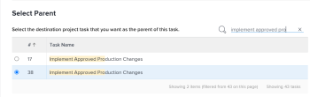

# Copy and duplicate tasks

The highlighted information on this page refers to functionality not yet generally available. It is available only in the Preview Sandbox environment.

You can copy a task from a project to another project, or you can duplicate a task within the same project.

You can copy or duplicate one or several tasks or parent tasks at a time.

## Access requirements

You must have the following access to perform the steps in this article:

<table cellspacing="0"> 
 <col> 
 <col> 
 <tbody> 
  <tr> 
   <td role="rowheader"><em>Adobe Workfront</em> plan*</td> 
   <td> 
Any
 </td> 
  </tr> 
  <tr> 
   <td role="rowheader"><em>Adobe Workfront</em> license*</td> 
   <td> 
<em>Work</em> or higher 
 </td> 
  </tr> 
  <tr> 
   <td role="rowheader">Access level configurations*</td> 
   <td> 
Edit access to Tasks and Projects
 
Note: If you still don't have access, ask your <em>Workfront administrator</em> if they set additional restrictions in your access level. For information on how a <em>Workfront administrator</em> can modify your access level, see <a href="../../../administration-and-setup/add-users/configure-and-grant-access/create-modify-access-levels.md" class="MCXref xref">Create or modify custom access levels</a>.
 </td> 
  </tr> 
  <tr> 
   <td role="rowheader">Object permissions</td> 
   <td> 
Manage permissions to a task 
 
Contribute or higher permissions to the project
 
For information on requesting additional access, see <a href="../../../workfront-basics/grant-and-request-access-to-objects/request-access.md" class="MCXref xref">Request access to objects in Adobe Workfront</a>.
 </td> 
  </tr> 
 </tbody> 
</table>

&#42;To find out what plan, license type, or access you have, contact your *Workfront administrator*.

## Considerations for copying tasks

Consider the following when copying a task:

* Issues are not copied with the task.
* Milestones are transferred to the copied task and removed from the original task.

You can copy a task in the following areas of the *Adobe Workfront* web application:

<ul> 
 <li> <draft-comment>
   
At the task level, from the More icon  to the left of the task name. 

  </draft-comment>
At the task level, from the More icon  to the left of the task name. 
 
For information, see the <a href="#copy" class="MCXref xref">Copy a task&nbsp;at the task level</a> section in this article.
 </li> 
 <li> 
In a task list, by doing one of the following:
 
  <ul> 
   <li> 
Right-click the name of a task.
 </li> 
   <li> 
Select the task (or tasks) and expand the <draft-comment>
      <MadCap:conditionalText data-mc-conditions="QuicksilverOrClassic.Quicksilver">
       More icon 
       
      </MadCap:conditionalText>
     </draft-comment><MadCap:conditionalText data-mc-conditions="QuicksilverOrClassic.Quicksilver">
      More icon 
      
     </MadCap:conditionalText> at the top of the task list.
 </li> 
   <li> 
Select a task and expanding the More icon  next to the task name.
 
This option is not available when selecting multiple tasks. 
 </li> 
  </ul> 
For information, see the <a href="#copy2" class="MCXref xref">Copy tasks in a list</a> section in this article.
 </li> 
</ul>

## Copy tasks in a list

<ol> 
 <li value="1"> 
Go to the project that contains the task or tasks that you want to copy.
 
Or
 
Go to a task report. 
 </li> 
 <li value="2"> <draft-comment>
   
Click Tasks in the left panel. 

  </draft-comment>
Click Tasks in the left panel. 
 </li> 
 <li value="3"> <draft-comment>
   
Click the Plan mode menu  , then Autosave.

  </draft-comment>
Click the Plan mode menu  , then Autosave.
 <note type="important">
   You can copy tasks in a list only when automatically saving your changes. For information about saving options when editing tasks, see 
   <a href="../../../manage-work/tasks/manage-tasks/edit-tasks-in-a-list.md" class="MCXref xref">Edit tasks in a list</a>.
  </note> </li> 
 <li value="4"> <draft-comment>
   
Select the task or tasks that you want to copy and do one of the following:

  </draft-comment>
Select the task or tasks that you want to copy and do one of the following:
 <draft-comment>
   <ul data-mc-conditions="QuicksilverOrClassic.Quicksilver"> 
    <li> 
Click the More menu  at the top of the task list, then click Copy to. 
 </li> 
    <li> 
Right click the selected tasks, then click Copy to.
 </li> 
    <li> 
When selecting one task, click the More menu  next to the task name in the list, then click&nbsp;Copy to. 
 </li> 
   </ul>
  </draft-comment>
  <ul data-mc-conditions="QuicksilverOrClassic.Quicksilver"> 
   <li> 
Click the More menu  at the top of the task list, then click Copy to. 
 </li> 
   <li> 
Right click the selected tasks, then click Copy to.
 </li> 
   <li> 
When selecting one task, click the More menu  next to the task name in the list, then click&nbsp;Copy to. 
 </li> 
  </ul> <draft-comment>
   
  

  </draft-comment>
  
 </li> 
 <li value="5"> <draft-comment>
   
Continue with copying the task, as described in the section <a href="#copy" class="MCXref xref">Copy a task&nbsp;at the task level</a> starting with Step 4.

  </draft-comment>
Continue with copying the task, as described in the section <a href="#copy" class="MCXref xref">Copy a task&nbsp;at the task level</a> starting with Step 4.
 </li> 
</ol>

## Copy a task&nbsp;at the task level

In addition to copying tasks in a list of tasks, you can also copy a task after you have opened it.&nbsp;

<!--

<ol>
<li value="1">Find a task in your <em>Workfront</em> system by searching for it.</li>
<li value="2">Click the name of the task to open it.&nbsp;</li>
<li value="3"> 
Click the More drop-down menu  next to the name of the task, then click Copy  to. 
 
 <draft-comment>

</draft-comment> 
 
The Copy Task box displays. 
 </li>
<li value="4"> 
(Optional) Update the Task Name. 

Tip: </b>">
<b>Tip: </b>

This field is dimmed and not editable when selecting to copy multiple tasks in a list. You can hover over the Task Name field and a list of all selected tasks displays.

  

 </li>
<li value="5"> 
Type the name of the Destination Project&nbsp;where you want to copy the task in the Select Destination Project field.&nbsp;

Tips: </b>">
<b>Tips: </b>
<ul>
<li> 
The name of the project is case sensitive. 
 </li>
<li> 
You can also start typing the Reference Number or enter the ID of the project. This might help you distinguish between projects with identical names. 
 </li>
<li> 
Only 100 projects display in the list.
 </li>
</ul>

 
The current project name displays by default. If you want to copy the task within the same project, leave this field unchanged. 
 </li>
<li value="6"> 
(Conditional)&nbsp;Click&nbsp;request access to request access to the project, if you don't have access to the selected project. 
 <draft-comment>

Continue to copy the task on the selected destination project without request access if you have access to add tasks to one of the tasks on the destination project. 

</draft-comment>
Continue to copy the task on the selected destination project without request access if you have access to add tasks to one of the tasks on the destination project. 
 
  
 <note type="tip">
Similar messages display if the project selected is in pending approval or completed or dead, when the
<em>Workfront administrator</em> prevents adding tasks to these projects.&nbsp;For more information, see
<a href="../../../administration-and-setup/set-up-workfront/configure-system-defaults/set-project-preferences.md" class="MCXref xref">Configure system-wide project preferences</a>.
</note> </li>
<li value="7"> 
Click&nbsp;Options in the left panel, then deselect the task attributes that you do not want to copy with the task. All options are selected by default. 
 <note type="tip">
Selecting then deselecting
Select all deselects all the options.
</note> 
Deselect from the following options to not transfer them to the copied task. The following table describes what happens when the options are deselected: 

<table cellspacing="0">
<col>
<col>
<tbody>
<tr>
<td role="rowheader">Constraint</td>
<td> 
The task constraint is set to As Soon As Possible or As Late As Possible based on the project Schedule Mode setting.
 
 When selected, the current constraint of the task transfers to the copied task. 
 <note type="note">
When moving or copying a task with date-specific constraints to another project and the constraint dates of the task are outside the dates of the new project, either the Task&nbsp;Constraint changes to As Soon as Possible or As Late as Possible or the Planned Start or Planned Completion dates of the projects are adjusted. Some examples of date-specific constraints are Must Start On, Must&nbsp;Finish On, Start No Earlier Than, Start No Later Than, etc. For information about task constraints and how task constraints or project dates can be affected, see
<a href="../../../manage-work/tasks/task-constraints/task-constraint-overview.md" class="MCXref xref">Task Constraint overview</a> and look for a specific constraint.
</note> </td>
</tr>
<tr>
<td role="rowheader">Assignments</td>
<td> 
All the assignments are removed from the task. 
 </td>
</tr>
<tr>
<td role="rowheader">Approval Process</td>
<td>All approval processes are removed from the task.</td>
</tr>
<tr>
<td role="rowheader">Progress</td>
<td>The task status is New. Otherwise, the copied task keeps the status of the existing task.</td>
</tr>
<tr>
<td role="rowheader">Financial Information</td>
<td>The financial information of the task is removed.</td>
</tr>
<tr>
<td role="rowheader">All&nbsp;Predecessors</td>
<td> 
This means that the dependencies will not carry over to the copied tasks. 
 
When selected, the predecessors within the group of copied tasks are preserved, others are deleted.
 </td>
</tr>
<tr>
<td role="rowheader">Documents</td>
<td> 
The documents attached to the task are not transferred to the copied task. This includes versions, <em>proofs</em>, and linked documents.
 
This does not include document approvals. Document approvals can never be copied when a task is copied.
 </td>
</tr>
<tr>
<td role="rowheader">Reminder Notifications</td>
<td>The task reminders do not transfer to the copied task. </td>
</tr>
<tr>
<td role="rowheader">Expenses</td>
<td>The expenses logged on the task do not transfer to the copied task. </td>
</tr>
<tr>
<td role="rowheader">Permissions</td>
<td><em>Workfront</em> removes the names of all the entities displaying in the Sharing list of the task. </td>
</tr>
<tr>
<td role="rowheader">Custom Data</td>
<td> 
The values for the custom fields are cleared and the custom forms are transferred to the copied task. 
 
When selected, both the forms and the values for the custom fields transfer to the copied task. 
 </td>
</tr>
</tbody>
</table> </li>
<li value="8"> 
&nbsp;(Optional) Click Select Parent in the left panel, then select the task in the destination project that you want to become the parent of the copied task. 
 <note type="tip">
When selecting to copy multiple tasks in a list, all selected tasks become the children of the selected parent.
</note> 
Select a parent by doing one of the following:

<ul>
<li> 
In the task list, select one of the parents in the project plan.
 </li>
<li> 
Click the search icon  and search for a parent task by name. 
 </li>
</ul> 
The task should appear in the list.
 
  
 </li>
<li value="9"> 
Select the radio button for the parent, after you have found it.&nbsp;
 
If you do not select a parent task, the tasks are copied as main tasks rather than subtasks and they&nbsp;will be placed at the end of the task list on the destination project.&nbsp;
 </li>
<li value="10">

Click Copy task

Or

Click Copy tasks when you select multiple tasks in a list. 

 
The copied tasks are&nbsp;now on the specified project and&nbsp;are either subtasks to the selected parent task, or the last tasks on the project.
 </li>
</ol>

-->

<ol> 
 <li value="1">Find a task in your <em>Workfront</em> system by searching for it.</li> 
 <li value="2">Click the name of the task to open it.&nbsp;</li> 
 <li value="3"> 
Click the More drop-down menu  next to the name of the task, then click Copy  to. 
 
  
 
The Copy Task box displays. 
 </li> 
 <li value="4"> 
(Optional) Update the Task Name. 
 
  
Tip: </b>">
   <b>Tip: </b> 
   
This field is dimmed and not editable when selecting to copy multiple tasks in a list. You can hover over the Task Name field and a list of all selected tasks displays.
 
   
  
 
  
 </li> 
 <li value="5"> 
Type the name of the Destination Project&nbsp;where you want to copy the task in the Select Destination Project field.&nbsp;
 
  
Tips: </b>">
   <b>Tips: </b> 
   <ul> 
    <li> 
The name of the project is case sensitive. 
 </li> 
    <li> 
You can also start typing the Reference Number or enter the ID of the project. This might help you distinguish between projects with identical names. 
 </li> 
    <li> 
Only 100 projects display in the list.
 </li> 
   </ul> 
  
 
The current project name displays by default. If you want to copy the task within the same project, leave this field unchanged. 
 </li> 
 <li value="6"> 
(Conditional)&nbsp;Click&nbsp;request access to request access to the project, if you don't have access to the selected project. 
 
Continue to copy the task on the selected destination project without request access if you have access to add tasks to one of the tasks on the destination project. 
 
  
 <note type="tip">
   Similar messages display if the project selected is in pending approval or completed or dead, when the 
   <em>Workfront administrator</em> prevents adding tasks to these projects.&nbsp;For more information, see 
   <a href="../../../administration-and-setup/set-up-workfront/configure-system-defaults/set-project-preferences.md" class="MCXref xref">Configure system-wide project preferences</a>.
  </note> </li> 
 <li value="7"> 
Click&nbsp;Options in the left panel, then deselect the task attributes that you do not want to copy with the task. All options are selected by default. 
 <note type="tip">
   Selecting then deselecting 
   Select all deselects all the options. 
  </note> 
Deselect from the following options to not transfer them to the copied task. The following table describes what happens when the options are deselected: 
 
  <table cellspacing="0"> 
   <col> 
   <col> 
   <tbody> 
    <tr> 
     <td role="rowheader">Constraint</td> 
     <td> 
The task constraint is set to As Soon As Possible or As Late As Possible based on the project Schedule Mode setting.
 
 When selected, the current constraint of the task transfers to the copied task. 
 <note type="note">
       When moving or copying a task with date-specific constraints to another project and the constraint dates of the task are outside the dates of the new project, either the Task&nbsp;Constraint changes to As Soon as Possible or As Late as Possible or the Planned Start or Planned Completion dates of the projects are adjusted. Some examples of date-specific constraints are Must Start On, Must&nbsp;Finish On, Start No Earlier Than, Start No Later Than, etc. For information about task constraints and how task constraints or project dates can be affected, see 
       <a href="../../../manage-work/tasks/task-constraints/task-constraint-overview.md" class="MCXref xref">Task Constraint overview</a> and look for a specific constraint.
      </note> </td> 
    </tr> 
    <tr> 
     <td role="rowheader">Assignments</td> 
     <td> 
All the assignments are removed from the task. 
 </td> 
    </tr> 
    <tr> 
     <td role="rowheader">Approval Process</td> 
     <td>All approval processes are removed from the task.</td> 
    </tr> 
    <tr> 
     <td role="rowheader">Progress</td> 
     <td>The task status is New. Otherwise, the copied task keeps the status of the existing task.</td> 
    </tr> 
    <tr> 
     <td role="rowheader">Financial Information</td> 
     <td>The financial information of the task is removed.</td> 
    </tr> 
    <tr> 
     <td role="rowheader">All&nbsp;Predecessors</td> 
     <td> 
This means that the dependencies will not carry over to the copied tasks. 
 
When selected, the predecessors within the group of copied tasks are preserved, others are deleted.
 </td> 
    </tr> 
    <tr> 
     <td role="rowheader">Documents</td> 
     <td> 
The documents attached to the task are not transferred to the copied task. This includes versions, <em>proofs</em>, and linked documents.
 
This does not include document approvals. Document approvals can never be copied when a task is copied.
 </td> 
    </tr> 
    <tr> 
     <td role="rowheader">Reminder Notifications</td> 
     <td>The task reminders do not transfer to the copied task. </td> 
    </tr> 
    <tr> 
     <td role="rowheader">Expenses</td> 
     <td>The expenses logged on the task do not transfer to the copied task. </td> 
    </tr> 
    <tr> 
     <td role="rowheader">Permissions</td> 
     <td><em>Workfront</em> removes the names of all the entities displaying in the Sharing list of the task. </td> 
    </tr> 
    <tr> 
     <td role="rowheader">Custom Data</td> 
     <td> 
The values for the custom fields are cleared and the custom forms are transferred to the copied task. 
 
When selected, both the forms and the values for the custom fields transfer to the copied task. 
 </td> 
    </tr> 
   </tbody> 
  </table> </li> 
 <li value="8"> 
&nbsp;(Optional) Click Select Parent in the left panel, then select the task in the destination project that you want to become the parent of the copied task. 
 <note type="tip">
   When selecting to copy multiple tasks in a list, all selected tasks become the children of the selected parent. 
  </note> 
Select a parent by doing one of the following:
 
  <ul> 
   <li> 
In the task list, select one of the parents in the project plan.
 </li> 
   <li> 
Click the search icon  and search for a parent task by name. 
 </li> 
  </ul> 
The task should appear in the list.
 
  
 </li> 
 <li value="9"> 
Select the radio button for the parent, after you have found it.&nbsp;
 
If you do not select a parent task, the tasks are copied as main tasks rather than subtasks and they&nbsp;will be placed at the end of the task list on the destination project.&nbsp;
 </li> 
 <li value="10"> 
  
 
   
Click Copy task
 
   
Or
 
   
Click Copy tasks when you select multiple tasks in a list. 
 
  
 
The copied tasks are&nbsp;now on the specified project and&nbsp;are either subtasks to the selected parent task, or the last tasks on the project.
 </li> 
</ol>

## Duplicate tasks

You can quickly duplicate a task in a task list, if you need an identical task on the same project.

* [Considerations for duplicating tasks](#consider) 
* [Duplicate tasks](#duplicat)

### Considerations for duplicating tasks

* You can duplicate a task in a task list only when the list is sorted by task number.

* The new task will have the same name as the original task.
* You cannot select what information is duplicated to the new task. Almost all the information from the original task will be transferred to the duplicated task, including parent relationship, by default. 
* The following items are not transferred to the new task:

  * Logged hours
  * Notes
  * Issues
  * Only the predecessors which are in the same group of copied tasks are also copied with their successor tasks.

    ` `**Example: **``For example, if you copy Task 2 and its predecessor, Task 1, at the same time, then you have a copy of Task 2 and a copy of Task 1. The copy of Task 1 will be the predecessor of the copy of Task 2. But if you copy just Task 2 without copying its predecessor, then its copy will have no predecessor.

* When you duplicate a parent task, all children tasks are also duplicated, even when the children tasks are not selected. 
* You can duplicate multiple tasks as the same time.

  However, you cannot duplicate multiple tasks that are not sequential at the same time. 

* Milestones are moved to the new task and removed from the original task.

### Duplicate tasks

<ol> 
 <li value="1"> 
Go to the project that contains the task or tasks that you want to duplicate.
 </li> 
 <li value="2"> <draft-comment>
   
Click Tasks in the left panel.

  </draft-comment>
Click Tasks in the left panel.
 </li> 
 <li value="3"> 
  
 
   
Do one of the following:
 
   <ul> 
    <li> <draft-comment>
      
(Conditional) Click the Plan mode menu  > Autosave, select the tasks you want to duplicate, then click the More menu  > Duplicate. 

     </draft-comment>
(Conditional) Click the Plan mode menu  > Autosave, select the tasks you want to duplicate, then click the More menu  > Duplicate. 
 <draft-comment>
      
  

     </draft-comment>
  
 </li> 
   </ul> 
   <ul> 
    <li> 

      <draft-comment>
       (Conditional) Click the Plan mode menu  > Manual save > Standard or Timeline Planning, then do the following:
      </draft-comment>(Conditional) Click the Plan mode menu  > Manual save > Standard or Timeline Planning, then do the following: 
 </li> 
    <ol> 
     <li value="1">Select the task or tasks you want to duplicate, and click Duplicate. </li> 
     <li value="2">(Optional) Click Undo to reverse your changes and not duplicate the tasks.</li> 
     <li value="3">(Optional and conditional) Click Redo if you had previously clicked Undo, to keep the changes and duplicate the tasks.</li> 
     <li value="4">Click Save to save your changes.</li> 
    </ol> 
   </ul> 
   <ol>
     The tasks you selected are added directly after the original tasks, on the same project. If the tasks you duplicated were children tasks, they are added under the same parent as the original task. For information about saving options when editing tasks, see <a href="../../../manage-work/tasks/manage-tasks/edit-tasks-in-a-list.md" class="MCXref xref">Edit tasks in a list</a><![CDATA[                
						]]>
   </ol> 
  
 </li> 
</ol>

