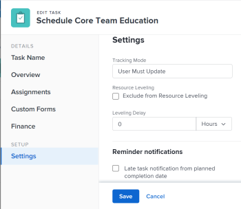

# Edit tasks

You can edit information on tasks that you have created, or that you have Contribute or Manage permissions to.

## Access requirements

You must have the following access to perform the steps in this article:

<table cellspacing="0"> 
 <col> 
 <col> 
 <tbody> 
  <tr> 
   <td role="rowheader"><em>Adobe Workfront</em> plan*</td> 
   <td> 
Any 
 </td> 
  </tr> 
  <tr> 
   <td role="rowheader"><em>Adobe Workfront</em> license*</td> 
   <td> 
<em>Work</em> or higher
 </td> 
  </tr> 
  <tr> 
   <td role="rowheader">Access level*</td> 
   <td> 
Edit access to Tasks and&nbsp;Projects
 
Note: If you still don't have access, ask your <em>Workfront administrator</em> if they set additional restrictions in your access level. For information on how a <em>Workfront administrator</em> can change your access level, see <a href="../../../administration-and-setup/add-users/configure-and-grant-access/create-modify-access-levels.md" class="MCXref xref">Create or modify custom access levels</a>.
 </td> 
  </tr> 
  <tr> 
   <td role="rowheader">Object permissions</td> 
   <td> 
    <ul> 
     <li> 
Contribute permissions to a task to edit it in the Task Details area 
 </li> 
     <li> 
Manage permissions to a task to edit it in the Edit Task box
 </li> 
    </ul> 
    <ul> 
     <li> 
Contribute or higher permissions to the project
 </li> 
    </ul> 
For information on requesting additional access, see <a href="../../../workfront-basics/grant-and-request-access-to-objects/request-access.md" class="MCXref xref">Request access to objects in Adobe Workfront</a>.
 </td> 
  </tr> 
 </tbody> 
</table>

&#42;To find out what plan, license type, or access you have, contact your *Workfront administrator*.

## Limitations for editing tasks

There are some limitations that might prevent you from editing tasks.

Consider the following when editing tasks:

<ul> 
 <li>Updating tasks triggers notifications for projects that are a Current status. To avoid confusion for users who are assigned to the tasks, limit editing tasks as much as possible when the project is in the Current status. </li> 
 <li> 
You cannot edit tasks that are in an Approval Process. You can only log time or update the Status for a task in an approval process. 
 <draft-comment>
   
  

  </draft-comment>
  
 </li> 
 <li>You can edit and add documents to tasks on a project that has a status of Complete, Dead, or is Pending Approval only when your <em>Workfront administrator</em> or a <em>group administrator</em> enabled this functionality in the Project Preferences area. For information about setting project preferences, see <a href="../../../administration-and-setup/set-up-workfront/configure-system-defaults/set-project-preferences.md" class="MCXref xref">Configure system-wide project preferences</a>. </li> 
 <li>You can always edit the following information on a task when the project has been marked Complete, Dead, or is in an Approval Process:
  <ul>
   <li>
Log time
</li>
   <li>Edit existing expenses</li>
   <li>Attach a custom form</li>
  </ul></li> 
</ul>

## Edit a task in a list

You can edit task information in a list of tasks, by inline editing fields displayed in the view of the list.

For information about editing tasks in lists, see [Edit tasks in a list](../../../manage-work/tasks/manage-tasks/edit-tasks-in-a-list.md).

<!--

 <draft-comment>
<h2 data-mc-conditions="QuicksilverOrClassic.Quicksilver">Edit a task in a list using the Summary</h2>
</draft-comment>
<h2 data-mc-conditions="QuicksilverOrClassic.Quicksilver">Edit a task in a list using the Summary</h2> <draft-comment>

You can edit a task in a list using the Summary panel. For information about editing a task in the Summary panel, see the "Edit a task in the Summary" section in the <a href="../../../manage-work/tasks/manage-tasks/edit-tasks-in-a-list.md" class="MCXref xref">Edit tasks in a list</a> article.

</draft-comment>

You can edit a task in a list using the Summary panel. For information about editing a task in the Summary panel, see the "Edit a task in the Summary" section in the <a href="../../../manage-work/tasks/manage-tasks/edit-tasks-in-a-list.md" class="MCXref xref">Edit tasks in a list</a> article.

-->

## Edit a task in a list using the Summary

You can edit a task in a list using the Summary panel. For information about editing a task in the Summary panel, see the "Edit a task in the Summary" section in the [Edit tasks in a list](../../../manage-work/tasks/manage-tasks/edit-tasks-in-a-list.md) article.

## Edit a task in the Edit Task box

You can edit a task using the Edit Task or Task Details areas. The following steps describe editing a task in the Edit Task box.

<!--

<ol>
<li value="1">Click the Main Menu icon  in the upper-right corner of <em>Adobe Workfront</em>.</li>
<li value="2"> <draft-comment>
<MadCap:conditionalText data-mc-conditions="QuicksilverOrClassic.Quicksilver">
Click
Projects, then
</MadCap:conditionalText>
</draft-comment><MadCap:conditionalText data-mc-conditions="QuicksilverOrClassic.Quicksilver">
Click
Projects, then
</MadCap:conditionalText>click the name of a project to open it.</li>
<li value="3"> <draft-comment>
<MadCap:conditionalText data-mc-conditions="QuicksilverOrClassic.Quicksilver">
Click
Tasks in the left panel.
</MadCap:conditionalText>
</draft-comment><MadCap:conditionalText data-mc-conditions="QuicksilverOrClassic.Quicksilver">
Click
Tasks in the left panel.
</MadCap:conditionalText> </li>
<li value="4"> 
Click the task you want to edit.
 </li>
<li value="5">

(Optional) To edit limited information about a task, click Task Details in the left panel. 

  

Consider editing information in the following areas in the Task Details section:

<ul>
<li> 
Overview 
 
This area is expanded by default.
 </li>
<li> 
Custom&nbsp;Forms 
 
Names of customs forms display only if there are custom forms attached to the object.
 </li>
<li> 
Finance 
 </li>
</ul> <note type="note">
Depending on how your
<em>Workfront administrator</em> or
<em>Group administrator</em> modified your Layout Template, the fields in the Task Details area might be rearranged or not display. For information, see
<a href="../../../administration-and-setup/customize-workfront/use-layout-templates/customize-details-view-layout-template.md" class="MCXref xref">Customize the Details view using a layout template</a>.
</note>

 For information about the fields visible in the Task Details section,

continue with editing the task in the Edit Task box as described below.

To edit information in the Details section, do the following: 

<ol>
<li value="1"> 
(Optional) Click the Collapse All icon  in the upper-right corner to collapse all areas. 
 </li>
<li value="2"> 
(Optional and conditional) When an area is collapsed, click the right-pointing arrow  next to each area to expand the area you want to edit. 
 </li>
<li value="3"> 
For more information about editing information in the Task Details tab, see the following articles:

<ul>
<li> 
<a href="../../../manage-work/tasks/manage-tasks/task-information-in-overview.md" class="MCXref xref">Manage task information in the Task Details Overview area</a> 
 </li>
<li> 
<a href="../../../manage-work/tasks/manage-tasks/task-finances-in-details.md" class="MCXref xref">Manage task finances in the Task Details section</a> 
 </li>
</ul> </li>
<li value="4"> 
(Optional) If there are no custom forms attached to the task, start typing the name of a form in the Add custom form field, then select it when it displays in the list, then click Save Changes.
 </li>
<li value="5"> 
(Optional) Click the Export icon  to export the Overview and custom forms information to a PDF file, then click Export. Select from the following:

<ul>
<li> 
Select all (displays only when there is at least one custom form attached)
 </li>
<li> 
Overview
 </li>
<li> 
The name of one or multiple custom forms
 </li>
</ul> 
The PDF file downloads to your computer. 
 
  
 
For more information, see <a href="../../../workfront-basics/work-with-custom-forms/export-custom-forms-details.md" class="MCXref xref">Export custom forms and object details in Adobe Workfront</a>.
 </li>
</ol>

 </li>
<li value="6"> 
To edit all information about the task, click the More menu  next to the name of the task, then click Edit.
 
Or
 
From a list of tasks, select a task, then click the Edit icon  at the top of the list.
 
The Edit Task box opens. 
 <note type="important">
You must have Manage permissions to the task in order to see the Edit option.
</note> 
All task fields are available in the Edit Task box and are grouped by the areas listed in the left panel.
 <note type="note">
Depending on how your
<em>Workfront administrator</em> or
<em>Group administrator</em> modified your Layout Template, the fields in the Task Details area might be rearranged or not display. For information, see
<a href="../../../administration-and-setup/customize-workfront/use-layout-templates/customize-details-view-layout-template.md" class="MCXref xref">Customize the Details view using a layout template</a>.
</note> 
Consider specifying information in any of the following sections: 

<ul>
<li> 
<a href="#task" class="MCXref xref">Task Name</a> 
 </li>
<li> 
<a href="#overview" class="MCXref xref">Overview</a> 
 </li>
<li> 
<a href="#assignme" class="MCXref xref">Assignments</a> 
 </li>
<li> 
<a href="#custom%c2%a0f" class="MCXref xref">Custom&nbsp;Forms</a> 
 </li>
<li> 
<a href="#finance" class="MCXref xref">Finance</a> 
 </li>
<li> 
<a href="#settings" class="MCXref xref">Settings</a> 
 </li>
</ul> <note type="note">
Depending on how your
<em>Workfront administrator</em> or
<em>Group administrator</em> sets up our Layout Template, the fields in the Edit Task box might be rearranged or not display. For information, see
<a href="../../../administration-and-setup/customize-workfront/use-layout-templates/customize-details-view-layout-template.md" class="MCXref xref">Customize the Details view using a layout template</a>.
</note> </li>
</ol>
<h3>Task Name</h3>
<ol>
<li value="1"> 
Begin editing your task as described above.
 </li>
<li value="2"> 
Click Task Name in the left panel. 
 
  
 </li>
<li value="3"> 
Update the name of the task. 
 </li>
<li value="4"> 
Click&nbsp;Save or continue with the following sections. 
 </li>
</ol>
<h3>Overview</h3>
<ol>
<li value="1"> 
Begin editing your task as described above.
 </li>
<li value="2"> 
Click Overview in the left panel. 
 
  
 </li>
<li value="3"> 
Update the following information about the task: 

<table cellspacing="0">
<col>
<col>
<tbody>
<tr>
<td role="rowheader">Description</td>
<td>Add additional information about the task. </td>
</tr>
<tr>
<td colspan="2" role="rowheader">Basic information section </td>
</tr>
<tr>
<td role="rowheader">Status</td>
<td> 
Select the status of the task which indicates what stage of development the task is in.
 <note type="tip">
You can update the task Status in the task header.
</note> </td>
</tr>
<tr>
<td role="rowheader">Priority</td>
<td> 
This is a visual flag for you which allows you to prioritize your tasks. 
 
Select from the following options: 

<ul>
<li> 
 None
 </li>
<li> 
 Low 
 </li>
<li> 
Normal 
 </li>
<li> 
High 
 </li>
<li> 
 Urgent 
 </li>
</ul> 
Depending on the Project Preferences selected by your Workfront administrator, the names of priorities might be different for you. For information about task priorities, see <a href="../../../manage-work/tasks/task-information/task-priority.md" class="MCXref xref">Update Task Priority</a>. 
 </td>
</tr>
<tr>
<td colspan="2" role="rowheader">Task&nbsp;dates and constraints section </td>
</tr>
<tr>
<td role="rowheader">Task Constraint</td>
<td> 
Decide when the task must be completed by specifying a Task Constraint. 
 
Select from the following options: 

<ul>
<li> 
Fixed Dates 
 
Specify a Planned Start and a Planned Completion Date. 
 </li>
<li> 
Must Start On 
 
Specify a Planned Start Date. 
 </li>
<li> 
Must Finish On 
 
Specify a Planned Completion Date. 
 </li>
</ul>
<ul>
<li> 
<![CDATA[
]]>As Soon as Possible<![CDATA[
]]>
 </li>
<li> 
As Late as Possible<![CDATA[

]]>
 </li>
<li> 
Earliest Available Time<![CDATA[

]]>
 </li>
<li> 
 Latest Available Time<![CDATA[

]]>
 </li>
<li> 
Start No Later Than 
 </li>
<li> 
Specify a Planned Start Date
 </li>
<li> 
Start No Earlier Than 
 
Specify a Planned Start Date. 
 </li>
<li> 
 Finish No Later Than
 
Specify a Planned Completion Date. 
 </li>
<li> 
 Finish No Earlier Than
 
Specify a Planned Completion Date
 </li>
</ul> 
For more information on Task Constraint, see <a href="../../../manage-work/tasks/task-constraints/task-constraint-overview.md" class="MCXref xref">Task Constraint overview</a>.
 </td>
</tr>
<tr>
<td role="rowheader">Commit Date and time</td>
<td> 
This is the date by which the user assigned to the task commits to have it completed. This can be different than the Planned Completion Date. Only assignees can edit this field. For information about Commit Dates in <em>Workfront</em>, see <a href="../../../manage-work/projects/updating-work-in-a-project/overview-of-commit-dates.md" class="MCXref xref">Commit Date overview</a>. 
 </td>
</tr>
<tr>
<td role="rowheader">Planned Start Date and time</td>
<td> 
When the task is planned to start. The planned start date of a task is set and influenced by a number of factors:

<ul>
<li>Depending on the system-wide preference for the task planned start date, the start date of a new task on a project can either be today, or the start date of the project, by default. The <em>group administrator</em> for the group associated with the project can also set this preference for the group. For more information about the system-level or group-level task preferences, see <a href="../../../administration-and-setup/set-up-workfront/configure-system-defaults/set-task-issue-preferences.md" class="MCXref xref">Configure system-wide task and issue preferences</a>.</li>
<li>Depending on the predecessors of the task, the planned start date is picked by <em>Workfront</em> to be the next available date after the predecessors finish, or start, depending on the predecessor relationship. For more information about predecessor relationships, see <a href="../../../manage-work/tasks/use-prdcssrs/predecessors-overview.md" class="MCXref xref">Overview of task predecessors</a>.</li>
<li>The project manager or the task owner can manually set the planned start date when the task constraint is either Fixed Dates or Must Start On. For more information about task constraints, see <a href="../../../manage-work/tasks/task-constraints/task-constraint-overview.md" class="MCXref xref">Task Constraint overview</a>.</li>
</ul> </td>
</tr>
<tr>
<td role="rowheader">Planned Completion Date and time</td>
<td> 
The anticipated completion date as shown when the task is planned. The planned completion date can be set by a number of factors:

<ul>
<li>The planned completion date is calculated from the planned start date by adding the Duration of the task to the planned start date. When the project manager or <em>Workfront</em> specifies the Duration of the task, this triggers an update to the planned completion date. If the planned date changes, it will often be because the Duration of the has been updated.</li>
<li>The project manager or the task owner can manually set the planned completion date when the task constraint is either Fixed Dates or Must Finish On. For more information about task constraints, see <a href="../../../manage-work/tasks/task-constraints/task-constraint-overview.md" class="MCXref xref">Task Constraint overview</a>.</li>
<li>If the Duration Type of the task changes, and the number of resources on the tasks changes at the same time, the planned completion date will change, as well. For more information about duration types, see <a href="../../../manage-work/tasks/taskdurtn/task-duration-and-duration-type.md" class="MCXref xref">Overview of Task Duration and Duration Type</a>.</li>
</ul> </td>
</tr>
<tr>
<td role="rowheader">Actual Start Date and time</td>
<td> 
Specify an Actual Start Date for the task. The default is typically automatically populated when you change the status of the task to In Progress. The actual start date can also be manually modified by the project manager, or the task owner. 
 </td>
</tr>
<tr>
<td role="rowheader">Actual Completion Date and time</td>
<td> 
Specify the actual date and time when the task completes. The default date and time when a task is completed always coincides with the actual time when the status becomes Completed. The actual completion date can also be manually modified by the project manager, or the task owner. 
 </td>
</tr>
<tr>
<td role="rowheader" colspan="2">Working time section</td>
</tr>
<tr>
<td role="rowheader"><em>Work Effort</em> </td>
<td>

The amount of effort required to complete the task. Your project manager might decide to use this field instead of Planned Hours to estimate the effort needed to complete a task. This field is visible only when the following conditions are met:

<ul>
<li> 
The task has a Simple Duration&nbsp;Type. 
 <note type="tip">
If you update the task Duration&nbsp;Type, this field becomes dimmed.
</note> </li>
<li>Your project manager has enabled the Use <em>Work Effort</em> to automatically calculate task Planned Hours field on the project. </li>
</ul>

Select from the following options:

<ul>
<li>Small</li>
<li>Medium (this is the default value for a new task)</li>
<li>Large</li>
</ul> <note type="note">
Updating the amount of effort could update the task Planned Hours. The update is immediate if the project Update Type is Automatic. When the project Update Type is Manual you must recalculate timeline to see the updated Planned Hours.
</note>

For information about using <em>Work Effort</em> instead of Planned Hours to estimate task effort, see <a href="../../../manage-work/tasks/task-information/work-effort.md" class="MCXref xref">Work Effort overview</a>. 

 </td>
</tr>
</tbody>
</table> </li>
<li value="4"> 
Click&nbsp;Save or continue with the following sections. 
 </li>
</ol>
<h3>Assignments</h3>
<ol>
<li value="1"> 
Begin editing your task as described above.
 </li>
<li value="2"> 
Click&nbsp;Assignments in the left panel. 
 
  
 </li>
<li value="3"> 
Click Search people, role and teams and start typing the name of a user, role, or team that you want to assign to the task, then click it or press Enter when it displays on the list. 
 <note type="note">
If the user's name contains a special character, you must include the special character in the search field.
</note> 
You can assign multiple users or job roles to a task. You can assign only one team to a task. 

Tip: </b>">
<b>Tip: </b>

You can assign multiple users or job roles, and you can assign only one team. You can assign only active users, job roles, and teams.

If a user, job role, or a team was assigned before they were deactivated, they remain assigned to the work item. In this case, we recommend the following: 

<ul>
<li> 
Reassign the work item to active resources. 
 </li>
<li> 
Associate the users in a deactivated team with an active team and reassign the work item to the active team. 
 </li>
</ul>

 </li>
<li value="4"> 
(Optional) Indicate whether an assignee is the primary assignee on the task, by selecting the Owner radio button next to their name. A team cannot be the primary assignee of a task. 
 </li>
<li value="5"> 
(Conditional and optional) Update the following fields: 

<table cellspacing="0">
<col>
<col>
<tbody>
<tr>
<td role="rowheader">Duration Type</td>
<td> 
This identifies the relationship between the following: 

<ul>
<li> 
The number of resources assigned to a task 
 </li>
<li> 
The total effort required to complete the task 
 </li>
<li> 
 The total duration of the task. 
 </li>
</ul> 
Your <em>Workfront administrator</em>  or a <em>group administrator</em> selects the default Duration Type setting for the tasks in your system or your group. For information about setting project defaults, see <a href="../../../administration-and-setup/set-up-workfront/configure-system-defaults/set-project-preferences.md" class="MCXref xref">Configure system-wide project preferences</a>. 
 
Duration Types enable you to set consistent resource assignments based on the needs of the task. For more information about the Duration Type of a task, see <a href="../../../manage-work/tasks/taskdurtn/task-duration-and-duration-type.md" class="MCXref xref">Overview of Task Duration and Duration Type</a>. 
 
Select from the following options: 

<ul>
<li> 
Calculated Assignment 
 </li>
<li> 
 Calculated Work 
 </li>
<li> 
Effort Driven 
 </li>
<li> 
Simple
 </li>
</ul> </td>
</tr> <draft-comment>
<tr data-mc-conditions="QuicksilverOrClassic.Quicksilver">
<td role="rowheader">Duration per Occurrence</td>
<td> 
This displays only on the parent of recurring tasks. It displays the duration of each recurring task. For information about creating recurring tasks, see <a href="../../../manage-work/tasks/create-tasks/create-recurring-tasks.md" class="MCXref xref">Create recurring tasks</a>. 
 <note type="note">
Durations modified in individual recurring tasks do not display the value indicated in this field.
</note> </td>
</tr>
</draft-comment>
<tr data-mc-conditions="QuicksilverOrClassic.Quicksilver">
<td role="rowheader">Duration per Occurrence</td>
<td> 
This displays only on the parent of recurring tasks. It displays the duration of each recurring task. For information about creating recurring tasks, see <a href="../../../manage-work/tasks/create-tasks/create-recurring-tasks.md" class="MCXref xref">Create recurring tasks</a>. 
 <note type="note">
Durations modified in individual recurring tasks do not display the value indicated in this field.
</note> </td>
</tr>
<tr>
<td role="rowheader">Duration</td>
<td>

This is the amount of time that you allow a task to remain open before it is completed. 
 <note type="important">
Because the task duration is typically the amount of time between the Planned Start and the Planned Completion Dates, it affects the timeline of the project.
</note>

To indicate the Duration of the task and the unit of time do the following:

<ul>
<li> <draft-comment>

Type the length of time and select from the units of time available in the drop-down menu.

</draft-comment>
Type the length of time and select from the units of time available in the drop-down menu.
 <note type="tip">
When you update the Duration of tasks in a task list, you can use the abbreviation for the unit of time.
</note> </li>
</ul>

 You can choose from the regular time or elapsed time options in the following table: 

<table cellspacing="3">
<col> <draft-comment>
<col data-mc-conditions="">
</draft-comment>
<col data-mc-conditions="">
<tbody>
<tr>
<td>Unit of Time</td>
<td>Abbreviation</td>
</tr>
<tr>
<td>Minutes</td>
<td>M</td>
</tr>
<tr>
<td>Hours</td>
<td>H</td>
</tr>
<tr>
<td>Days.&nbsp;This is the default. </td>
<td>D</td>
</tr>
<tr>
<td>Weeks</td>
<td>W</td>
</tr>
<tr>
<td>Months</td>
<td>T</td>
</tr>
<tr>
<td>Elapsed Minutes</td>
<td>EM</td>
</tr>
<tr>
<td>Elapsed Hours</td>
<td>EH</td>
</tr>
<tr>
<td>Elapsed Days</td>
<td>ED</td>
</tr>
<tr>
<td>Elapsed Weeks</td>
<td>EW</td>
</tr>
<tr>
<td>Elapsed Months</td>
<td>ET</td>
</tr>
</tbody>
</table> <note type="note">
Elapsed time is a unit of time for a task's Duration. It is the time between the Planned Start Date and the Planned Completion Date of a task that includes holidays, weekends, and time off. In other words, elapsed time is the passage of calendar days. Regular time takes into account holidays, weekends, and time off and excludes them from the Duration of the task. For more information about task duration, see
<a href="../../../manage-work/tasks/taskdurtn/task-duration-and-duration-type.md" class="MCXref xref">Overview of Task Duration and Duration Type</a>.
</note>

 <draft-comment>
<MadCap:conditionalText data-mc-conditions="QuicksilverOrClassic.Draft mode">
You cannot specify the Duration of a task when the Duration Type of the task is Simple, or when the Task Constraint is Fixed Dates.
</MadCap:conditionalText>
</draft-comment><MadCap:conditionalText data-mc-conditions="QuicksilverOrClassic.Draft mode">
You cannot specify the Duration of a task when the Duration Type of the task is Simple, or when the Task Constraint is Fixed Dates.
</MadCap:conditionalText>

 </td>
</tr>
<tr>
<td role="rowheader">Planned Hours</td>
<td> 
Specify the amount of Planned Hours for the task, in hours. This is the amount of actual time it would take the assignees of the task to complete it. You can only specify the amount of Planned Hours for a task when the Duration Type is set to Calculated Assignment. For more information about duration types, see <a href="../../../manage-work/tasks/taskdurtn/task-duration-and-duration-type.md" class="MCXref xref">Overview of Task Duration and Duration Type</a>.
 </td>
</tr>
<tr>
<td role="rowheader">Allocation</td>
<td> 
If your Task Constraint is Calculated Work or Effort Driven, specify the Allocation % (allocation percentage) for each assignee. This is the amount of time from the schedule of the assignee that they can spend on this task. Changing the allocation percentage for an assignee will change the Planned Hours of a task. 
 
When the Task Constraint is Simple, you can specify the following:

<ul>
<li> 
Allocation Hours of each assignee.
 </li>
<li> 
Planned Hours of the task
 </li>
<li> 
Duration of the task
 </li>
</ul> </td>
</tr>
<tr>
<td role="rowheader">Assignee's&nbsp;Role</td>
<td> 
Select a role from the Assignee's Role drop-down menu when you selected a person as an assignee. This is the role that the assignee can fulfill on this task. 
 <note type="tip">
Only the job roles associated with each assignee in their profile appear in the drop-down menu.
</note> </td>
</tr>
</tbody>
</table> </li>
<li value="6"> 
Click&nbsp;Save or continue with the following sections. 
 </li>
</ol>

<h3>Custom&nbsp;Forms</h3>

You can define default custom forms to be automatically attached to tasks when the tasks are added to a project. For information about setting up the project to include default task custom forms for all new tasks, see the "Tasks"section in the article <a href="../../../manage-work/projects/manage-projects/edit-projects.md" class="MCXref xref">Edit projects</a>. 

<ol>
<li value="1"> 
Begin editing the task as described above.
 </li>
<li value="2"> 
Click Custom&nbsp;Forms in the left panel, or click the name of a custom form if it is already attached. 
 
  
 </li>
<li value="3"> 
Click Add custom form and select the custom form or forms that you want to associate with the task. You must build the custom forms before they are available to select in this field. Only active custom forms display in the list. 
 
For more information about building custom forms, see <a href="../../../administration-and-setup/customize-workfront/create-manage-custom-forms/create-or-edit-a-custom-form.md" class="MCXref xref">Create or edit a custom form</a>.You can add up to ten custom forms to a task.
 </li>
<li value="4"> 
(Conditional) If you attached a custom form to the task, edit any fields on the form. You must specify all required fields before you can save the task.
 <note type="note">
Depending on how your
<em>Workfront administrator</em> set the permissions for the sections in your custom form, not everyone can view or edit the same fields on a given custom form. The permissions to edit fields within a section of a custom form depend on the permissions you have on the task itself.
For information about setting task permissions, see <a href="../../../workfront-basics/grant-and-request-access-to-objects/share-a-task.md" class="MCXref xref">Share a task in&nbsp;Adobe Workfront</a>.
</note> </li>
<li value="5"> 
Click&nbsp;Save or continue with the following sections. 
 </li>
</ol>
<h3>Finance</h3>
<ol>
<li value="1"> 
Begin editing your task as described in the <a href="#edit2" class="MCXref xref">Edit tasks</a> section&nbsp;in this article.
 </li>
<li value="2"> 
Click&nbsp;Finance in the left panel. 
 
  
 </li>
<li value="3"> 
Update the following fields:

<table cellspacing="0">
<col>
<col>
<tbody>
<tr>
<td role="rowheader">Cost Type</td>
<td> 
Specify the Cost Type for the task. This is going to determine how the cost of the task is calculated, based on the number of hours on the tasks. 
 
Select from the following options: 

<ul>
<li> 
No Cost
 </li>
<li> 
Fixed Hourly 
 </li>
<li> 
 User Hourly 
 </li>
<li> 
 Role Hourly
 </li>
</ul> 
For more information about tracking costs, see <a href="../../../manage-work/projects/project-finances/track-costs.md" class="MCXref xref">Track costs</a> . Your <em>Workfront administrator</em> or a <em>group administrator</em> selects the default Cost Type setting for the tasks in your system or your group. For information about setting project defaults, see <a href="../../../administration-and-setup/set-up-workfront/configure-system-defaults/set-project-preferences.md" class="MCXref xref">Configure system-wide project preferences</a> .
 </td>
</tr>
<tr>
<td role="rowheader">Revenue Type</td>
<td> 
Specify the Revenue Type for the task. This is going to determine how the Revenue on the task is calculated, based on the number of hours on the tasks. 
 
Select from the following options: 

<ul>
<li> 
 Not Billable 
 </li>
<li> 
User Hourly 
 </li>
<li> 
Role Hourly 
 </li>
<li> 
Fixed Hourly 
 </li>
<li> 
User Hourly w/Cap 
 </li>
<li> 
Role Hourly w/Cap 
 </li>
<li> 
User Hourly Plus Fixed 
 </li>
<li> 
Role Hourly Plus Fixed 
 </li>
<li> 
Fixed Revenue 
 </li>
</ul> 
For more information about tracking revenue, see<a href="../../../manage-work/projects/project-finances/billing-and-revenue-overview.md" class="MCXref xref">Overview of Billing and Revenue</a> . 
 
Your <em>Workfront administrator</em> or <em>group administrator</em> selects the default Revenue Type setting for the tasks in your system or your group. For information about setting project defaults, see <a href="../../../administration-and-setup/set-up-workfront/configure-system-defaults/set-project-preferences.md" class="MCXref xref">Configure system-wide project preferences</a>.
 </td>
</tr>
</tbody>
</table> </li>
<li value="4"> 
Click Save or continue with the following section.
 </li>
</ol>
<h3>Settings</h3>
<ol>
<li value="1"> 
Begin editing your task as described in the <a href="#edit2" class="MCXref xref">Edit tasks</a> section&nbsp;in this article. 
 </li>
<li value="2"> 
Click Settings in the left panel.
 
  
 </li>
<li value="3"> 
Update the following fields: 

<table cellspacing="0">
<col>
<col>
<tbody>
<tr>
<td role="rowheader">Tracking Mode</td>
<td> 
Specify how the progress status of the task is tracked. 
 
Select from the following options: 

<ul>
<li> 
 User Must Update 
 </li>
<li> 
Assume on Time 
 </li>
<li> 
Ignore Late Warnings
 </li>
<li> 
 Autocomplete 
 </li>
<li> 
Predecessor 
 </li>
</ul> 
For more information about the Tracking Mode on tasks, see <a href="../../../manage-work/tasks/task-information/task-tracking-mode.md" class="MCXref xref">Task Tracking Mode overview</a>.
 </td>
</tr>
<tr>
<td role="rowheader">Resource Leveling</td>
<td> 
Select the Exclude from Resource Leveling field if you want the resources assigned to the task to be excluded from leveling.
 </td>
</tr>
<tr>
<td role="rowheader">Leveling Delay</td>
<td> 
Specify the Leveling Delay, in hours. 
 
 For more information about leveling delays, see <a href="../../../manage-work/tasks/task-information/task-leveling-delay.md" class="MCXref xref">Update task Leveling Delay</a>. 
 </td>
</tr>
<tr>
<td role="rowheader">Approval process</td>
<td> 
Select an approval process that you want to associate with the task. Your <em>Workfront administrator</em> must define system-level Approval Processes before you can associate them with tasks. A user with administrative access to Approval processes can also create group-specific approval processes. 
 
For more information about creating Approval Processes, see <a href="../../../administration-and-setup/customize-workfront/configure-approval-milestone-processes/create-approval-processes.md" class="MCXref xref">Create an approval process for work items</a>. Consider the following when adding approval processes: 

<ul>
<li> 
Only active approval processes display in the list. 
 </li>
<li> 
System-wide and group-specific approval processes display in the list. An approval process associated with a group other than that of the project does not display in the list. 
 <note type="important">
If the group of the project changes, the group-specific approval process previously attached becomes a single-use approval process. For more information about how changes to the group of the project or changes in the approval process affect approval settings, see
<a href="../../../administration-and-setup/customize-workfront/configure-approval-milestone-processes/how-changes-affect-group-approvals.md" class="MCXref xref">How group and approval process changes affect assigned approval processes</a>.
</note> </li>
<li> 
You can define default approval processes to be automatically attached to tasks when the tasks are added to a project. For information about setting up the project to include default task approval processes, see the "Tasks" section in the article <a href="../../../manage-work/projects/manage-projects/edit-projects.md" class="MCXref xref">Edit projects</a>. 
 </li>
<li> 
When bulk-editing tasks, the following scenarios exist: 

<ul>
<li> 
When you select multiple tasks from the same group, both system-level and group-level approval processes display in this field. 
 </li>
<li> 
When you select multiple tasks from different groups, only system-level approval processes display in this field. 
 </li>
<li> 
When any of the tasks have a single-use approval process attached, it is replaced by the system-level or group-level approval process you select. 
 </li>
</ul> </li>
</ul> </td>
</tr>
</tbody>
</table> </li>
<li value="4"> 
Click Save. 
 </li>
</ol>

&nbsp;

-->

<ol> 
 <li value="1">Click the Main Menu icon  in the upper-right corner of <em>Adobe Workfront</em>.</li> 
 <li value="2"> <MadCap:conditionalText data-mc-conditions="QuicksilverOrClassic.Quicksilver">
   Click 
   Projects, then 
  </MadCap:conditionalText>click the name of a project to open it.</li> 
 <li value="3"> <MadCap:conditionalText data-mc-conditions="QuicksilverOrClassic.Quicksilver">
   Click 
   Tasks in the left panel.
  </MadCap:conditionalText> </li> 
 <li value="4"> 
Click the task you want to edit.
 </li> 
 <li value="5"> 
  
 
   
(Optional) To edit limited information about a task, click Task Details in the left panel. 
 
   
  
 
   
Consider editing information in the following areas in the Task Details section:
 
   <ul> 
    <li> 
Overview 
 
This area is expanded by default.
 </li> 
    <li> 
Custom&nbsp;Forms 
 
Names of customs forms display only if there are custom forms attached to the object.
 </li> 
    <li> 
Finance 
 </li> 
   </ul> <note type="note">
    Depending on how your 
    <em>Workfront administrator</em> or 
    <em>Group administrator</em> modified your Layout Template, the fields in the Task Details area might be rearranged or not display. For information, see 
    <a href="../../../administration-and-setup/customize-workfront/use-layout-templates/customize-details-view-layout-template.md" class="MCXref xref">Customize the Details view using a layout template</a>.
   </note> 
   
 For information about the fields visible in the Task Details section,
 
   
continue with editing the task in the Edit Task box as described below.
 
   
To edit information in the Details section, do the following: 
 
   <ol> 
    <li value="1"> 
(Optional) Click the Collapse All icon  in the upper-right corner to collapse all areas. 
 </li> 
    <li value="2"> 
(Optional and conditional) When an area is collapsed, click the right-pointing arrow  next to each area to expand the area you want to edit. 
 </li> 
    <li value="3"> 
For more information about editing information in the Task Details tab, see the following articles:
 
     <ul> 
      <li> 
<a href="../../../manage-work/tasks/manage-tasks/task-information-in-overview.md" class="MCXref xref">Manage task information in the Task Details Overview area</a> 
 </li> 
      <li> 
<a href="../../../manage-work/tasks/manage-tasks/task-finances-in-details.md" class="MCXref xref">Manage task finances in the Task Details section</a> 
 </li> 
     </ul> </li> 
    <li value="4"> 
(Optional) If there are no custom forms attached to the task, start typing the name of a form in the Add custom form field, then select it when it displays in the list, then click Save Changes.
 </li> 
    <li value="5"> 
(Optional) Click the Export icon  to export the Overview and custom forms information to a PDF file, then click Export. Select from the following:
 
     <ul> 
      <li> 
Select all (displays only when there is at least one custom form attached)
 </li> 
      <li> 
Overview
 </li> 
      <li> 
The name of one or multiple custom forms
 </li> 
     </ul> 
The PDF file downloads to your computer. 
 
  
 
For more information, see <a href="../../../workfront-basics/work-with-custom-forms/export-custom-forms-details.md" class="MCXref xref">Export custom forms and object details in Adobe Workfront</a>.
 </li> 
   </ol> 
  
 </li> 
 <li value="6"> 
To edit all information about the task, click the More menu  next to the name of the task, then click Edit.
 
Or
 
From a list of tasks, select a task, then click the Edit icon  at the top of the list.
 
The Edit Task box opens. 
 <note type="important">
   You must have Manage permissions to the task in order to see the Edit option.
  </note> 
All task fields are available in the Edit Task box and are grouped by the areas listed in the left panel.
 <note type="note">
   Depending on how your 
   <em>Workfront administrator</em> or 
   <em>Group administrator</em> modified your Layout Template, the fields in the Task Details area might be rearranged or not display. For information, see 
   <a href="../../../administration-and-setup/customize-workfront/use-layout-templates/customize-details-view-layout-template.md" class="MCXref xref">Customize the Details view using a layout template</a>.
  </note> 
Consider specifying information in any of the following sections: 
 
  <ul> 
   <li> 
<a href="#task" class="MCXref xref">Task Name</a> 
 </li> 
   <li> 
<a href="#overview" class="MCXref xref">Overview</a> 
 </li> 
   <li> 
<a href="#assignme" class="MCXref xref">Assignments</a> 
 </li> 
   <li> 
<a href="#custom%c2%a0f" class="MCXref xref">Custom&nbsp;Forms</a> 
 </li> 
   <li> 
<a href="#finance" class="MCXref xref">Finance</a> 
 </li> 
   <li> 
<a href="#settings" class="MCXref xref">Settings</a> 
 </li> 
  </ul> <note type="note">
   Depending on how your 
   <em>Workfront administrator</em> or 
   <em>Group administrator</em> sets up our Layout Template, the fields in the Edit Task box might be rearranged or not display. For information, see 
   <a href="../../../administration-and-setup/customize-workfront/use-layout-templates/customize-details-view-layout-template.md" class="MCXref xref">Customize the Details view using a layout template</a>.
  </note> </li> 
</ol>

### Task Name

<ol> 
 <li value="1"> 
Begin editing your task as described above.
 </li> 
 <li value="2"> 
Click Task Name in the left panel. 
 
  
 </li> 
 <li value="3"> 
Update the name of the task. 
 </li> 
 <li value="4"> 
Click&nbsp;Save or continue with the following sections. 
 </li> 
</ol>

### Overview

<ol> 
 <li value="1"> 
Begin editing your task as described above.
 </li> 
 <li value="2"> 
Click Overview in the left panel. 
 
  
 </li> 
 <li value="3"> 
Update the following information about the task: 
 
  <table cellspacing="0"> 
   <col> 
   <col> 
   <tbody> 
    <tr> 
     <td role="rowheader">Description</td> 
     <td>Add additional information about the task. </td> 
    </tr> 
    <tr> 
     <td colspan="2" role="rowheader">Basic information section </td> 
    </tr> 
    <tr> 
     <td role="rowheader">Status</td> 
     <td> 
Select the status of the task which indicates what stage of development the task is in.
 <note type="tip">
       You can update the task Status in the task header. 
      </note> </td> 
    </tr> 
    <tr> 
     <td role="rowheader">Priority</td> 
     <td> 
This is a visual flag for you which allows you to prioritize your tasks. 
 
Select from the following options: 
 
      <ul> 
       <li> 
 None
 </li> 
       <li> 
 Low 
 </li> 
       <li> 
Normal 
 </li> 
       <li> 
High 
 </li> 
       <li> 
 Urgent 
 </li> 
      </ul> 
Depending on the Project Preferences selected by your Workfront administrator, the names of priorities might be different for you. For information about task priorities, see <a href="../../../manage-work/tasks/task-information/task-priority.md" class="MCXref xref">Update Task Priority</a>. 
 </td> 
    </tr> 
    <tr> 
     <td colspan="2" role="rowheader">Task&nbsp;dates and constraints section </td> 
    </tr> 
    <tr> 
     <td role="rowheader">Task Constraint</td> 
     <td> 
Decide when the task must be completed by specifying a Task Constraint. 
 
Select from the following options: 
 
      <ul> 
       <li> 
Fixed Dates 
 
Specify a Planned Start and a Planned Completion Date. 
 </li> 
       <li> 
Must Start On 
 
Specify a Planned Start Date. 
 </li> 
       <li> 
Must Finish On 
 
Specify a Planned Completion Date. 
 </li> 
      </ul> 
      <ul> 
       <li> 
<![CDATA[
]]>As Soon as Possible<![CDATA[
]]>
 </li> 
       <li> 
As Late as Possible<![CDATA[

]]>
 </li> 
       <li> 
Earliest Available Time<![CDATA[

]]>
 </li> 
       <li> 
 Latest Available Time<![CDATA[

]]>
 </li> 
       <li> 
Start No Later Than 
 </li> 
       <li> 
Specify a Planned Start Date
 </li> 
       <li> 
Start No Earlier Than 
 
Specify a Planned Start Date. 
 </li> 
       <li> 
 Finish No Later Than
 
Specify a Planned Completion Date. 
 </li> 
       <li> 
 Finish No Earlier Than
 
Specify a Planned Completion Date
 </li> 
      </ul> 
For more information on Task Constraint, see <a href="../../../manage-work/tasks/task-constraints/task-constraint-overview.md" class="MCXref xref">Task Constraint overview</a>.
 </td> 
    </tr> 
    <tr> 
     <td role="rowheader">Commit Date and time</td> 
     <td> 
This is the date by which the user assigned to the task commits to have it completed. This can be different than the Planned Completion Date. Only assignees can edit this field. For information about Commit Dates in <em>Workfront</em>, see <a href="../../../manage-work/projects/updating-work-in-a-project/overview-of-commit-dates.md" class="MCXref xref">Commit Date overview</a>. 
 </td> 
    </tr> 
    <tr> 
     <td role="rowheader">Planned Start Date and time</td> 
     <td> 
When the task is planned to start. The planned start date of a task is set and influenced by a number of factors:
 
      <ul> 
       <li>Depending on the system-wide preference for the task planned start date, the start date of a new task on a project can either be today, or the start date of the project, by default. The <em>group administrator</em> for the group associated with the project can also set this preference for the group. For more information about the system-level or group-level task preferences, see <a href="../../../administration-and-setup/set-up-workfront/configure-system-defaults/set-task-issue-preferences.md" class="MCXref xref">Configure system-wide task and issue preferences</a>.</li> 
       <li>Depending on the predecessors of the task, the planned start date is picked by <em>Workfront</em> to be the next available date after the predecessors finish, or start, depending on the predecessor relationship. For more information about predecessor relationships, see <a href="../../../manage-work/tasks/use-prdcssrs/predecessors-overview.md" class="MCXref xref">Overview of task predecessors</a>.</li> 
       <li>The project manager or the task owner can manually set the planned start date when the task constraint is either Fixed Dates or Must Start On. For more information about task constraints, see <a href="../../../manage-work/tasks/task-constraints/task-constraint-overview.md" class="MCXref xref">Task Constraint overview</a>.</li> 
      </ul> </td> 
    </tr> 
    <tr> 
     <td role="rowheader">Planned Completion Date and time</td> 
     <td> 
The anticipated completion date as shown when the task is planned. The planned completion date can be set by a number of factors:
 
      <ul> 
       <li>The planned completion date is calculated from the planned start date by adding the Duration of the task to the planned start date. When the project manager or <em>Workfront</em> specifies the Duration of the task, this triggers an update to the planned completion date. If the planned date changes, it will often be because the Duration of the has been updated.</li> 
       <li>The project manager or the task owner can manually set the planned completion date when the task constraint is either Fixed Dates or Must Finish On. For more information about task constraints, see <a href="../../../manage-work/tasks/task-constraints/task-constraint-overview.md" class="MCXref xref">Task Constraint overview</a>.</li> 
       <li>If the Duration Type of the task changes, and the number of resources on the tasks changes at the same time, the planned completion date will change, as well. For more information about duration types, see <a href="../../../manage-work/tasks/taskdurtn/task-duration-and-duration-type.md" class="MCXref xref">Overview of Task Duration and Duration Type</a>.</li> 
      </ul> </td> 
    </tr> 
    <tr> 
     <td role="rowheader">Actual Start Date and time</td> 
     <td> 
Specify an Actual Start Date for the task. The default is typically automatically populated when you change the status of the task to In Progress. The actual start date can also be manually modified by the project manager, or the task owner. 
 </td> 
    </tr> 
    <tr> 
     <td role="rowheader">Actual Completion Date and time</td> 
     <td> 
Specify the actual date and time when the task completes. The default date and time when a task is completed always coincides with the actual time when the status becomes Completed. The actual completion date can also be manually modified by the project manager, or the task owner. 
 </td> 
    </tr> 
    <tr> 
     <td role="rowheader" colspan="2">Working time section</td> 
    </tr> 
    <tr> 
     <td role="rowheader"><em>Work Effort</em> </td> 
     <td> 
      
 
       
The amount of effort required to complete the task. Your project manager might decide to use this field instead of Planned Hours to estimate the effort needed to complete a task. This field is visible only when the following conditions are met:
 
       <ul> 
        <li> 
The task has a Simple Duration&nbsp;Type. 
 <note type="tip">
          If you update the task Duration&nbsp;Type, this field becomes dimmed. 
         </note> </li> 
        <li>Your project manager has enabled the Use <em>Work Effort</em> to automatically calculate task Planned Hours field on the project. </li> 
       </ul> 
       
Select from the following options:
 
       <ul> 
        <li>Small</li> 
        <li>Medium (this is the default value for a new task)</li> 
        <li>Large</li> 
       </ul> <note type="note">
        Updating the amount of effort could update the task Planned Hours. The update is immediate if the project Update Type is Automatic. When the project Update Type is Manual you must recalculate timeline to see the updated Planned Hours. 
       </note> 
       
For information about using <em>Work Effort</em> instead of Planned Hours to estimate task effort, see <a href="../../../manage-work/tasks/task-information/work-effort.md" class="MCXref xref">Work Effort overview</a>. 
 
      
 </td> 
    </tr> 
   </tbody> 
  </table> </li> 
 <li value="4"> 
Click&nbsp;Save or continue with the following sections. 
 </li> 
</ol>

### Assignments

<ol> 
 <li value="1"> 
Begin editing your task as described above.
 </li> 
 <li value="2"> 
Click&nbsp;Assignments in the left panel. 
 
  
 </li> 
 <li value="3"> 
Click Search people, role and teams and start typing the name of a user, role, or team that you want to assign to the task, then click it or press Enter when it displays on the list. 
 <note type="note">
    If the user's name contains a special character, you must include the special character in the search field. 
  </note> 
You can assign multiple users or job roles to a task. You can assign only one team to a task. 
 
  
Tip: </b>">
   <b>Tip: </b> 
   
You can assign multiple users or job roles, and you can assign only one team. You can assign only active users, job roles, and teams.
 
   
If a user, job role, or a team was assigned before they were deactivated, they remain assigned to the work item. In this case, we recommend the following: 
 
   <ul> 
    <li> 
Reassign the work item to active resources. 
 </li> 
    <li> 
Associate the users in a deactivated team with an active team and reassign the work item to the active team. 
 </li> 
   </ul> 
  
 </li> 
 <li value="4"> 
(Optional) Indicate whether an assignee is the primary assignee on the task, by selecting the Owner radio button next to their name. A team cannot be the primary assignee of a task. 
 </li> 
 <li value="5"> 
(Conditional and optional) Update the following fields: 
 
  <table cellspacing="0"> 
   <col> 
   <col> 
   <tbody> 
    <tr> 
     <td role="rowheader">Duration Type</td> 
     <td> 
This identifies the relationship between the following: 
 
      <ul> 
       <li> 
The number of resources assigned to a task 
 </li> 
       <li> 
The total effort required to complete the task 
 </li> 
       <li> 
 The total duration of the task. 
 </li> 
      </ul> 
Your <em>Workfront administrator</em>  or a <em>group administrator</em> selects the default Duration Type setting for the tasks in your system or your group. For information about setting project defaults, see <a href="../../../administration-and-setup/set-up-workfront/configure-system-defaults/set-project-preferences.md" class="MCXref xref">Configure system-wide project preferences</a>. 
 
Duration Types enable you to set consistent resource assignments based on the needs of the task. For more information about the Duration Type of a task, see <a href="../../../manage-work/tasks/taskdurtn/task-duration-and-duration-type.md" class="MCXref xref">Overview of Task Duration and Duration Type</a>. 
 
Select from the following options: 
 
      <ul> 
       <li> 
Calculated Assignment 
 </li> 
       <li> 
 Calculated Work 
 </li> 
       <li> 
Effort Driven 
 </li> 
       <li> 
Simple
 </li> 
      </ul> </td> 
    </tr> 
    <tr data-mc-conditions="QuicksilverOrClassic.Quicksilver"> 
     <td role="rowheader">Duration per Occurrence</td> 
     <td> 
This displays only on the parent of recurring tasks. It displays the duration of each recurring task. For information about creating recurring tasks, see <a href="../../../manage-work/tasks/create-tasks/create-recurring-tasks.md" class="MCXref xref">Create recurring tasks</a>. 
 <note type="note">
       Durations modified in individual recurring tasks do not display the value indicated in this field. 
      </note> </td> 
    </tr> 
    <tr> 
     <td role="rowheader">Duration</td> 
     <td> 
      
 
       
 
        
This is the amount of time that you allow a task to remain open before it is completed. 
 <note type="important">
         Because the task duration is typically the amount of time between the Planned Start and the Planned Completion Dates, it affects the timeline of the project.
        </note> 
        
To indicate the Duration of the task and the unit of time do the following:
 
        <ul> 
         <li> 
Type the length of time and select from the units of time available in the drop-down menu.
 <note type="tip">
           When you update the Duration of tasks in a task list, you can use the abbreviation for the unit of time. 
          </note> </li> 
        </ul> 
        
 You can choose from the regular time or elapsed time options in the following table: 
 
        <table cellspacing="3"> 
         <col> 
         <col data-mc-conditions=""> 
         <tbody> 
          <tr> 
           <td>Unit of Time</td> 
           <td>Abbreviation</td> 
          </tr> 
          <tr> 
           <td>Minutes</td> 
           <td>M</td> 
          </tr> 
          <tr> 
           <td>Hours</td> 
           <td>H</td> 
          </tr> 
          <tr> 
           <td>Days.&nbsp;This is the default. </td> 
           <td>D</td> 
          </tr> 
          <tr> 
           <td>Weeks</td> 
           <td>W</td> 
          </tr> 
          <tr> 
           <td>Months</td> 
           <td>T</td> 
          </tr> 
          <tr> 
           <td>Elapsed Minutes</td> 
           <td>EM</td> 
          </tr> 
          <tr> 
           <td>Elapsed Hours</td> 
           <td>EH</td> 
          </tr> 
          <tr> 
           <td>Elapsed Days</td> 
           <td>ED</td> 
          </tr> 
          <tr> 
           <td>Elapsed Weeks</td> 
           <td>EW</td> 
          </tr> 
          <tr> 
           <td>Elapsed Months</td> 
           <td>ET</td> 
          </tr> 
         </tbody> 
        </table> <note type="note">
         Elapsed time is a unit of time for a task's Duration. It is the time between the Planned Start Date and the Planned Completion Date of a task that includes holidays, weekends, and time off. In other words, elapsed time is the passage of calendar days. Regular time takes into account holidays, weekends, and time off and excludes them from the Duration of the task. For more information about task duration, see 
         <a href="../../../manage-work/tasks/taskdurtn/task-duration-and-duration-type.md" class="MCXref xref">Overview of Task Duration and Duration Type</a>. 
        </note> 
        
 <MadCap:conditionalText data-mc-conditions="QuicksilverOrClassic.Draft mode">
          You cannot specify the Duration of a task when the Duration Type of the task is Simple, or when the Task Constraint is Fixed Dates. 
         </MadCap:conditionalText>
 
       
 
      
 </td> 
    </tr> 
    <tr> 
     <td role="rowheader">Planned Hours</td> 
     <td> 
Specify the amount of Planned Hours for the task, in hours. This is the amount of actual time it would take the assignees of the task to complete it. You can only specify the amount of Planned Hours for a task when the Duration Type is set to Calculated Assignment. For more information about duration types, see <a href="../../../manage-work/tasks/taskdurtn/task-duration-and-duration-type.md" class="MCXref xref">Overview of Task Duration and Duration Type</a>.
 </td> 
    </tr> 
    <tr> 
     <td role="rowheader">Allocation</td> 
     <td> 
If your Task Constraint is Calculated Work or Effort Driven, specify the Allocation % (allocation percentage) for each assignee. This is the amount of time from the schedule of the assignee that they can spend on this task. Changing the allocation percentage for an assignee will change the Planned Hours of a task. 
 
When the Task Constraint is Simple, you can specify the following:
 
      <ul> 
       <li> 
Allocation Hours of each assignee.
 </li> 
       <li> 
Planned Hours of the task
 </li> 
       <li> 
Duration of the task
 </li> 
      </ul> </td> 
    </tr> 
    <tr> 
     <td role="rowheader">Assignee's&nbsp;Role</td> 
     <td> 
Select a role from the Assignee's Role drop-down menu when you selected a person as an assignee. This is the role that the assignee can fulfill on this task. 
 <note type="tip">
       Only the job roles associated with each assignee in their profile appear in the drop-down menu.
      </note> </td> 
    </tr> 
   </tbody> 
  </table> </li> 
 <li value="6"> 
Click&nbsp;Save or continue with the following sections. 
 </li> 
</ol>

### Custom&nbsp;Forms

You can define default custom forms to be automatically attached to tasks when the tasks are added to a project. For information about setting up the project to include default task custom forms for all new tasks, see the "Tasks"section in the article [Edit projects](../../../manage-work/projects/manage-projects/edit-projects.md).

<ol> 
 <li value="1"> 
Begin editing the task as described above.
 </li> 
 <li value="2"> 
Click Custom&nbsp;Forms in the left panel, or click the name of a custom form if it is already attached. 
 
  
 </li> 
 <li value="3"> 
Click Add custom form and select the custom form or forms that you want to associate with the task. You must build the custom forms before they are available to select in this field. Only active custom forms display in the list. 
 
For more information about building custom forms, see <a href="../../../administration-and-setup/customize-workfront/create-manage-custom-forms/create-or-edit-a-custom-form.md" class="MCXref xref">Create or edit a custom form</a>.You can add up to ten custom forms to a task.
 </li> 
 <li value="4"> 
(Conditional) If you attached a custom form to the task, edit any fields on the form. You must specify all required fields before you can save the task.
 <note type="note">
   Depending on how your 
   <em>Workfront administrator</em> set the permissions for the sections in your custom form, not everyone can view or edit the same fields on a given custom form. The permissions to edit fields within a section of a custom form depend on the permissions you have on the task itself. 
   For information about setting task permissions, see <a href="../../../workfront-basics/grant-and-request-access-to-objects/share-a-task.md" class="MCXref xref">Share a task in&nbsp;Adobe Workfront</a>.
  </note> </li> 
 <li value="5"> 
Click&nbsp;Save or continue with the following sections. 
 </li> 
</ol>

### Finance

<ol> 
 <li value="1"> 
Begin editing your task as described in the <a href="#edit2" class="MCXref xref">Edit tasks</a> section&nbsp;in this article.
 </li> 
 <li value="2"> 
Click&nbsp;Finance in the left panel. 
 
  
 </li> 
 <li value="3"> 
Update the following fields:
 
  <table cellspacing="0"> 
   <col> 
   <col> 
   <tbody> 
    <tr> 
     <td role="rowheader">Cost Type</td> 
     <td> 
Specify the Cost Type for the task. This is going to determine how the cost of the task is calculated, based on the number of hours on the tasks. 
 
Select from the following options: 
 
      <ul> 
       <li> 
No Cost
 </li> 
       <li> 
Fixed Hourly 
 </li> 
       <li> 
 User Hourly 
 </li> 
       <li> 
 Role Hourly
 </li> 
      </ul> 
For more information about tracking costs, see <a href="../../../manage-work/projects/project-finances/track-costs.md" class="MCXref xref">Track costs</a> . Your <em>Workfront administrator</em> or a <em>group administrator</em> selects the default Cost Type setting for the tasks in your system or your group. For information about setting project defaults, see <a href="../../../administration-and-setup/set-up-workfront/configure-system-defaults/set-project-preferences.md" class="MCXref xref">Configure system-wide project preferences</a> .
 </td> 
    </tr> 
    <tr> 
     <td role="rowheader">Revenue Type</td> 
     <td> 
Specify the Revenue Type for the task. This is going to determine how the Revenue on the task is calculated, based on the number of hours on the tasks. 
 
Select from the following options: 
 
      <ul> 
       <li> 
 Not Billable 
 </li> 
       <li> 
User Hourly 
 </li> 
       <li> 
Role Hourly 
 </li> 
       <li> 
Fixed Hourly 
 </li> 
       <li> 
User Hourly w/Cap 
 </li> 
       <li> 
Role Hourly w/Cap 
 </li> 
       <li> 
User Hourly Plus Fixed 
 </li> 
       <li> 
Role Hourly Plus Fixed 
 </li> 
       <li> 
Fixed Revenue 
 </li> 
      </ul> 
For more information about tracking revenue, see<a href="../../../manage-work/projects/project-finances/billing-and-revenue-overview.md" class="MCXref xref">Overview of Billing and Revenue</a> . 
 
Your <em>Workfront administrator</em> or <em>group administrator</em> selects the default Revenue Type setting for the tasks in your system or your group. For information about setting project defaults, see <a href="../../../administration-and-setup/set-up-workfront/configure-system-defaults/set-project-preferences.md" class="MCXref xref">Configure system-wide project preferences</a>.
 </td> 
    </tr> 
   </tbody> 
  </table> </li> 
 <li value="4"> 
Click Save or continue with the following section.
 </li> 
</ol>

### Settings

<ol> 
 <li value="1"> 
Begin editing your task as described in the <a href="#edit2" class="MCXref xref">Edit tasks</a> section&nbsp;in this article. 
 </li> 
 <li value="2"> 
Click Settings in the left panel.
 
  
 </li> 
 <li value="3"> 
Update the following fields: 
 
  <table cellspacing="0"> 
   <col> 
   <col> 
   <tbody> 
    <tr> 
     <td role="rowheader">Tracking Mode</td> 
     <td> 
Specify how the progress status of the task is tracked. 
 
Select from the following options: 
 
      <ul> 
       <li> 
 User Must Update 
 </li> 
       <li> 
Assume on Time 
 </li> 
       <li> 
Ignore Late Warnings
 </li> 
       <li> 
 Autocomplete 
 </li> 
       <li> 
Predecessor 
 </li> 
      </ul> 
For more information about the Tracking Mode on tasks, see <a href="../../../manage-work/tasks/task-information/task-tracking-mode.md" class="MCXref xref">Task Tracking Mode overview</a>.
 </td> 
    </tr> 
    <tr> 
     <td role="rowheader">Resource Leveling</td> 
     <td> 
Select the Exclude from Resource Leveling field if you want the resources assigned to the task to be excluded from leveling.
 </td> 
    </tr> 
    <tr> 
     <td role="rowheader">Leveling Delay</td> 
     <td> 
Specify the Leveling Delay, in hours. 
 
 For more information about leveling delays, see <a href="../../../manage-work/tasks/task-information/task-leveling-delay.md" class="MCXref xref">Update task Leveling Delay</a>. 
 </td> 
    </tr> 
    <tr> 
     <td role="rowheader">Approval process</td> 
     <td> 
Select an approval process that you want to associate with the task. Your <em>Workfront administrator</em> must define system-level Approval Processes before you can associate them with tasks. A user with administrative access to Approval processes can also create group-specific approval processes. 
 
For more information about creating Approval Processes, see <a href="../../../administration-and-setup/customize-workfront/configure-approval-milestone-processes/create-approval-processes.md" class="MCXref xref">Create an approval process for work items</a>. Consider the following when adding approval processes: 
 
      <ul> 
       <li> 
Only active approval processes display in the list. 
 </li> 
       <li> 
System-wide and group-specific approval processes display in the list. An approval process associated with a group other than that of the project does not display in the list. 
 <note type="important">
          If the group of the project changes, the group-specific approval process previously attached becomes a single-use approval process. For more information about how changes to the group of the project or changes in the approval process affect approval settings, see 
         <a href="../../../administration-and-setup/customize-workfront/configure-approval-milestone-processes/how-changes-affect-group-approvals.md" class="MCXref xref">How group and approval process changes affect assigned approval processes</a>. 
        </note> </li> 
       <li> 
You can define default approval processes to be automatically attached to tasks when the tasks are added to a project. For information about setting up the project to include default task approval processes, see the "Tasks" section in the article <a href="../../../manage-work/projects/manage-projects/edit-projects.md" class="MCXref xref">Edit projects</a>. 
 </li> 
       <li> 
When bulk-editing tasks, the following scenarios exist: 
 
        <ul> 
         <li> 
When you select multiple tasks from the same group, both system-level and group-level approval processes display in this field. 
 </li> 
         <li> 
When you select multiple tasks from different groups, only system-level approval processes display in this field. 
 </li> 
         <li> 
When any of the tasks have a single-use approval process attached, it is replaced by the system-level or group-level approval process you select. 
 </li> 
        </ul> </li> 
      </ul> </td> 
    </tr> 
   </tbody> 
  </table> </li> 
 <li value="4"> 
Click Save. 
 </li> 
</ol>

&nbsp;

<!--

<h2>Edit a task in the task header (limited)</h2>

You can edit a limited amount of information in the task header. 

  

You can edit the following fields in the task header:

<ul>
<li>Task name</li>
<li>Percent complete</li>
<li>Assignments</li>
<li> 
Planned Completion Date and time 
 
Warning: </b>"><b>Warning: </b>Some Task Constraints and other dependencies might prevent you from editing this field. For information about Task Constraints, see <a href="../../../manage-work/tasks/task-constraints/task-constraint-overview.md" class="MCXref xref">Task Constraint overview</a>.  
 </li>
<li>Status</li>
<li>Make approval decisions if you are set as the approver in a current approval process</li>
</ul>

-->

## Edit a task in the task header (limited)

You can edit a limited amount of information in the task header.

You can edit the following fields in the task header:

* Task name
* Percent complete
* Assignments
* Planned Completion Date `and time`

  ` `**Warning: **``Some Task Constraints and other dependencies might prevent you from editing this field. For information about Task Constraints, see [Task Constraint overview](../../../manage-work/tasks/task-constraints/task-constraint-overview.md).

* Status
* Make approval decisions if you are set as the approver in a current approval process

## Edit tasks in bulk

You can edit tasks in bulk in a list and update all their information at the same time when you select to automatically save the changes you are making to tasks in the list.

For information about saving tasks in bulk , see the "Edit tasks in bulk" section in the article [Edit tasks in a list](../../../manage-work/tasks/manage-tasks/edit-tasks-in-a-list.md).
