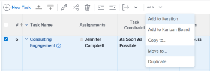
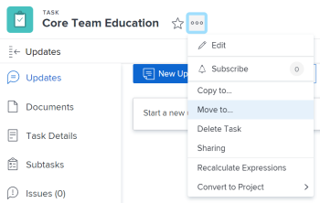
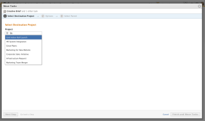
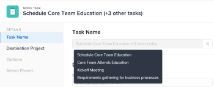
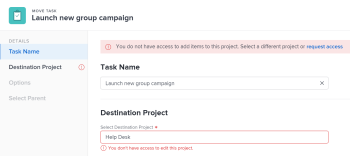

# Move tasks {#move-tasks}

The highlighted information on this page refers to functionality not yet generally available. It is available only in the Preview Sandbox environment.

You can move tasks in *`Adobe Workfront`* in the following scenarios:

* An ad hoc task to a project.
* A task from a project to another project.
* A task within the same project under a different parent.

You can move a task at the task level or you can move a task from a list of tasks. 

## Access requirements {#access-requirements}

You must have the following access to perform the actions in this article:

<table style="width: 100%;margin-left: 0;margin-right: auto;mc-table-style: url('../../../Resources/TableStyles/TableStyle-List-options-in-steps.css');" class="TableStyle-TableStyle-List-options-in-steps" cellspacing="0"> 
 <col class="TableStyle-TableStyle-List-options-in-steps-Column-Column1"> 
 <col class="TableStyle-TableStyle-List-options-in-steps-Column-Column2"> 
 <tbody> 
  <tr class="TableStyle-TableStyle-List-options-in-steps-Body-LightGray"> 
   <td class="TableStyle-TableStyle-List-options-in-steps-BodyE-Column1-LightGray" role="rowheader">Adobe Workfront plan*</td> 
   <td class="TableStyle-TableStyle-List-options-in-steps-BodyD-Column2-LightGray"> 
Any
 </td> 
  </tr> 
  <tr class="TableStyle-TableStyle-List-options-in-steps-Body-MediumGray"> 
   <td class="TableStyle-TableStyle-List-options-in-steps-BodyE-Column1-MediumGray" role="rowheader">Adobe Workfront licenses*</td> 
   <td class="TableStyle-TableStyle-List-options-in-steps-BodyD-Column2-MediumGray"> 
Work or higher
 </td> 
  </tr> 
  <tr class="TableStyle-TableStyle-List-options-in-steps-Body-LightGray"> 
   <td class="TableStyle-TableStyle-List-options-in-steps-BodyE-Column1-LightGray" role="rowheader">Access level configurations*</td> 
   <td class="TableStyle-TableStyle-List-options-in-steps-BodyD-Column2-LightGray"> 
Edit access to Tasks and Projects
 
Note: If you still don't have access, ask your Workfront administrator if they set additional restrictions in your access level. For information on how a Workfront administrator can modify your access level, see <a href="create-modify-access-levels.md" class="MCXref xref">Create or modify custom access levels</a>.
 </td> 
  </tr> 
  <tr class="TableStyle-TableStyle-List-options-in-steps-Body-MediumGray"> 
   <td class="TableStyle-TableStyle-List-options-in-steps-BodyB-Column1-MediumGray" role="rowheader">Object permissions</td> 
   <td class="TableStyle-TableStyle-List-options-in-steps-BodyA-Column2-MediumGray"> 
Manage permissions to the tasks
 
Contribute or higher permissions to the project with ability to Add Tasks
 
For information on requesting additional access, see <a href="request-access.md" class="MCXref xref">Request access to objects in Adobe Workfront</a>.
 </td> 
  </tr> 
 </tbody> 
</table>

&#42;To find out what plan, license type, or access you have, contact your *`Workfront administrator`*.

## Move a task in a list {#move-a-task-in-a-list}

To move a task displayed in a task list:

1. Go to the project that contains the task or tasks that you want to move.
1.  `<MadCap:conditionalText data-mc-conditions="QuicksilverOrClassic.Quicksilver"> Click  Tasks in the left panel to display the task list.</MadCap:conditionalText>` 
1.  
   Ensure that the `Autosave` toggle is enabled, then select the task or tasks that you want to move. 

   

   >[!IMPORTANT] {type="important"}
   >
   >You cannot move tasks when the `Autosave` toggle is disabled.   

1.  (Optional and conditional) If you want to move the selected tasks within the same project, click the tasks you selected, drag them and drop them where you want them moved on the project.

   After you dropped the tasks in the correct place on the project, the changes you made to the task hierarchy are saved immediately. All the information associated with each task is moved with the tasks.

1.  (Conditional) Select the task or tasks that you want to move and do one of the following:

    
    
    *  Click the `More menu     
    
      ` at the top of the task list, then click `Move to`. 
    *  Right click the selected tasks, then click `Move to`.
    *  When selecting one task, click the `More` menu  next to the task name in the list, then click  `Move to`. 
    
    
   

   The Move Task box displays

1.  Continue with moving the task, as described in the sections [Move a task in the Production environment](#move) or ` [Move a task in the Preview environment](#move2)` starting with Step 4 of each section.

## Move a task&nbsp;at the task level {#move-a-task-at-the-task-level}

In addition to moving tasks from a list of tasks, you can also move a task after you have opened it.&nbsp;

Moving a task differs depending on what environment you use to move a task. 

*  [Move a task in the Production environment](#move) 
*  [Move a task in the Preview environment](#move2) 

### Move a task in the Production environment {#move-a-task-in-the-production-environment}

1. Find a task in your *`Workfront`* system by searching for it.
1. Click the name of the task to open it.&nbsp;
1.   `<MadCap:conditionalText data-mc-conditions="QuicksilverOrClassic.Quicksilver"> Click the  More drop-down menu   next to the name of the task, then click  Move  to.</MadCap:conditionalText>`

   

   The Move Task box displays. 

   

1.  Type the name of the `Project`&nbsp;where you want the task to move.&nbsp;

   If you want to move the task within the same project, type the name of the current project.

1. (Optional) Click  `Next Step`&nbsp;to clear any of the following options from the task:&nbsp;  

    
    
    * Constraints
    
    
      >[!NOTE]
      >
      >When moving or copying a task with date-specific constraints to another project and the constraint dates of the task are outside the dates of the new project, either the Task&nbsp;Constraint changes to As Soon as Possible or As Late as Possible or the Planned Start or Planned Completion dates of the projects are adjusted. Some examples of date-specific constraints are Must Start On, Must&nbsp;Finish On, Start No Earlier Than, Start No Later Than, etc. For information about task constraints and how task constraints or project dates can be affected, see [Task Constraint overview](task-constraint-overview.md) and look for a specific constraint.
    
    
    
    * Assignments
    * Approval Processes
    * Progress
    * All Predecessors
    * Financial information
    * Documents
    
    
      This includes versions, *`proofs`*, and linked documents.&nbsp;
    
    
      This does not include document approvals. Document approvals can never be moved when a task is moved.
    
    * Reminder Notifications
    * Expenses
    * Permissions
    
    

1. (Optional) Click `Go back a Step` to move to the previous step.
1.  (Optional) Click  `Next Step.`

   Or

   Click `Select Parent` if you want to choose a parent for the tasks moved to the new project.

   If you do not select a parent task, the tasks are moved&nbsp;as main tasks rather than subtasks and they&nbsp;will be placed at the end of the task list on the specified&nbsp;project.&nbsp;

1. (Optional) Select a parent by doing one of the following:  
   In the task list, select one of the parents in the project plan.  
   Or  
   Using the `Search` field, search for a parent task by name. The task should appear in the list.

1. Select the radio button for the parent, after you have found it.&nbsp;
1. (Optional) Click `Go back a Step` to move to the previous step
1.  Click `Finish and Move Task.`

   The moved&nbsp;task now resides&nbsp;on the specified project and&nbsp;is either a subtask to a parent task, or the last task on the project.

### Move a task in the Preview environment {#move-a-task-in-the-preview-environment}

1. Find a task in your *`Workfront`* system by searching for it.
1. Click the name of the task to open it.&nbsp;
1.  Click the `More` drop-down menu  next to the name of the task, then click `Move` `to`. The Move Task box displays. 

   

1.  (Optional) Update the `Task Name`. The task moves with the new name in the new location. *`Workfront`* does not record the original name of the task.

   ` `**Tip: **`` `This field is dimmed and not editable when selecting to move multiple tasks in` `a` `list. You can hover over the Task Name field and a list of all selected tasks displays.` 

   

1.  Type the name of the `Destination Project` where you want the task to move in the `Select Destination Project` field.&nbsp;

   If you want to move the task within the same project, type the name of the current project.

   >[!TIP] {type="tip"}
   >
   >You can also start typing the Reference Number or enter the ID of the project. This might help you distinguish between projects with identical names. 

1.  (Conditional) Click  `Request Access` to request access to the project, if you don't have access to the selected project. 

   

1.  Click  `Options` in the left panel

   Or 

   Scroll down to the `Options` section in the Move Task box, then deselect the task attributes that you do not want to move with the task. All options are selected by default. 

   >[!TIP] {type="tip"}
   >
   >Selecting then deselecting `Select all` deselects all the options. 

   Deselect from the following options. The following table describes what happens when the options are deselected: 

<table style="width: 100%;mc-table-style: url('../../../Resources/TableStyles/TableStyle-List-options-in-steps.css');" class="TableStyle-TableStyle-List-options-in-steps" cellspacing="0"> 
 <col class="TableStyle-TableStyle-List-options-in-steps-Column-Column1"> 
 <col class="TableStyle-TableStyle-List-options-in-steps-Column-Column2"> 
 <tbody> 
  <tr class="TableStyle-TableStyle-List-options-in-steps-Body-LightGray"> 
   <td class="TableStyle-TableStyle-List-options-in-steps-BodyE-Column1-LightGray" role="rowheader">Constraint</td> 
   <td class="TableStyle-TableStyle-List-options-in-steps-BodyD-Column2-LightGray"> 
The task constraint is set to As Soon As Possible or As Late As Possible based on the project Schedule Mode setting.
 
 When selected, the current constraint of the task transfers with the task. 
 
Note: When moving or copying a task with date-specific constraints to another project and the constraint dates of the task are outside the dates of the new project, either the Task&nbsp;Constraint changes to As Soon as Possible or As Late as Possible or the Planned Start or Planned Completion dates of the projects are adjusted. Some examples of date-specific constraints are Must Start On, Must&nbsp;Finish On, Start No Earlier Than, Start No Later Than, etc. For information about task constraints and how task constraints or project dates can be affected, see <a href="task-constraint-overview.md" class="MCXref xref">Task Constraint overview</a> and look for a specific constraint.
 </td> 
  </tr> 
  <tr class="TableStyle-TableStyle-List-options-in-steps-Body-MediumGray"> 
   <td class="TableStyle-TableStyle-List-options-in-steps-BodyE-Column1-MediumGray" role="rowheader">Assignments</td> 
   <td class="TableStyle-TableStyle-List-options-in-steps-BodyD-Column2-MediumGray"> 
All the assignments are removed from the task. 
 </td> 
  </tr> 
  <tr class="TableStyle-TableStyle-List-options-in-steps-Body-LightGray"> 
   <td class="TableStyle-TableStyle-List-options-in-steps-BodyE-Column1-LightGray" role="rowheader">Approval Process</td> 
   <td class="TableStyle-TableStyle-List-options-in-steps-BodyD-Column2-LightGray">All approval processes are removed from the task.</td> 
  </tr> 
  <tr class="TableStyle-TableStyle-List-options-in-steps-Body-MediumGray"> 
   <td class="TableStyle-TableStyle-List-options-in-steps-BodyE-Column1-MediumGray" role="rowheader">Progress</td> 
   <td class="TableStyle-TableStyle-List-options-in-steps-BodyD-Column2-MediumGray">The task status is New. Otherwise, the existing task status is preserved. </td> 
  </tr> 
  <tr class="TableStyle-TableStyle-List-options-in-steps-Body-LightGray"> 
   <td class="TableStyle-TableStyle-List-options-in-steps-BodyE-Column1-LightGray" role="rowheader">Financial Information</td> 
   <td class="TableStyle-TableStyle-List-options-in-steps-BodyD-Column2-LightGray">The financial information of the task is removed and the Workfront updates the task&nbsp;Cost Type to No Cost and the task Revenue Type as Not Billable. </td> 
  </tr> 
  <tr class="TableStyle-TableStyle-List-options-in-steps-Body-MediumGray"> 
   <td class="TableStyle-TableStyle-List-options-in-steps-BodyE-Column1-MediumGray" role="rowheader">All&nbsp;Predecessors</td> 
   <td class="TableStyle-TableStyle-List-options-in-steps-BodyD-Column2-MediumGray"> 
When selected, the dependency becomes a cross-project predecessor when you move the task to another project. 
 </td> 
  </tr> 
  <tr class="TableStyle-TableStyle-List-options-in-steps-Body-LightGray"> 
   <td class="TableStyle-TableStyle-List-options-in-steps-BodyE-Column1-LightGray" role="rowheader">Documents</td> 
   <td class="TableStyle-TableStyle-List-options-in-steps-BodyD-Column2-LightGray"> 
The documents attached to the task are not transferred to the moved task. This includes versions, proofs, and linked documents.
 
This does not include document approvals. Document approvals can never be moved when a task is moved.
 </td> 
  </tr> 
  <tr class="TableStyle-TableStyle-List-options-in-steps-Body-MediumGray"> 
   <td class="TableStyle-TableStyle-List-options-in-steps-BodyE-Column1-MediumGray" role="rowheader">Reminder Notifications</td> 
   <td class="TableStyle-TableStyle-List-options-in-steps-BodyD-Column2-MediumGray">The task reminders do not transfer to the moved task. </td> 
  </tr> 
  <tr class="TableStyle-TableStyle-List-options-in-steps-Body-LightGray"> 
   <td class="TableStyle-TableStyle-List-options-in-steps-BodyE-Column1-LightGray" role="rowheader">Expenses</td> 
   <td class="TableStyle-TableStyle-List-options-in-steps-BodyD-Column2-LightGray">The expenses logged on the task do not transfer to the moved task. </td> 
  </tr> 
  <tr class="TableStyle-TableStyle-List-options-in-steps-Body-MediumGray"> 
   <td class="TableStyle-TableStyle-List-options-in-steps-BodyB-Column1-MediumGray" role="rowheader">Permissions</td> 
   <td class="TableStyle-TableStyle-List-options-in-steps-BodyA-Column2-MediumGray">Workfront removes the names of all the entities displaying in the Sharing list of the task. </td> 
  </tr> 
 </tbody> 
</table>

1.   (Optional) Click `Select Parent` in the left panel

   Or

   Scroll to the `Select Parent` section, then select the task in the destination project that you want to become the parent of the moved task. 

   >[!TIP] {type="tip"}
   >
   >`When selecting to move multiple tasks in a list, all selected tasks become the children of the selected parent.` 

   Select a parent by doing one of the following:

    
    
    *  In the task list, select one of the parents in the project plan.
    *  Click the search icon  and search for a parent task by name. 
    
    
   The task should appear in the list.

   

1.  Select the radio button for the parent, after you have found it.&nbsp;

   If you do not select a parent task, the tasks are moved&nbsp;as main tasks rather than subtasks and they&nbsp;will be placed at the end of the task list on the destination project.&nbsp;

1.  
   Click `Move task`

   Or

   Click `Move tasks` when you select multiple tasks in a list. 
   The moved&nbsp;tasks are&nbsp;now on the specified project and&nbsp;are either subtasks to a parent task, or the last tasks on the project.  

