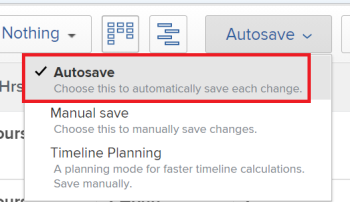

# Move tasks

The highlighted information on this page refers to functionality not yet generally available. It is available only in the Preview Sandbox environment.

You can move tasks in *Adobe Workfront* between the following objects:

* An ad hoc task to a project.
* A task from a project to another project.
* A task from a project under a different parent in another project. 
* A task within the same project under a different parent.

You can move a task at the task level or you can move a task from a list of tasks.

## Access requirements

You must have the following access to perform the actions in this article:

<table cellspacing="0"> 
 <col> 
 <col> 
 <tbody> 
  <tr> 
   <td role="rowheader"><em>Adobe Workfront</em> plan*</td> 
   <td> 
Any
 </td> 
  </tr> 
  <tr> 
   <td role="rowheader"><em>Adobe Workfront</em> licenses*</td> 
   <td> 
<em>Work</em> or higher
 </td> 
  </tr> 
  <tr> 
   <td role="rowheader">Access level configurations*</td> 
   <td> 
Edit access to Tasks and Projects
 
Note: If you still don't have access, ask your <em>Workfront administrator</em> if they set additional restrictions in your access level. For information on how a <em>Workfront administrator</em> can modify your access level, see <a href="../../../administration-and-setup/add-users/configure-and-grant-access/create-modify-access-levels.md" class="MCXref xref">Create or modify custom access levels</a>.
 </td> 
  </tr> 
  <tr> 
   <td role="rowheader">Object permissions</td> 
   <td> 
Manage permissions to the tasks
 
Contribute or higher permissions to the project with ability to Add Tasks
 
For information on requesting additional access, see <a href="../../../workfront-basics/grant-and-request-access-to-objects/request-access.md" class="MCXref xref">Request access to objects in Adobe Workfront</a>.
 </td> 
  </tr> 
 </tbody> 
</table>

&#42;To find out what plan, license type, or access you have, contact your *Workfront administrator*.

## Move a task in a list

To move a task displayed in a task list:

<ol> 
 <li value="1">Go to the project that contains the task or tasks that you want to move.</li> 
 <li value="2"> <draft-comment>
   <MadCap:conditionalText data-mc-conditions="QuicksilverOrClassic.Quicksilver">
    Click 
    Tasks in the left panel to display the task list.
   </MadCap:conditionalText>
  </draft-comment><MadCap:conditionalText data-mc-conditions="QuicksilverOrClassic.Quicksilver">
   Click 
   Tasks in the left panel to display the task list.
  </MadCap:conditionalText> </li> 
 <li value="3"> 
  
 
   
Ensure that the Autosave toggle is enabled, then select the task or tasks that you want to move. 
 
   
  
 <note type="important">
    You cannot move tasks when the 
    Autosave toggle is disabled. 
     
   </note> 
  
 </li> 
 <li value="4"> 
(Optional and conditional) If you want to move the selected tasks within the same project, click the tasks you selected, drag them and drop them where you want them moved on the project.
 
After you dropped the tasks in the correct place on the project, the changes you made to the task hierarchy are saved immediately. All the information associated with each task is moved with the tasks.
 </li> 
 <li value="5"> <draft-comment>
   
(Conditional) Select the task or tasks that you want to move and do one of the following:

  </draft-comment>
(Conditional) Select the task or tasks that you want to move and do one of the following:
 <draft-comment>
   <ul data-mc-conditions="QuicksilverOrClassic.Quicksilver"> 
    <li> 
Click the More menu  at the top of the task list, then click Move to. 
 </li> 
    <li> 
Right click the selected tasks, then click Move to.
 </li> 
    <li> 
When selecting one task, click the More menu  next to the task name in the list, then click&nbsp;Move to. 
 </li> 
   </ul>
  </draft-comment>
  <ul data-mc-conditions="QuicksilverOrClassic.Quicksilver"> 
   <li> 
Click the More menu  at the top of the task list, then click Move to. 
 </li> 
   <li> 
Right click the selected tasks, then click Move to.
 </li> 
   <li> 
When selecting one task, click the More menu  next to the task name in the list, then click&nbsp;Move to. 
 </li> 
  </ul> <draft-comment>
   
  

  </draft-comment>
  
 
The Move Task box displays
 </li> 
 <li value="6"> <draft-comment>
   
Continue with moving the task, as described in the section <a href="#moving-one-task" class="MCXref xref">Move a task&nbsp;at the task level</a> in this article, starting with Step 4.

  </draft-comment>
Continue with moving the task, as described in the section <a href="#moving-one-task" class="MCXref xref">Move a task&nbsp;at the task level</a> in this article, starting with Step 4.
 </li> 
</ol>

## Move a task&nbsp;at the task level

In addition to moving tasks from a list of tasks, you can also move a task at the task level, after you have opened it.&nbsp;

<!--

<ol>
<li value="1">Find a task in your <em>Workfront</em> system by searching for it.</li>
<li value="2">Click the name of the task to open it.&nbsp;</li>
<li value="3"> 
Click the More drop-down menu  next to the name of the task, then click Move to. The Move Task box displays. 
 
  
 </li>
<li value="4"> 
(Optional) Update the Task Name. The task moves with the new name in the new location. <em>Workfront</em> does not record the original name of the task.

Tip: </b>">
<b>Tip: </b>

This field is dimmed and not editable when selecting to move multiple tasks in a list. You can hover over the Task Name field and a list of all selected tasks displays.

  

 </li>
<li value="5"> 
Type the name of the Destination Project&nbsp;where you want the task to move&nbsp;in the Select Destination Project field.&nbsp;
 
If you want to move the task within the same project, type the name of the current project.

Tips: </b>">
<b>Tips: </b>
<ul>
<li> 
The name of the project is case sensitive. 
 </li>
<li> 
You can also start typing the Reference Number or enter the ID of the project. This might help you distinguish between projects with identical names. 
 </li>
<li> 
Only 100 projects display in the list.
 </li>
</ul>

 </li>
<li value="6"> 
(Conditional)&nbsp;Click&nbsp;request access to request access to the project, if you don't have access to the selected project. 
 <draft-comment>

Continue to move the task on the selected destination project without requesting access if you have access to add tasks to one of the tasks on the destination project. 

</draft-comment>
Continue to move the task on the selected destination project without requesting access if you have access to add tasks to one of the tasks on the destination project. 
 
  
 </li>
<li value="7"> 
(Optional) Click&nbsp;Options in the left panel
 
Or 
 
Scroll down to the Options section in the Move Task box, then deselect any of the items listed in the table below to remove&nbsp;them&nbsp;from&nbsp;the moved tasks . All options are selected by default. 
 <note type="important">
Deselecting items in the Options list results in loss of data. Information from the existing task will be removed and cannot be recovered.
</note>
<table cellspacing="0">
<col>
<col>
<tbody>
<tr>
<td role="rowheader">Select all</td>
<td>Deselect this option to remove all information from the task when moving it to its new location. </td>
</tr>
<tr>
<td role="rowheader">Constraint</td>
<td> 
The task constraint is set to As Soon As Possible or As Late As Possible based on the project Schedule Mode setting.
 
 When selected, the current constraint of the task transfers with the task. 
 <note type="note">
When moving or copying a task with date-specific constraints to another project and the constraint dates of the task are outside the dates of the new project, either the Task&nbsp;Constraint changes to As Soon as Possible or As Late as Possible or the Planned Start or Planned Completion dates of the projects are adjusted. Some examples of date-specific constraints are Must Start On, Must&nbsp;Finish On, Start No Earlier Than, Start No Later Than, etc. For information about task constraints and how task constraints or project dates can be affected, see
<a href="../../../manage-work/tasks/task-constraints/task-constraint-overview.md" class="MCXref xref">Task Constraint overview</a> and look for a specific constraint.
</note> </td>
</tr>
<tr>
<td role="rowheader">Assignments</td>
<td> 
All the assignments are removed from the task. 
 </td>
</tr>
<tr>
<td role="rowheader">Approval Process</td>
<td>All approval processes are removed from the task.</td>
</tr>
<tr>
<td role="rowheader">Progress</td>
<td>The task status is New. Otherwise, the existing task status is preserved. </td>
</tr>
<tr>
<td role="rowheader">Financial Information</td>
<td>The financial information of the task is removed and the <em>Workfront</em> updates the task&nbsp;Cost Type to No Cost and the task Revenue Type as Not Billable. </td>
</tr>
<tr>
<td role="rowheader">All&nbsp;Predecessors</td>
<td> 
When selected, the dependency becomes a cross-project predecessor when you move the task to another project. 
 </td>
</tr>
<tr>
<td role="rowheader">Documents</td>
<td> 
The documents attached to the task are not transferred to the moved task. This includes versions, <em>proofs</em>, and linked documents.
 
This does not include document approvals. Document approvals can never be moved when a task is moved.
 </td>
</tr>
<tr>
<td role="rowheader">Reminder Notifications</td>
<td>The task reminders do not transfer to the moved task. </td>
</tr>
<tr>
<td role="rowheader">Expenses</td>
<td>The expenses logged on the task do not transfer to the moved task. </td>
</tr>
<tr>
<td role="rowheader">Permissions</td>
<td> 
<em>Workfront</em> removes the names of all the entities displaying in the Sharing list of the task. 
 </td>
</tr>
</tbody>
</table> </li>
<li value="8"> 
&nbsp;
 </li>
<li value="9"> 
(Optional) Click Select Parent in the left panel
 
Or
 
Scroll to the Select Parent section, then select the task in the destination project that you want to become the parent of the moved task. 
 <note type="tip">
When selecting to move multiple tasks in a list, all selected tasks become the children of the selected parent.
</note> 
Select a parent by doing one of the following:

<ul>
<li> 
In the task list, select one of the parents in the project plan.
 </li>
<li> 
Click the search icon  and search for a parent task by name. 
 </li>
</ul> 
The task should appear in the list.
 
  
 </li>
<li value="10"> 
Select the radio button for the parent, after you have found it.&nbsp;
 
If you do not select a parent task, the tasks are moved&nbsp;as main tasks rather than subtasks and they&nbsp;will be placed at the end of the task list on the destination project.&nbsp;
 </li>
<li value="11">

Click Move task

Or

Click Move tasks when you select multiple tasks in a list. 

 
The moved&nbsp;tasks are&nbsp;now on the specified project and&nbsp;are either subtasks to a parent task, or the last tasks on the project. 
 </li>
</ol>

-->

<ol> 
 <li value="1">Find a task in your <em>Workfront</em> system by searching for it.</li> 
 <li value="2">Click the name of the task to open it.&nbsp;</li> 
 <li value="3"> 
Click the More drop-down menu  next to the name of the task, then click Move to. The Move Task box displays. 
 
  
 </li> 
 <li value="4"> 
(Optional) Update the Task Name. The task moves with the new name in the new location. <em>Workfront</em> does not record the original name of the task.
 
  
Tip: </b>">
   <b>Tip: </b> 
   
This field is dimmed and not editable when selecting to move multiple tasks in a list. You can hover over the Task Name field and a list of all selected tasks displays.
 
   
  
 
  
 </li> 
 <li value="5"> 
Type the name of the Destination Project&nbsp;where you want the task to move&nbsp;in the Select Destination Project field.&nbsp;
 
If you want to move the task within the same project, type the name of the current project.
 
  
Tips: </b>">
   <b>Tips: </b> 
   <ul> 
    <li> 
The name of the project is case sensitive. 
 </li> 
    <li> 
You can also start typing the Reference Number or enter the ID of the project. This might help you distinguish between projects with identical names. 
 </li> 
    <li> 
Only 100 projects display in the list.
 </li> 
   </ul> 
  
 </li> 
 <li value="6"> 
(Conditional)&nbsp;Click&nbsp;request access to request access to the project, if you don't have access to the selected project. 
 
Continue to move the task on the selected destination project without requesting access if you have access to add tasks to one of the tasks on the destination project. 
 
  
 </li> 
 <li value="7"> 
(Optional) Click&nbsp;Options in the left panel
 
Or 
 
Scroll down to the Options section in the Move Task box, then deselect any of the items listed in the table below to remove&nbsp;them&nbsp;from&nbsp;the moved tasks . All options are selected by default. 
 <note type="important">
   Deselecting items in the Options list results in loss of data. Information from the existing task will be removed and cannot be recovered. 
  </note> 
  <table cellspacing="0"> 
   <col> 
   <col> 
   <tbody> 
    <tr> 
     <td role="rowheader">Select all</td> 
     <td>Deselect this option to remove all information from the task when moving it to its new location. </td> 
    </tr> 
    <tr> 
     <td role="rowheader">Constraint</td> 
     <td> 
The task constraint is set to As Soon As Possible or As Late As Possible based on the project Schedule Mode setting.
 
 When selected, the current constraint of the task transfers with the task. 
 <note type="note">
       When moving or copying a task with date-specific constraints to another project and the constraint dates of the task are outside the dates of the new project, either the Task&nbsp;Constraint changes to As Soon as Possible or As Late as Possible or the Planned Start or Planned Completion dates of the projects are adjusted. Some examples of date-specific constraints are Must Start On, Must&nbsp;Finish On, Start No Earlier Than, Start No Later Than, etc. For information about task constraints and how task constraints or project dates can be affected, see 
       <a href="../../../manage-work/tasks/task-constraints/task-constraint-overview.md" class="MCXref xref">Task Constraint overview</a> and look for a specific constraint.
      </note> </td> 
    </tr> 
    <tr> 
     <td role="rowheader">Assignments</td> 
     <td> 
All the assignments are removed from the task. 
 </td> 
    </tr> 
    <tr> 
     <td role="rowheader">Approval Process</td> 
     <td>All approval processes are removed from the task.</td> 
    </tr> 
    <tr> 
     <td role="rowheader">Progress</td> 
     <td>The task status is New. Otherwise, the existing task status is preserved. </td> 
    </tr> 
    <tr> 
     <td role="rowheader">Financial Information</td> 
     <td>The financial information of the task is removed and the <em>Workfront</em> updates the task&nbsp;Cost Type to No Cost and the task Revenue Type as Not Billable. </td> 
    </tr> 
    <tr> 
     <td role="rowheader">All&nbsp;Predecessors</td> 
     <td> 
When selected, the dependency becomes a cross-project predecessor when you move the task to another project. 
 </td> 
    </tr> 
    <tr> 
     <td role="rowheader">Documents</td> 
     <td> 
The documents attached to the task are not transferred to the moved task. This includes versions, <em>proofs</em>, and linked documents.
 
This does not include document approvals. Document approvals can never be moved when a task is moved.
 </td> 
    </tr> 
    <tr> 
     <td role="rowheader">Reminder Notifications</td> 
     <td>The task reminders do not transfer to the moved task. </td> 
    </tr> 
    <tr> 
     <td role="rowheader">Expenses</td> 
     <td>The expenses logged on the task do not transfer to the moved task. </td> 
    </tr> 
    <tr> 
     <td role="rowheader">Permissions</td> 
     <td> 
<em>Workfront</em> removes the names of all the entities displaying in the Sharing list of the task. 
 </td> 
    </tr> 
   </tbody> 
  </table> </li> 
 <li value="8"> 
&nbsp;
 </li> 
 <li value="9"> 
(Optional) Click Select Parent in the left panel
 
Or
 
Scroll to the Select Parent section, then select the task in the destination project that you want to become the parent of the moved task. 
 <note type="tip">
   When selecting to move multiple tasks in a list, all selected tasks become the children of the selected parent. 
  </note> 
Select a parent by doing one of the following:
 
  <ul> 
   <li> 
In the task list, select one of the parents in the project plan.
 </li> 
   <li> 
Click the search icon  and search for a parent task by name. 
 </li> 
  </ul> 
The task should appear in the list.
 
  
 </li> 
 <li value="10"> 
Select the radio button for the parent, after you have found it.&nbsp;
 
If you do not select a parent task, the tasks are moved&nbsp;as main tasks rather than subtasks and they&nbsp;will be placed at the end of the task list on the destination project.&nbsp;
 </li> 
 <li value="11"> 
  
 
   
Click Move task
 
   
Or
 
   
Click Move tasks when you select multiple tasks in a list. 
 
  
 
The moved&nbsp;tasks are&nbsp;now on the specified project and&nbsp;are either subtasks to a parent task, or the last tasks on the project. 
 </li> 
</ol>

