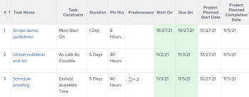

# Task Constraint overview: Earliest Available Time

Earliest Available Time is a Task Constraint that schedules a task to begin at the earliest available time after considering any predecessor relationships.

For information about how to update the Task&nbsp;Constraint on a task, see [Update the Task Constraint of a task](../../../manage-work/tasks/task-constraints/update-task-constraint-of-task.md).

<!--

To update the Task Constraint to Earliest Available Time:

-->

To update the Task Constraint to Earliest Available Time:

<ol> <draft-comment>
  <li value="1" data-mc-conditions="QuicksilverOrClassic.Draft mode">Go to a task whose constraint you want to modify. </li>
 </draft-comment>
 <li value="1" data-mc-conditions="QuicksilverOrClassic.Draft mode">Go to a task whose constraint you want to modify. </li> 
 <li value="2"> <draft-comment>
   
Click Edit Task.

  </draft-comment>
Click Edit Task.
 <draft-comment>
   
Click the More icon  next to the task name, then click Edit.

  </draft-comment>
Click the More icon  next to the task name, then click Edit.
 </li> 
 <li value="3"> <draft-comment>
   
In the Overview section, expand the Task Constraint drop-down menu.

  </draft-comment>
In the Overview section, expand the Task Constraint drop-down menu.
 </li> 
 <li value="4"> <draft-comment>
   
Select Earliest Available Time.

  </draft-comment>
Select Earliest Available Time.
 </li> <draft-comment>
  <li value="5" data-mc-conditions="QuicksilverOrClassic.Draft mode">Click Save Changes.</li>
 </draft-comment>
 <li value="5" data-mc-conditions="QuicksilverOrClassic.Draft mode">Click Save Changes.</li> 
</ol>

## The difference between Earliest Available Time and As Soon As Possible

The Earliest Available Time constraint differs from the As Soon As Possible constraint when all of the following criteria exist:

* The project is scheduled From Completion 
* Tasks in the project have a predecessor relationship 
* The predecessor task has a flexible task constraint

In this situation:

<ul> 
 <li> 
Earliest Available Time: Using the Earliest Available Time constraint on the successor task gives priority to the predecessor's flexible constraint.
 
  
Example: </b>">
   <b>Example: </b> 
   
Task A is a predecessor to Task B. Task B has the Earliest Available Time constraint and Task A has the As Late As Possible constraint. In this situation, Task B is scheduled as close to the completion of the project as possible.
 
   
  
 
  
 </li> 
 <li> 
As Soon As Possible: In this scenario, using the As Soon As Possible constraint on the successor task gives the priority to the successor task.
 
  
Example: </b>">
   <b>Example: </b> 
   
 Task A is a predecessor to Task B. Task B has the As Soon As Possible constraint and Task A has the As Late As Possible constraint. In this situation, Task B is scheduled as close to the start of the project as possible.
 
   
  
 
  
 </li> 
</ul>

