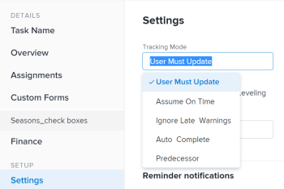

# Set Tracking Mode for tasks

The Tracking Mode of a task determines how the task Progress Status is updated in *Adobe Workfront*.

For information about Tracking Mode on tasks, see [Task Tracking Mode overview](../../../manage-work/tasks/task-information/task-tracking-mode.md).

## Access requirements

You must have the following access to perform the steps in this article:

<table cellspacing="0"> 
 <col> 
 <col> 
 <tbody> 
  <tr> 
   <td role="rowheader"><a href="https://www.workfront.com/plans" target="_blank"><em>Adobe Workfront</em> plan</a>*</td> 
   <td> 
Any
 </td> 
  </tr> 
  <tr> 
   <td role="rowheader"><a href="../../../administration-and-setup/add-users/access-levels-and-object-permissions/wf-licenses.md" class="MCXref xref">Adobe Workfront licenses overview</a>*</td> 
   <td> 
Work or higher
 </td> 
  </tr> 
  <tr> 
   <td role="rowheader">Access level configurations*</td> 
   <td> 
Edit access to Tasks 
 
Note: If you still don't have access, ask your <em>Workfront administrator</em> if they set additional restrictions in your access level. For information on how a <em>Workfront administrator</em> can modify your access level, see <a href="../../../administration-and-setup/add-users/access-levels-and-object-permissions/wf-licenses.md" class="MCXref xref">Adobe Workfront licenses overview</a>
 </td> 
  </tr> 
  <tr> 
   <td role="rowheader">Object permissions</td> 
   <td> 
Manage permissions on a task
 
For information on requesting additional access, see <a href="../../../workfront-basics/grant-and-request-access-to-objects/request-access.md" class="MCXref xref">Request access to objects in Adobe Workfront</a>.
 </td> 
  </tr> 
 </tbody> 
</table>

&#42;To find out what plan, license type, or access you have, contact your *Workfront administrator*.

## Set Tracking Mode for tasks

To set the tracking mode:

<ol> 
 <li value="1">Go to the task you want to set the tracking mode for.</li> 
 <li value="2"> <draft-comment>
   
Click the More icon next to the name of the task, then click&nbsp;Edit.

  </draft-comment>
Click the More icon next to the name of the task, then click&nbsp;Edit.
 
The Edit Task dialog box opens. 
 </li> 
 <li value="3"> 
In the&nbsp;Settings section, use the&nbsp;Tracking Mode drop-down menu to select the Tracking Mode for the task.
 <draft-comment>
   
  

  </draft-comment>
  
 </li> 
 <li value="4">Select from the following options:
  <ul>
   <li>User Must Update (this is the default option)</li>
   <li>Assume On&nbsp;Time</li>
   <li>Ignore Late Warnings</li>
   <li>Auto&nbsp;Complete</li>
   <li>
Predecessor
</li>
  </ul>
For more information about the tracking mode options, see the <a href="#tracking-mode-options" class="MCXref xref">Set Tracking Mode for tasks</a> section in this article. 
</li> 
 <li value="5">Click&nbsp;Save.</li> 
</ol>

