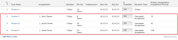

# Duration Type overview: Calculated Assignment {#duration-type-overview-calculated-assignment}

Calculated Assignment is a Duration Type that you can set for a task in *`Adobe Workfront`*.


## Overview of the Calculated Assignment Duration Type {#overview-of-the-calculated-assignment-duration-type}


*  When you use a Calculated Assignment Duration Type, you must specify both a Duration and a number of Planned Hours for the task. *`Workfront`* then divides the amount of Planned Hours by the amount of hours in the Duration, then by the number of resources assigned to the task to calculate the allocation percentage (calculates the assignment) for each resource. Each resource will equally have the same value for their allocation percentage. In this case, you cannot modify the allocation values for each resource.
*  Your *`Workfront`* `or a *`group administrator`*` can set the default Duration&nbsp;Type of your system or group as Calculated Assignment.&nbsp;In this case, all new tasks will be created with this Duration Type. For information about changing your task and issue preferences as part of your system-level or group-level project preferences, see [Configure system-wide task and issue preferences](set-task-issue-preferences.md). 


  In this case, the task has a default of a one-day Duration and a default of 0 hours of Planned Hours. Unless the project manager sets a more accurate Duration and populates the Planned Hours field with a realistic estimate, then resources appear underallocated.


Calculated Assignment is the preferred Duration Type in the following situations:


* When assignments have a window of activity but do not take the entire Duration allotted to complete their work. For example, you are assigned to deliver a report to your supervisor by the end of the week. You have a five-day duration, but it will only take you ten hours to draft the document.
*  When a single resource is assigned to a task because the project manager can estimate the planned Duration and planned amount of effort independent of each other. 


  You can use the Calculated Work Duration Type for the same result, but the project manager must input a percentage allocation for the resource in order to affect the calculated value for Planned Hours. This makes project planning more difficult and time-consuming.


The allocation percentage for each resource is calculated as follows:


```
Planned Hours / Duration / Number of Resources = Allocation Percentage for each resource
```


For example, in the scenario outlined below, each task has a Duration of 3 days. The project manager manually enters both the Duration (3 days or 24 hours) and Planned Hours, and as a result, the allocation percentage (or assignment percentage) is calculated:





## Change the Duration Type of a task to Calculated Assignment {#change-the-duration-type-of-a-task-to-calculated-assignment}

For information about changing the Duration Type of a task, see [Update the Duration Type of a task](update-duration-type-of-task.md). 
