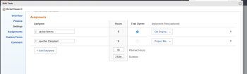

# Duration Type overview: Simple  {#duration-type-overview-simple}

The Simple Duration Type is a Duration Type that you can be set for a task in *`Adobe Workfront`*.

## Overview of the Simple Duration Type {#overview-of-the-simple-duration-type}

Your *`Workfront`* `or a *`group administrator`*` can set the default Duration&nbsp;Type of your system or group as Simple.&nbsp;In this case, all new tasks will be created with this Duration Type. For information about changing your task and issue preferences as part of your system-level or group-level project preferences, see [Configure system-wide task and issue preferences](set-task-issue-preferences.md).

The following things occur when a task has a Duration Type of Simple: 

*  Project managers can modify the both the Duration and the Planned Hours of a task when modifying how those hours should be distributed among assignees. 

  >[!IMPORTANT] {type="important"}
  >
  >When you first create a task and assign the Simple Duration Type to it and do not specify a Duration, *`Workfront`* calculates the Duration of the task based on the amount of Planned Hours you specify for the task. If you manually modify the Duration of a Simple Duration task, *`Workfront`* stops matching the Planned Hours to the Duration because it assumes you want to define them manually yourself. 

* Allocation percent is hidden and allocation hours are available to be edited, instead.
* All new customers have the system-level Duration Type set to Simple. 

## Access requirements {#access-requirements}

You must have the following access to perform the steps in this article:

<table style="width: 100%;margin-left: 0;margin-right: auto;mc-table-style: url('../../../Resources/TableStyles/TableStyle-List-options-in-steps.css');" class="TableStyle-TableStyle-List-options-in-steps" cellspacing="0"> 
 <col class="TableStyle-TableStyle-List-options-in-steps-Column-Column1"> 
 <col class="TableStyle-TableStyle-List-options-in-steps-Column-Column2"> 
 <tbody> 
  <tr class="TableStyle-TableStyle-List-options-in-steps-Body-LightGray"> 
   <td class="TableStyle-TableStyle-List-options-in-steps-BodyE-Column1-LightGray" role="rowheader">Adobe Workfront plan*</td> 
   <td class="TableStyle-TableStyle-List-options-in-steps-BodyD-Column2-LightGray"> 
Any
 </td> 
  </tr> 
  <tr class="TableStyle-TableStyle-List-options-in-steps-Body-MediumGray"> 
   <td class="TableStyle-TableStyle-List-options-in-steps-BodyE-Column1-MediumGray" role="rowheader">Adobe Workfront license*</td> 
   <td class="TableStyle-TableStyle-List-options-in-steps-BodyD-Column2-MediumGray"> 
Work or higher
 </td> 
  </tr> 
  <tr class="TableStyle-TableStyle-List-options-in-steps-Body-LightGray"> 
   <td class="TableStyle-TableStyle-List-options-in-steps-BodyE-Column1-LightGray" role="rowheader">Access level configurations*</td> 
   <td class="TableStyle-TableStyle-List-options-in-steps-BodyD-Column2-LightGray"> 
Edit access to&nbsp;Tasks
 
Note: If you still don't have access, ask your Workfront administrator if they set additional restrictions in your access level. For information on how a Workfront administrator can modify your access level, see <a href="create-modify-access-levels.md" class="MCXref xref">Create or modify custom access levels</a>.
 </td> 
  </tr> 
  <tr class="TableStyle-TableStyle-List-options-in-steps-Body-MediumGray"> 
   <td class="TableStyle-TableStyle-List-options-in-steps-BodyB-Column1-MediumGray" role="rowheader">Object permissions</td> 
   <td class="TableStyle-TableStyle-List-options-in-steps-BodyA-Column2-MediumGray"> 
Manage permissions to the task
 
For information on requesting additional access, see <a href="request-access.md" class="MCXref xref">Request access to objects in Adobe Workfront</a>.
 </td> 
  </tr> 
 </tbody> 
</table>

&#42;To find out what plan, license type, or access you have, contact your *`Workfront administrator`*.

## Edit the Planned Hours and Duration of a task with a Simple Duration Type {#edit-the-planned-hours-and-duration-of-a-task-with-a-simple-duration-type}

By default, *`Workfront`* calculates the Duration of a task with a Simple Duration Type based on the amount of Planned Hours. However, you can also manually edit the amount of Planned Hours and the Duration of a Simple Duration task in certain areas of *`Workfront`*. 

You can either edit Planned Hours and Duration of a task with a Simple Duration Type inline or at the task level in the Advanced Assignments box. 

For more information about editing information inline, see [Inline edit items in a list in Adobe Workfront](inline-edit-objects.md).

>[!IMPORTANT] {type="important"}
>
>After you manually update the Duration on a Simple Duration task, *`Workfront`* stops calculating it based on the Planned Hours. 

To edit the Planned Hours and Duration of a task with a Simple Duration Type in the Advanced Assignments box: 

1. In the task list, click the name of the task for which you want to change the duration type.
1.  Click the `More` icon  next to the name of the task, then click `Edit`. 
1. Click `Assignments`.
1. Enter a total value for the `Planned Hours` for all the assignments, for example, 10 hours.
1.  Enter a value for the task `Duration`, for example 2 days.

   

   Notice that the total Planned Hours is distributed equally to each assignee. 

1. (Optional) Manually distribute the hours unevenly between the assignees. 
1. Click `Save Changes`. 

## Change the Duration Type of a task to Simple {#change-the-duration-type-of-a-task-to-simple}

For information about changing the Duration Type of a task, see [Update the Duration Type of a task](update-duration-type-of-task.md). 
