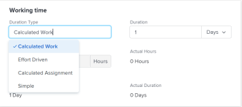

# Update the Duration&nbsp;Type of a task

The Duration Type of a task identifies the relationship between the number of resources assigned to a task, the total effort, and the total Duration of the task. For more information, see [Overview of Task Duration and Duration Type](../../../manage-work/tasks/taskdurtn/task-duration-and-duration-type.md).

## Access requirements

You must have the following to change the Duration&nbsp;Type of a task:

<table cellspacing="0"> 
 <col> 
 <col> 
 <tbody> 
  <tr> 
   <td role="rowheader"><em>Adobe Workfront</em> plan*</td> 
   <td> 
Any 
 </td> 
  </tr> 
  <tr> 
   <td role="rowheader"><em>Adobe Workfront</em> license*</td> 
   <td> 
<em>Work</em> or higher
 </td> 
  </tr> 
  <tr> 
   <td role="rowheader">Access level configurations*</td> 
   <td> 
View or higher access to Projects
 
Edit access to Tasks
 
Note: If you still don't have access, ask your <em>Workfront administrator</em> if they set additional restrictions in your access level. For information on how a <em>Workfront administrator</em> can modify your access level, see <a href="../../../administration-and-setup/add-users/configure-and-grant-access/create-modify-access-levels.md" class="MCXref xref">Create or modify custom access levels</a>.
 </td> 
  </tr> 
  <tr> 
   <td role="rowheader">Object permissions</td> 
   <td> 
Manage access to the task 
 
For information on requesting additional access, see <a href="../../../workfront-basics/grant-and-request-access-to-objects/request-access.md" class="MCXref xref">Request access to objects in Adobe Workfront</a>.
 </td> 
  </tr> 
 </tbody> 
</table>

&#42;To find out what plan, license type, or access you have, contact your *Workfront administrator*.

## Update the Duration Type of a task

In addition to updating the Duration&nbsp;Type of a task as described in this article, you can also update the Duration&nbsp;Type when editing a task or when making advanced assignments.&nbsp;For more information, see:

* [Edit tasks](../../../manage-work/tasks/manage-tasks/edit-tasks.md) 
* [Create advanced assignments](../../../manage-work/tasks/assign-tasks/create-advanced-assignments.md)

To update the Duration&nbsp;Type of a task:

<ol> 
 <li value="1"> <draft-comment>
   
Click Main Menu >&nbsp;Projects, then click a project to access it.

  </draft-comment>
Click Main Menu >&nbsp;Projects, then click a project to access it.
 </li> 
 <li value="2"> 
Click the Tasks <draft-comment>
    <MadCap:conditionalText data-mc-conditions="QuicksilverOrClassic.Quicksilver">
      section in the left panel 
    </MadCap:conditionalText>
   </draft-comment><MadCap:conditionalText data-mc-conditions="QuicksilverOrClassic.Quicksilver">
     section in the left panel 
   </MadCap:conditionalText>. 
 </li> 
 <li value="3"> <draft-comment>
   
Click Task Details in the left panel, then in the Overview area click Duration Type. 

  </draft-comment>
Click Task Details in the left panel, then in the Overview area click Duration Type. 
 <draft-comment>
   
  

  </draft-comment>
  
 </li> 
 <li value="4"> 
Select from the following options
 
  <table cellspacing="0"> 
   <col> 
   <col> 
   <tbody> 
    <tr> 
     <td role="rowheader">Calculated Work</td> 
     <td>For information, see <a href="../../../manage-work/tasks/taskdurtn/calculated-work.md" class="MCXref xref">Duration Type overview: Calculated Work</a>. </td> 
    </tr> 
    <tr> 
     <td role="rowheader">Effort Driven</td> 
     <td>For information, see <a href="../../../manage-work/tasks/taskdurtn/effort-driven.md" class="MCXref xref">Duration Type overview: Effort Driven</a>. </td> 
    </tr> 
    <tr> 
     <td role="rowheader">Calculated Assignment</td> 
     <td>For information, see <a href="../../../manage-work/tasks/taskdurtn/calculated-assignment.md" class="MCXref xref">Duration Type overview: Calculated Assignment</a>. </td> 
    </tr> 
    <tr> 
     <td role="rowheader">Simple</td> 
     <td>For information, see <a href="../../../manage-work/tasks/taskdurtn/simple-duration-type.md" class="MCXref xref">Duration Type overview: Simple</a>. </td> 
    </tr> 
   </tbody> 
  </table> </li> 
 <li value="5">Click Save&nbsp;<draft-comment>
   Changes
  </draft-comment>Changes.</li> 
</ol>

&nbsp;
