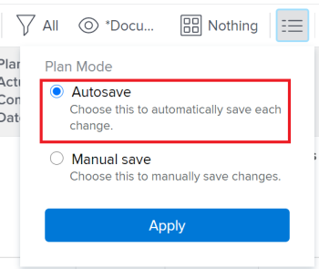

# Create predecessor relationships by chaining tasks {#create-predecessor-relationships-by-chaining-tasks}

You can create predecessor relationships in multiple ways in *`Adobe Workfront`*. One method is by chaining tasks. 

For information about predecessor tasks, see [Overview of task predecessors](predecessors-overview.md).

By chaining tasks, you can allow the system to create the predecessor relationships automatically on selected tasks, rather than manually creating a relationship on each task yourself. Different predecessor relationship types can still be used between tasks.

## Access requirements {#access-requirements}

You must have the following access to perform the steps in this article:

<table style="width: 100%;margin-left: 0;margin-right: auto;mc-table-style: url('../../../Resources/TableStyles/TableStyle-List-options-in-steps.css');" class="TableStyle-TableStyle-List-options-in-steps" cellspacing="0"> 
 <col class="TableStyle-TableStyle-List-options-in-steps-Column-Column1"> 
 <col class="TableStyle-TableStyle-List-options-in-steps-Column-Column2"> 
 <tbody> 
  <tr class="TableStyle-TableStyle-List-options-in-steps-Body-LightGray"> 
   <td class="TableStyle-TableStyle-List-options-in-steps-BodyE-Column1-LightGray" role="rowheader">Adobe Workfront plan*</td> 
   <td class="TableStyle-TableStyle-List-options-in-steps-BodyD-Column2-LightGray"> 
Any
 </td> 
  </tr> 
  <tr class="TableStyle-TableStyle-List-options-in-steps-Body-MediumGray"> 
   <td class="TableStyle-TableStyle-List-options-in-steps-BodyE-Column1-MediumGray" role="rowheader">Adobe Workfront license*</td> 
   <td class="TableStyle-TableStyle-List-options-in-steps-BodyD-Column2-MediumGray"> 
Plan 
 </td> 
  </tr> 
  <tr class="TableStyle-TableStyle-List-options-in-steps-Body-LightGray"> 
   <td class="TableStyle-TableStyle-List-options-in-steps-BodyE-Column1-LightGray" role="rowheader">Access level configurations*</td> 
   <td class="TableStyle-TableStyle-List-options-in-steps-BodyD-Column2-LightGray"> 
Edit access to Tasks and Projects
 
Note: If you still don't have access, ask your Workfront administrator if they set additional restrictions in your access level. For information on how a Workfront administrator can modify your access level, see <a href="create-modify-access-levels.md" class="MCXref xref">Create or modify custom access levels</a>.
 </td> 
  </tr> 
  <tr class="TableStyle-TableStyle-List-options-in-steps-Body-MediumGray"> 
   <td class="TableStyle-TableStyle-List-options-in-steps-BodyB-Column1-MediumGray" role="rowheader">Object permissions</td> 
   <td class="TableStyle-TableStyle-List-options-in-steps-BodyA-Column2-MediumGray"> 
Manage permissions to the tasks and the project
 
For information on requesting additional access, see <a href="request-access.md" class="MCXref xref">Request access to objects in Adobe Workfront</a>.
 </td> 
  </tr> 
 </tbody> 
</table>

&#42;To find out what plan, license type, or access you have, contact your *`Workfront administrator`*.

## Chain tasks to create predecessor relationships {#chain-tasks-to-create-predecessor-relationships}

1. Go to the project that contains the tasks that you want to chain. 
1.   `<MadCap:conditionalText data-mc-conditions="QuicksilverOrClassic.Quicksilver"> Click  Tasks in the left panel.</MadCap:conditionalText>`
1.  (Conditional) Select `Autosave` in the upper-right corner of the task list, then select the tasks that you want to chain. 

   

   >[!IMPORTANT] {type="important"}
   >
   >Chaining tasks in a task list is not possible when you manually save changes to tasks or use the Timeline Planning mode for saving tasks. 

1.  Right-click the selected tasks, then click `Chain`. 
1. Select from the following dependency types: 
    
    
    * `Finish-Start`
    * `Finish-Finish`
    * `Start-Start`
    * `Start-Finish`
    
    
   For more information about predecessor dependency types, see [Overview of task dependency types](task-dependency-types.md).

1.  (Optional) Click `Unchain` if some of the tasks have been previously chained. 

   ` `**Warning: **`` Only sequential predecessors are removed by using the unchain option when bulk editing tasks. 

   Your selected tasks are now linked by predecessor relationships. 

