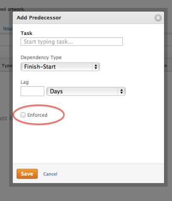

# Enforce predecessors

Predecessors are tasks on which other tasks are dependent for completion. Predecessor relationships affect the Start and Completion Dates of the tasks and ultimately impact the timeline of the project.

For information about predecessors, see [Overview of task predecessors](../../../manage-work/tasks/use-prdcssrs/predecessors-overview.md).

By setting predecessor relationships between tasks, you define how the start or finish of a dependent task depends upon the start or finish of their predecessor tasks. This is done by using different Dependency Types.

For information about Dependency Types, see [Overview of task dependency types](../../../manage-work/tasks/use-prdcssrs/task-dependency-types.md).

## Overview of enforced predecessors

>[!IMPORTANT]
>
>You must enforce predecessors to require that predecessor relationships are respected. Without enforcing the predecessors, dependent tasks can start and finish independently from the start and finish of their predecessors, regardless of their Dependency Types.

You can enforce the predecessor relationship when setting predecessors on a project.

If a predecessor is enforced, the successor task cannot start before the predecessor completes. For example, enforcing a Finish-Start relationship between Task A and Task B means that Task B cannot start (the Status must remain New, and the Percent Complete must remain 0%) until Task A is marked as completed. Enforcing relationships apply to all predecessor types.

## Access requirements

You must have the following access to perform the steps in this article:

<table cellspacing="0"> 
 <col> 
 <col> 
 <tbody> 
  <tr> 
   <td role="rowheader"><em>Adobe Workfront</em> plan*</td> 
   <td> 
Any
 </td> 
  </tr> 
  <tr> 
   <td role="rowheader"><em>Adobe Workfront</em> license*</td> 
   <td> 
<em>Plan</em> 
 </td> 
  </tr> 
  <tr> 
   <td role="rowheader">Access level configurations*</td> 
   <td> 
Edit access to Tasks and Projects
 
Note: If you still don't have access, ask your <em>Workfront administrator</em> if they set additional restrictions in your access level. For information on how a <em>Workfront administrator</em> can modify your access level, see <a href="../../../administration-and-setup/add-users/configure-and-grant-access/create-modify-access-levels.md" class="MCXref xref">Create or modify custom access levels</a>.
 </td> 
  </tr> 
  <tr> 
   <td role="rowheader">Object permissions</td> 
   <td> 
Manage permissions to the tasks and the project
 
For information on requesting additional access, see <a href="../../../workfront-basics/grant-and-request-access-to-objects/request-access.md" class="MCXref xref">Request access to objects in Adobe Workfront</a>.
 </td> 
  </tr> 
 </tbody> 
</table>

&#42;To find out what plan, license type, or access you have, contact your *Workfront administrator*.

## Enforce a predecessor at the task level

<ol> 
 <li value="1">Go to the successor task whose predecessor you want to enforce.</li> 
 <li value="2"> <draft-comment>
   
Click Predecessors in the left panel, then click Add Predecessor. You might need to click Show More, then Predecessors. 

  </draft-comment>
Click Predecessors in the left panel, then click Add Predecessor. You might need to click Show More, then Predecessors. 
 </li> <draft-comment>
  <li value="3" data-mc-conditions="QuicksilverOrClassic.Quicksilver">(Conditional) If you want to add a cross-project predecessor, remove the name of the project in the Parent Project field and replace it with another project. </li>
 </draft-comment>
 <li value="3" data-mc-conditions="QuicksilverOrClassic.Quicksilver">(Conditional) If you want to add a cross-project predecessor, remove the name of the project in the Parent Project field and replace it with another project. </li> 
 <li value="4">Specify the name of the predecessor task or tasks in the Tasks field. </li> 
 <li value="5"> 
Specify the Dependency Type between these two tasks.
 
The default Dependency Type is Finish-Start.
 
  
 </li> 
 <li value="6">Select the Enforced field to enforce the predecessor.</li> 
 <li value="7">Click Save.</li> 
</ol>

## Enforce a predecessor in a task list

<ol> 
 <li value="1">Go to a task list on a project.</li> 
 <li value="2">From the View drop-down menu, select the Standard View. </li> 
 <li value="3">Make a mental note of the number of task which you are going to designate as the predecessor.</li> 
 <li value="4">Find the successor task whose predecessor you want to enforce. </li> 
 <li value="5">In the Predecessors column, start entering the number of the predecessor task followed by "e". For example, type "1e" to add task number 1 as a predecessor to the selected task. </li> 
 <li value="6"> 
Click Enter to save your predecessor information for the task. 
 
  
 </li> 
</ol>

