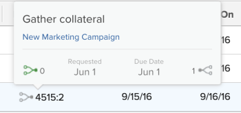

# Overview of task predecessors

A predecessor is the task another task (called a successor or dependent task) depends on. `Adobe Workfront` supports five types of predecessor dependencies. To understand predecessor dependencies, see [Overview of task dependency types](../../../manage-work/tasks/use-prdcssrs/task-dependency-types.md).

## Predecessors overview

Understanding predecessor functionality is important for understanding of the timelines in your projects.

Predecessor relationships between `tasks` exist both within a single project and across multiple projects.

In the case of multi-project dependency, you can establish cross-project predecessors.

Whether the predecessor and successor tasks belong to the same project or to two different projects, the dependencies and the timelines are calculated in the same way.

When it comes to predecessors, the project timeline is impacted by the following:

* Predecessor dependency
* Lag value and type  
  For more information on both dependency and lags, see [Examples of predecessor values in a task list](#understanding-predecessor-relationships).

For example, if task A is a predecessor to task B in a finish-start relationship, and task B has a task constraint of As Soon As Possible, then `Workfront` assigns task B a planned start date immediately following the planned completion date of task A, regardless of whether the predecessor is enforced or not.

To understand predecessor relationships, you must understand:

* `Dependency Types:` Predecessors are linked by various dependency types. For more information on dependency types, see [Overview of task dependency types](../../../manage-work/tasks/use-prdcssrs/task-dependency-types.md).

* `Enforcing a predecessor:` When enforcing a predecessor, the successor task cannot start until the predecessor completes. The successor task shows as starting immediately after the predecessor is finished.

  `Workfront` does not allow it to be marked as In Progress or Complete until the predecessor is complete. `Workfront` does, however, allow hours to be reported on the task.   
  For more information on enforcing predecessors, see [Enforce predecessors](../../../manage-work/tasks/use-prdcssrs/enforced-predecessors.md).

* `Lags:` You can built lags in your dependencies which create a delay that must occur after the completion of a predecessor task and before the successor task can begin. Lags impact the timeline of the project.

  To understand lag types, see [Overview of Lag Types](../../../manage-work/tasks/use-prdcssrs/lag-types.md).

## Create predecessor relationships

To create predecessors, see any of the following articles:

* To establish predecessors using the Predecessors tab of the task, see [Create a predecessor relationship using the Predecessors area](../../../manage-work/tasks/use-prdcssrs/create-predecessors-in-predecessors-area.md).
* To establish predecessors in a task list, see [Create a predecessor relationship on the task list](../../../manage-work/tasks/use-prdcssrs/create-predecessors-on-task-list.md).
* To establish predecessor relationships by chaining tasks, see [Create predecessor relationships by chaining tasks](../../../manage-work/tasks/use-prdcssrs/create-predecessors-by-chaining-tasks.md).
* To establish cross-project predecessors, see [Create cross-project predecessors](../../../manage-work/tasks/use-prdcssrs/cross-project-predecessors.md).

## Locate the predecessors of a task

To find the predecessors of a task do one of the following:

* Go to the project you are working on and do the following:

  1. Find the task for which you want to find the predecessors and click the task.
  1. Click Predecessors in the left panel. You might need to click Show More, then Predecessors.
  1. The name of the project that the predecessor is on shows in the Project column.

     The number in the `#` column shows the predecessor task number. For example "6" means the sixth task in the project.

  &nbsp;

<ul> 
 <li>Go to the project you are working on and do the following: 
  <ol> 
   <li value="1">Click the Tasks tab.</li> 
   <li value="2">Choose the Standard View at the top of the task list.</li> 
   <li value="3">
The Predecessors column shows the predecessor task numbers. 

For a cross-project predecessor, the Predecessors column shows the reference number of the project the predecessor belongs to and the number of the task, separated by a colon. 

The predecessor icon turns green when the predecessor task is marked complete. This signals that the dependent task is ready for work.

Hover over this value to get more information on the predecessor, the project and the dates.

 
</li> 
  </ol></li> 
</ul>

## Examples of predecessor values in a task list

When you view predecessors in a list of tasks, you might see any of the following types of predecessors with their respective Dependency Types and Lag amounts:

<ul> 
 <li>1fs - The predecessor task number is 1. The dependency type is Finish-Start. In the project timeline, this task is scheduled to start immediately after task 1 is finished. In spite of this, it can still be marked as In Progress or Complete.</li> 
 <li>1 - The predecessor task number is 1. This is the same as 1fs, because fs is the default predecessor relationship in Workfront.</li> 
 <li>1fse - The predecessor task number is 1. The dependency type is Finish-Start-Enforced. In the project timeline, this task shows as starting immediately after task 1 is finished. Workfront does not allow it to be marked as In Progress or Complete until task 1 is complete. Workfront does, however, allow hours to be reported on the task. </li> 
 <li>1fs+3d - The predecessor task number is 1. The dependency type is Finish-Start with a lag time of 3 days. In the project timeline, this task shows as starting 3 workdays after task 1 is finished. </li> 
 <li>1fs-3d - The predecessor task number is 1. The dependency type is Finish-Start with a lag time of 3 days. In the project timeline, this task shows as starting 3 workdays before the predecessor task is finished.</li> 
 <li> 
1fs+3de -The predecessor task number is 1. The dependency type is Finish-Start-Enforced with a lag time of 3 days. In the project timeline, this task shows as starting 3 workdays after task 1 is finished. Workfront does not allow it to be marked as In Progress or Complete until Task 1 is complete. Workfront does, however, allow hours to be reported on the task. 
 <note type="note">
   The enforced value (
   e) must be added to the Lag, not to the predecessor.
  </note> </li> 
 <li>4515:2 The predecessor task number is 2. - This is a Finish to Start, non-enforced dependency with the predecessor in the project with reference number 4515; the predecessor task number is 2. </li> 
</ul>

## View predecessor information

You can view predecessor information in the following areas of `Workfront`. This includes information about cross-project predecessors:

* At the task level, in the Predecessors section. For information about viewing predecessor information in the Predecessors section, see the section [Locate the predecessors of a task](#finding-predecessors) in this article.
* In the Gantt chart.

  For information about displaying predecessors in the Gantt chart, see [Configure how information displays on the Gantt Chart](../../../manage-work/gantt-chart/use-the-gantt-chart/configure-info-on-gantt-chart.md).

* In a task list.

  To view information about the predecessors of your tasks in a task list you can do one of the following:

  * Apply the built-in Standard view in a list of tasks.

    For information about viewing predecessor information in the Standard view, see the section [Locate the predecessors of a task](#finding-predecessors) in this article.
  
  * Build a task view or report and add the Predecessors column to that view.

    For more information about building a customized view for tasks with predecessor information, see [View: predecessor details](../../../reports-and-dashboards/reports/custom-view-filter-grouping-samples/view-predecessor-details.md).

