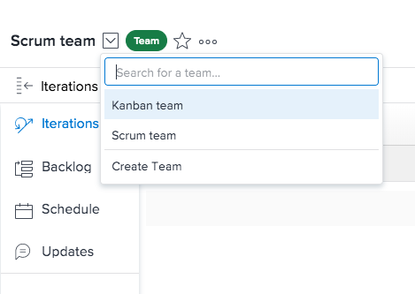

# Create a team {#create-a-team}

You must have a Plan license to create teams. 

When you create a team you become the Team Owner, by default.

You can view Team Owners for all the teams when you create a report for Teams and include the Owner Name field in your report. (For more information about creating a report, see [Create a report](create-report.md).)

You can create a team either from the People area or from the Setup area.

## Create a Team {#create-a-team-1}

1. Click the **Main Menu** icon  in the upper-right corner of `Workfront`.

1. Click the **Switch team** icon , then click **Create Team**.

1.  

1. Specify the following information: 
    
    
    * **Team Name:** Specify a name for the new team.
    * **This is an Agile Team:**&nbsp;Select this option if you want to configure this new team to be an agile team.  
      For more information about agile teams, see [Create an Agile Team](create-an-agile-team.md).
    
    * **Team Members:** Begin typing the name of a user to be on the team, then select the name when it appears in the drop-down list.  
      Repeat this process to add multiple users to the team.  
      There is no limit for how many users you can add to a team. However, we recommend to not have an excessively high number of users in one team, as your work management might become too complex for these teams.
    
    * **Description:** Specify a description for the team.
    
    
1. Click **Create**.

## Create a Team in Setup {#create-a-team-in-setup}

1. Click the **Main Menu** icon  in the upper-right corner of `Workfront`.

1. Click **Setup**.
1. Click&nbsp;**Teams**, then click&nbsp;**New Team**.  
   This opens up the New Team dialog box.

1.  Specify the following information: 
    
    
    * **Team Name:** Specify a name for the new team.
    * **Team Members:** Begin typing the name of a user to be on the team, then select the name when in appears in the drop-down list.  
      Repeat this process to add multiple users to the team.  
      There is no limit to how many users you can add to a team. However, we recommend to not have an excessively high number of users in one team, as your work management might become too complex for these teams.  
    
    * **Description:** Specify a description for the team.
    * **Calendar:** Choose which calendar tab will appear for this team.
    * **This is an Agile Team:** Select this item if you want to configure this new team to be an agile team. For more information about agile teams, see [Create an Agile Team](create-an-agile-team.md).
    
    * **Done Button:** Select the status that you want set for&nbsp;items when the Done button is clicked.  
    
    
    
1. Click&nbsp;**Create Team**.

