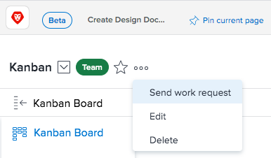

# Edit team settings {#edit-team-settings}

As a `Workfront administrator` or a user with a Plan or Work license, you can edit Team Settings.

You can add users to a team, set the team layout template, and set how status&nbsp;is recorded when work&nbsp;items are completed by a Team.&nbsp;

Only users with a Plan license can create teams.

To edit team settings:&nbsp;

1. Click the **Main Menu** icon  in the upper-right corner of `Workfront`, then click **Teams**.

1. Click the **Switch team** icon, then either select a new team from the drop-down menu or search for a team in the search bar.
1.  Click the **More** menu, then select **Edit**.

   Only team members with either a Plan or Work license see this option.  

      

1. In Team settings, you can make the following kinds of changes:  

    
    
    * Modify the team name
    * Designate the team owner
    * Add and remove team members
    * Add a description of the team
    * Apply&nbsp;a layout template to&nbsp;the team  
      For more information on&nbsp;applying a custom layout template to a team, see the "Applying a Custom Template to a Team" section in Changing the My Work and Work Requests Areas with Layout Templates.
    * Decide if this team is an agile team, by checking the **This is an Agile Team** option. For more information on agile teams and how to manage work inside an agile team, see [Create an Agile Team](create-an-agile-team.md).&nbsp;
    
    * Customize the **Done** button. For more information on how to customize the Done button, see
    
        
        
        * [Configure the Done button for tasks](configure-the-done-button-for-tasks.md)
        * [Configure the Done button for issues](configure-the-done-button-for-issues.md)
        
        
    
    
    

1. Click **Save Changes**.

