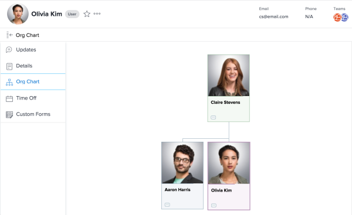

# View the Org Chart {#view-the-org-chart}

The Organizational Chart feature allows you to to view the organizational chart associated with a particular `Workfront` user.&nbsp;Organizational charts are a great way to visualize the structure of a specific department.&nbsp;

To locate a user's organizational chart:

1. Click the **Main Menu** icon  in the upper-right corner of `Workfront`, then click your user name next to your profile picture.

1. In the left panel, click **Org Chart**.  
   

