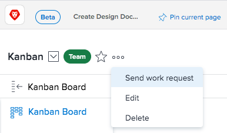

# Manage Work and Team Requests {#manage-work-and-team-requests}

A Request represents a pending task or issue assignment. Work Requests are made to individuals, and Team Requests are made to&nbsp;teams.

* [Assign a Request to a Team](#assigning-requests-to-a-team) 
* [Reassign Requests](#reassigning-requests) 

## Assign a Request to a Team {#assign-a-request-to-a-team}

Project managers and issue requestors can&nbsp;assign work to Teams when they do not know which resource is right to do the work or when it does not matter who completes the work.

Tasks assigned to the team remain on the Team Requests tab until a user on the team volunteers to work on the request.

When a request is assigned to both a team and a user who is not a member of the team, the request is visible in both the Team Requests tab and in the user's work requests area.&nbsp;If the&nbsp;user who is not on the team volunteers to work on the task, the task still remains in the Team Requests tab until a user on the team volunteers to work on it.

Teams can be assigned to tasks and issues in any of the following ways:

* Through the Gantt Chart
* From a Task or Issue List (individually or in bulk)
* When a task or issue is created or modified
* Through routing rules on a request (issues only)

You can manually assign a request to a team from the team page,&nbsp;as described in this section. Alternatively, you can assign a request to a team by creating an ad hoc work item and assigning it to the team, as described in Creating Ad Hoc Work Items in the new Workfront experience.

To manually assign a request to a team from the team page:

1. Click the **Main Menu** icon  in the upper-right corner of `Workfront`, then click **Teams**.

1. Click the **Switch team** icon , then either select a new team from the drop-down menu or search for a team in the search bar.

1.  Click the **More** icon , then select **Send work request**.

   

1. Fill in the information in the box that opens.
1. Click **Send Request**.  
   The team is now assigned a new task which is displayed on the Team Requests tab. This task is not currently associated with a project, but it can be moved, as described in [Move tasks](move-tasks.md).

## Reassign Requests {#reassign-requests}

You can reassign requests that have been assigned to your team:

1. Click the **Main Menu** icon  in the upper-right corner of `Workfront`, then click **Teams**.

1. Click the **Switch team** icon , then either select a new team from the drop-down menu or search for a team in the search bar.

1. In the left navigation panel, select **Team Requests**.
1. Click the **Reassign**&nbsp;icon.  

1. Begin typing the name of the user, group, or team who you want to reassign the request to, then click **Assign.**  
   The request is reassigned.

