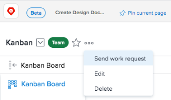

# Deactivate a team

You can deactivate teams you no longer use while retaining the associated historical data. *Adobe Workfront administrators* can reactivate a team at any time from the Teams area in Setup. If you deactivate a team, the team no longer displays in the following areas:

<table> 
 <col> 
 <col> 
 <tbody> 
  <tr> 
   <td> 
    <ul> 
     <li> 
Typeahead fields in custom forms
 </li> 
    </ul> 
    <ul> 
     <li> 
Sharing dialog for objects
 </li> 
     <li> 
User Profile*
 </li> 
    </ul> </td> 
   <td> 
    <ul> 
     <li> 
Main selection drop-down menu in the Teams area
 </li> 
     <li> 
Assignments typeahead
 </li> 
     <li> 
Add to Kanban board dialog in a project
 </li> 
    </ul> </td> 
  </tr> 
 </tbody> 
</table>

&#42;Deactivated teams don't appear when you search for a team, but will still display in Home Team and Other Teams if the user was assigned to the team prior to deactivation.

## Access requirements

You must have the following access to perform the steps in this article:

<table cellspacing="0"> 
 <col> 
 <col> 
 <tbody> 
  <tr> 
   <td role="rowheader"><em>Adobe Workfront</em> plan*</td> 
   <td> 
Any
 </td> 
  </tr> 
  <tr> 
   <td role="rowheader"><em>Adobe Workfront</em> license*</td> 
   <td> 
Plan
 </td> 
  </tr> 
 </tbody> 
</table>

&#42;To find out what plan or license type you have, contact your *Workfront administrator*.

## Deactivate a team

Any work assigned to the team prior to deactivation remains assigned. We recommend reassigning work before you deactivate the team.

>[!TIP]
>
>You can create a report to filter for any tasks or issues where the deactivated team is still assigned.

When using request queues, if you deactivate a team assigned as the default team in a routing rule, the team remains and requests are still routed to the deactivated team. We recommend updating routing rules with active teams before you deactivate the team.

<ol> <draft-comment>
  <li value="1" data-mc-conditions="QuicksilverOrClassic.Quicksilver"> 
Click the Main Menu icon  in the upper-right corner of <em>Adobe Workfront</em>, then click Teams.
 </li>
 </draft-comment>
 <li value="1" data-mc-conditions="QuicksilverOrClassic.Quicksilver"> 
Click the Main Menu icon  in the upper-right corner of <em>Adobe Workfront</em>, then click Teams.
 </li> <draft-comment>
  <li value="2" data-mc-conditions="QuicksilverOrClassic.Quicksilver"> 
Click the Switch team icon, then either select a new team from the drop-down menu or search for a team in the search bar.
 </li>
 </draft-comment>
 <li value="2" data-mc-conditions="QuicksilverOrClassic.Quicksilver"> 
Click the Switch team icon, then either select a new team from the drop-down menu or search for a team in the search bar.
 </li> <draft-comment>
  <li value="3" data-mc-conditions="QuicksilverOrClassic.Quicksilver"> 
Click the More menu, then select Edit.
 
  
 </li>
 </draft-comment>
 <li value="3" data-mc-conditions="QuicksilverOrClassic.Quicksilver"> 
Click the More menu, then select Edit.
 
  
 </li> 
 <li value="4">Uncheck the Is Active box.</li> 
 <li value="5"> 
Click Save changes.
 </li> 
</ol>

## Known limitations

Deactivated teams display in the following areas:

  <!--
  <li data-mc-conditions="QuicksilverOrClassic.Quicksilver"> 
The Owner field in <em>Workfront Goals</em>. This requires an additional license for <em>Adobe Workfront Goals</em>. For more information, see <a href="../../workfront-goals/goal-management/getting-started-with-wf-goals.md" class="MCXref xref">Get started with Adobe Workfront Goals</a>.
 </li>
  -->

* The Owner field in *Workfront Goals*. This requires an additional license for *Adobe Workfront Goals*. For more information, see [Get started with Adobe Workfront Goals](../../workfront-goals/goal-management/getting-started-with-wf-goals.md).

