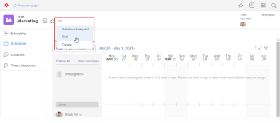

# Edit team settings

As an *Adobe Workfront administrator* or a user with a Plan or Work license, you can edit Team Settings.

You can add users to a team, set the team layout template, and set how status is recorded when work items are completed by a team.

## Access requirements

You must have the following access to perform the steps in this article:

<table cellspacing="0"> 
 <col> 
 </col> 
 <col> 
 </col> 
 <tbody> 
  <tr> 
   <td role="rowheader"><em>Adobe Workfront</em> plan*</td> 
   <td> 
Any
 </td> 
  </tr> 
  <tr> 
   <td role="rowheader"><em>Adobe Workfront</em> license*</td> 
   <td> 
<em>Work</em> or higher
 </td> 
  </tr> 
 </tbody> 
</table>

&#42;To find out what plan or license type you have, contact your *Workfront administrator*.

## Edit team settings

<ol> <draft-comment>
  <li value="1" data-mc-conditions="QuicksilverOrClassic.Quicksilver"> Click the Main Menu icon  in the upper-right corner of <em>Adobe Workfront</em>, then click Teams.</li>
 </draft-comment>
 <li value="1" data-mc-conditions="QuicksilverOrClassic.Quicksilver"> Click the Main Menu icon  in the upper-right corner of <em>Adobe Workfront</em>, then click Teams.</li> <draft-comment>
  <li value="2" data-mc-conditions="QuicksilverOrClassic.Quicksilver">Click the Switch team icon , then either select a new team from the drop-down menu or search for a team in the search bar.</li>
 </draft-comment>
 <li value="2" data-mc-conditions="QuicksilverOrClassic.Quicksilver">Click the Switch team icon , then either select a new team from the drop-down menu or search for a team in the search bar.</li> <draft-comment>
  <li value="3" data-mc-conditions="QuicksilverOrClassic.Quicksilver"> 
Click the More menu , then select Edit.
 
Only team members with either a Plan or Work license see this option. If you should have the Edit option but you do not see it, ask your <em>Workfront administrator</em>to verify that Team Settings is visible in the layout template for Scrum Team, Kanban Team, or Waterfall Team. 
 
  
 </li>
 </draft-comment>
 <li value="3" data-mc-conditions="QuicksilverOrClassic.Quicksilver"> 
Click the More menu , then select Edit.
 
Only team members with either a Plan or Work license see this option. If you should have the Edit option but you do not see it, ask your <em>Workfront administrator</em>to verify that Team Settings is visible in the layout template for Scrum Team, Kanban Team, or Waterfall Team. 
 
  
 </li> 
 <li value="4"> 
In team settings, you can make the following kinds of changes:
 
  <ul> 
   <li>Modify the team name</li> 
   <li>Deactivate the team </li> 
   <li> 
Associate the team with a group
 <note type="note">
     When a team is assigned to a group or subgroup, any 
     <em>group administrators</em> of that group or subgroup can manage the team without being a member of it. 
     <em>Group administrators</em> can go to the Teams area from the Main Menu and click the Switch Teams arrow 
      to list all of the teams that are assigned to the groups that they manage.
    </note> <draft-comment>
     
You can make sure you are associating the right group with the team by hovering over it and clicking the information icon  that displays next to it. This displays a tooltip listing information about the group, such as the hierarchy of groups above it and its administrators.<draft-comment>
       <MadCap:conditionalText data-mc-conditions="SnippetConditions.HIDE">
         Depending on the details configured for the group, you might also see its Business Leader and description.
       </MadCap:conditionalText>
      </draft-comment><MadCap:conditionalText data-mc-conditions="SnippetConditions.HIDE">
        Depending on the details configured for the group, you might also see its Business Leader and description.
      </MadCap:conditionalText>

    </draft-comment>
You can make sure you are associating the right group with the team by hovering over it and clicking the information icon  that displays next to it. This displays a tooltip listing information about the group, such as the hierarchy of groups above it and its administrators.<MadCap:conditionalText data-mc-conditions="SnippetConditions.HIDE">
       Depending on the details configured for the group, you might also see its Business Leader and description.
     </MadCap:conditionalText>
 </li> 
   <li>Designate the team owner</li> 
   <li>Add and remove team members</li> 
   <li>Add a description of the team</li> 
   <li> 
Apply a layout template to the team
 
For more information on applying a custom layout template to a team, see the "Applying a Custom Template to a Team" section in Change the My Work and Work Requests areas with Layout Templates.
 </li> 
   <li> 
Decide if this team is an agile team, by selecting the This is an Agile Team option.
 
For more information on agile teams and how to manage work inside an agile team, see <a href="../../agile/get-started-with-agile-in-workfront/create-an-agile-team.md" class="MCXref xref">Create an agile team</a>.
 </li> 
   <li>Change the Work On It button to a Start button. For more information on how to configure the Start button, see <a href="../../people-teams-and-groups/create-and-manage-teams/work-on-it-button-to-start-button.md" class="MCXref xref">Replace the Work On It button with a Start button</a>.</li> 
   <li> 
Customize the Done button. For more information on how to customize the Done button, see:
 
    <ul> 
     <li><a href="../../people-teams-and-groups/create-and-manage-teams/configure-the-done-button-for-tasks.md" class="MCXref xref">Configure the Done button for tasks</a> </li> 
     <li><a href="../../people-teams-and-groups/create-and-manage-teams/configure-the-done-button-for-issues.md" class="MCXref xref">Configure the Done button for issues</a> </li> 
    </ul> </li> 
  </ul> </li> 
 <li value="5">Click Save Changes.</li> 
</ol>

