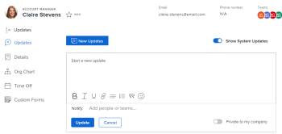

# Send direct messages to other users {#send-direct-messages-to-other-users}

*`Adobe Workfront`* enables you to quickly and easily send messages that are unrelated to any work item directly to other *`Workfront`* users. Messages sent as described in this section appear in the Updates tab on the user's home&nbsp;page and are visible to all users. For additional information on updates, see [Update work items and view updates](_update-work-items-and-view-updates.md).  

The user you are sending the message to receives the following types of notifications when you send a message as described in this section:

* An in-app notification, as described in [View and manage in-app notifications](view-and-manage-in-app-notifications.md)
*  An email notification

  This depends on the types of email notifications the user is configured to receive. For more information, see [Configure event notifications for everyone in the system](configure-event-notifications-for-everyone-in-the-system.md), [View and configure event notifications for a group](view-and-configure-event-notifications-group.md), and [Activate or deactivate your own event notifications](activate-or-deactivate-your-own-event-notifications.md).

## Access requirements {#access-requirements}

You must have the following access to perform the steps in this article:

<table style="width: 100%;margin-left: 0;margin-right: auto;mc-table-style: url('../../Resources/TableStyles/TableStyle-List-options-in-steps.css');" class="TableStyle-TableStyle-List-options-in-steps" cellspacing="0"> 
 <col class="TableStyle-TableStyle-List-options-in-steps-Column-Column1"> 
 </col> 
 <col class="TableStyle-TableStyle-List-options-in-steps-Column-Column2"> 
 </col> 
 <tbody> 
  <tr class="TableStyle-TableStyle-List-options-in-steps-Body-LightGray"> 
   <td class="TableStyle-TableStyle-List-options-in-steps-BodyE-Column1-LightGray" role="rowheader">Adobe Workfront plan*</td> 
   <td class="TableStyle-TableStyle-List-options-in-steps-BodyD-Column2-LightGray"> 
Any
 </td> 
  </tr> 
  <tr class="TableStyle-TableStyle-List-options-in-steps-Body-MediumGray"> 
   <td class="TableStyle-TableStyle-List-options-in-steps-BodyB-Column1-MediumGray" role="rowheader">Adobe Workfront license*</td> 
   <td class="TableStyle-TableStyle-List-options-in-steps-BodyA-Column2-MediumGray"> 
Review or higher
 </td> 
  </tr> 
 </tbody> 
</table>

&#42;To find out what plan or license type you have, contact your *`Workfront administrator`*.

## Send a message unrelated to a work item to another user {#send-a-message-unrelated-to-a-work-item-to-another-user}

1. Go to the home page of the user you want to send a message to.  
   You can do the following to navigate to a user's home page:  

    
    
    * Click the linked name of the user as it appears anywhere in the *`Workfront`* interface. User names are displayed in many areas of the *`Workfront`* interface, such as in a comment made by the user.
    
    
    

1.  On the `Updates`&nbsp;tab, click in the text box field.

   

1. Type your message.
1. (Optional) Click in the `Notify`&nbsp;field, then begin typing the name of another user you want to include in this message.  

1. (Optional) Select `Private to my company` to make this message visible only to other users in your company.  

1. Click `Update.`  
   The message is posted at the top of the list of messages on the `Updates`&nbsp;tab on the user's home page.

