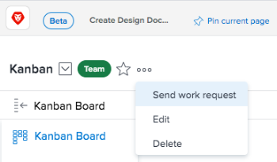

# Manage work and team requests

A request represents a pending task or issue assignment. Work requests are made to individuals, and team requests are made to&nbsp;teams.

>[!NOTE]
>
>Agile teams do not have team requests.

* [Assign a request to a team](#assigning-requests-to-a-team) 
* [Reassign requests](#reassigning-requests)

## Access requirements

You must have the following access to perform the steps in this article:

<table cellspacing="0"> 
 <col> 
 </col> 
 <col> 
 </col> 
 <tbody> 
  <tr> 
   <td role="rowheader"><em>Adobe Workfront</em> plan*</td> 
   <td> 
Any
 </td> 
  </tr> 
  <tr> 
   <td role="rowheader"><em>Adobe Workfront</em> license*</td> 
   <td> 
<em>Review</em> or higher to assign or work on a request; <em>Work</em> or higher to reassign a request
 </td> 
  </tr> 
 </tbody> 
</table>

&#42;To find out what plan or license type you have, contact your *Workfront administrator*.

## Assign a request to a team

Project managers and issue requestors can&nbsp;assign work to teams when they do not know which resource is right to do the work or when it does not matter who completes the work.

Tasks assigned to the team remain on the Team Requests tab until a user on the team volunteers to work on the request.

When a request is assigned to both a team and a user who is not a member of the team, the request is visible in both the Team Requests tab and in the user's work requests area.&nbsp;If the&nbsp;user who is not on the team volunteers to work on the task, the task still remains in the Team Requests tab until a user on the team volunteers to work on it.

Teams can be assigned to tasks and issues in any of the following ways:

* Through the Gantt Chart
* From a task or issue list (individually or in bulk)
* When a task or issue is created or modified
* Through routing rules on a request (issues only)

You can manually assign a request to a team from the team page,&nbsp;as described in this section.

To manually assign a request to a team from the team page:

<ol> 
 <li value="1">Click the Main Menu icon  in the upper-right corner of <em>Adobe Workfront</em>, then click Teams.</li> 
 <li value="2">Click the Switch team icon , then either select a new team from the drop-down menu or search for a team in the search bar.</li> 
 <li value="3"> 
Click the More icon , then select Send work request.
 
  
 </li> 
 <li value="4">Fill in the information in the box that opens.</li> 
 <li value="5">Click Send Request. The team is now assigned a new task which is displayed on the Team Requests tab. This task is not currently associated with a project, but it can be moved, as described in <a href="../../manage-work/tasks/manage-tasks/move-tasks.md" class="MCXref xref">Move tasks</a>.</li> 
</ol>

## Reassign requests

You can reassign requests that have been assigned to your team:

<ol> <draft-comment>
  <li value="1" data-mc-conditions="QuicksilverOrClassic.Quicksilver">Click the Main Menu icon  in the upper-right corner of <em>Workfront</em>, then click Teams.</li>
 </draft-comment>
 <li value="1" data-mc-conditions="QuicksilverOrClassic.Quicksilver">Click the Main Menu icon  in the upper-right corner of <em>Workfront</em>, then click Teams.</li> <draft-comment>
  <li value="2" data-mc-conditions="QuicksilverOrClassic.Quicksilver">Click the Switch team icon , then either select a new team from the drop-down menu or search for a team in the search bar.</li>
 </draft-comment>
 <li value="2" data-mc-conditions="QuicksilverOrClassic.Quicksilver">Click the Switch team icon , then either select a new team from the drop-down menu or search for a team in the search bar.</li> <draft-comment>
  <li value="3" data-mc-conditions="QuicksilverOrClassic.Quicksilver">In the left navigation panel, select Team Requests.</li>
 </draft-comment>
 <li value="3" data-mc-conditions="QuicksilverOrClassic.Quicksilver">In the left navigation panel, select Team Requests.</li> 
 <li value="4">Click the Reassign&nbsp;icon. </li> 
 <li value="5">Begin typing the name of the user, group, or team who you want to reassign the request to, then click Assign. The request is reassigned.</li> 
</ol>

