# Learn about the latest improvements in *`Adobe Workfront One`* {#learn-about-the-latest-improvements-in-adobe-workfront-one}

We recently made various improvements to *`Adobe Workfront One`*. These improvements affect search, navigation, and your experience in documentation articles.

## Search improvements {#search-improvements}

*  [Filter the search results page](#filter) 
*  [Set personalized search defaults](#set) 
*  [A single search result for Workfront Classic and New Workfront Experience articles](#a) 
*  [Categorized results as you type](#categori) 

### Filter the search results page {#filter-the-search-results-page}

After you type your search and press Enter, an improved search results page displays.

One new improvement is a new filtering area in the lower-left corner that allows you to apply helpful filters to the product documentation.

For example, has your organization moved over to the new Workfront experience and you no longer want to see Workfront Classic documentation? Simply select “The new Workfront experience” to view only the articles that apply to you.

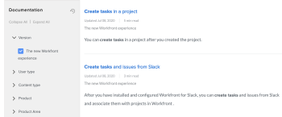

Or are you only interested in results pertaining to Workfront Fusion? Select that in the Product area to filter your results further.

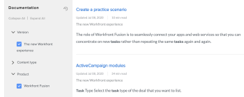

### Set personalized search defaults {#set-personalized-search-defaults}

>[!NOTE]
>
>You must be logged in to Workfront One to access this feature.

1.  On the search results page, make sure that the `Personalized Search Results` toggle is enabled, then click `Edit Preferences`.

   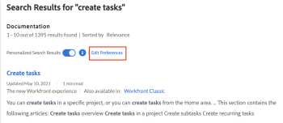

1.  Click the `Search Preferences`tab.

   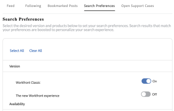

1.  Enable any options that you want to see prioritized in your search results. 

   For example, if you enable `Workfront Classic`in the `Version`section, the main link of each search result will display articles for Workfront Classic, and users will have to click the subordinate link of each result to view documentation for the new Workfront experience.

   Your changes are saved automatically.

### A single search result for Workfront Classic and New Workfront Experience articles {#a-single-search-result-for-workfront-classic-and-new-workfront-experience-articles}

If your organization is using the new Workfront experience, click the article title in the search results area to see *`the new Adobe Workfront experience`* version of the article.

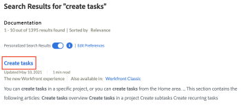

If your organization is still using Workfront Classic, click the link that says, `Also available in: The new Workfront experience` to see the Workfront Classic version of the article. 

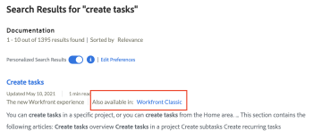

>[!TIP] {type="tip"}
>
>You can also use the filter to display only Workfront Classic or new Workfront experience articles, as described in [Filter the search results page](#filter). Or, you can set your individual search preferences to favor one or the other, as described in [Set personalized search defaults](#set).

### Categorized results as you type {#categorized-results-as-you-type}

Now when you search Workfront One, possible search results are grouped into helpful categories in the drop-down area as soon as you begin typing.

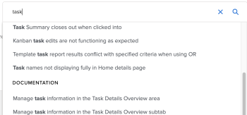

## Navigation improvements {#navigation-improvements}

*  [Documentation hierarchy in left panel](#document) 
*  [Jump to sections within an article](#jump) 
*  [View the next or previous article](#view) 

### Documentation hierarchy in left panel {#documentation-hierarchy-in-left-panel}

When viewing an article, you can now use the new left-panel to see where that article fits within the overall hierarchy, related articles, its parent folder, and so forth. You can even navigate throughout the hierarchy to explore what else is available.

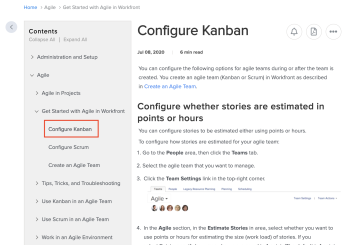

### Jump to sections within an article {#jump-to-sections-within-an-article}

When viewing an article, use the `On this page` section to see the main headings within the article and to jump to a specific section.

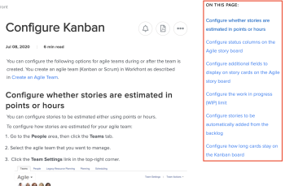

### View the next or previous article {#view-the-next-or-previous-article}

At the bottom of each article, use the provided arrows to go to the next or previous article.

## Article improvements {#article-improvements}

*  [Switch between Adobe Workfront Classic and the new Adobe Workfront experience articles](#switch) 
*  [Follow articles](#follow) 
*  [Submit feedback about articles](#submit) 
*  [Mark an article as helpful](#mark) 
*  [Create PDFs of articles](#create) 
*  [Share articles](#share) 

### Switch between *`Adobe Workfront Classic`* and *`the new Adobe Workfront experience`* articles {#switch-between-adobe-workfront-classic-and-the-new-adobe-workfront-experience-articles}

Now when you're viewing a *`Adobe Workfront Classic`* article, you can easily switch to *`the new Adobe Workfront experience`* version of the article (or vice-versa). 

1.  At the top of any article, click the `Currently viewing` drop-down menu to switch to the other version of the article, if one is available.

   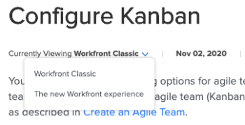

### Follow articles {#follow-articles}

>[!NOTE]
>
>You must be logged in to Workfront One to access this feature.

Use the Notification icon next to the article title to subscribe to receive notifications when an article is updated. Click it again to unsubscribe.

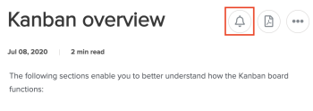

Notifications are emailed to you on a weekly digest.

### Submit feedback about articles {#submit-feedback-about-articles}

>[!NOTE]
>
>You must be logged in to Workfront One to access this feature.

Provide your feedback about any documentation article by using the `Send Feedback` option in the More (3-dot) menu next to the article title.

We monitor your feedback daily!

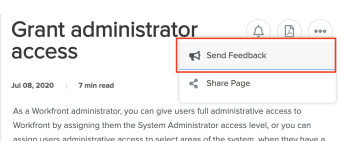

### Mark an article as helpful {#mark-an-article-as-helpful}

Use the W `as this helpful` message at the bottom of each article to let us know whether we’re on the right track in helping you answer your questions.

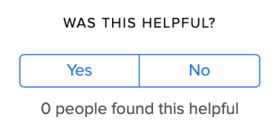

### Create PDFs of articles {#create-pdfs-of-articles}

Quickly create a PDF of any documentation article on Workfront One by clicking the PDF icon next to the article title.

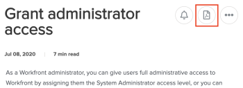

### Share articles {#share-articles}

Share articles via email or social media by using the `Share Page` option in the More (3-dot) menu next to the article title.

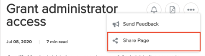

Alternatively, you can always copy and paste the article URL.
