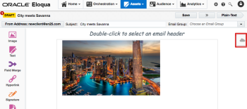
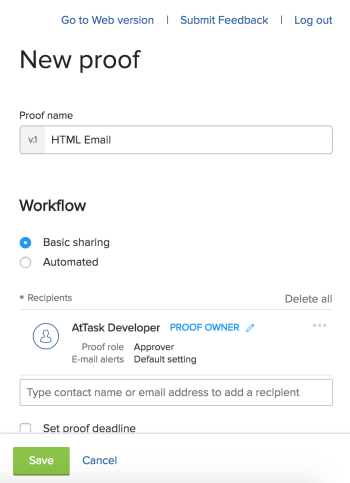

# Oracle Eloqua `Workfront Proof` Add-In Beta

The Oracle Eloqua `Workfront Proof` Add-In enables you to generate `proofs` for emails you create within Eloqua. You can create new `proofs`, new versions of existing `proofs`, and view the status of `proofs` you submit, without leaving the Eloqua interface. `Workfront Proof` users can then review the `proof` within `Workfront Proof`.

## Signing Up for the Beta

The process for signing up for the Oracle Eloqua `Workfront Proof`&nbsp;Add-In Beta is as follows:

1. Submit an application&nbsp; [here](https://goo.gl/forms/nEbKEyIjdomzKp6l2).   
   You are required to enter your name, email, and the name of your Eloqua instance.

1. You are contacted by the Oracle Eloqua `Workfront Proof`&nbsp;Add-In team, who then add your Eloqua instance to the allowlist and provide you with a link where you can install the integration.

<!--
Testing the Integration
-->

<!--
For information about how to configure and begin testing the integrations, see Generating Proofs of Email Assets in Eloqua.
-->

## Submitting Your Feedback

You can submit feedback on the Oracle Eloqua `Workfront Proof`&nbsp;Add-In Beta in either of the following ways:

* [Submitting Feedback within the Integration](#submitting-feedback-within-the-integration) 
* [Submitting Feedback in a Survey](#submitting-feedback-in-a-survey)

### Submitting Feedback within the Integration

<ol> 
 <li value="1">In Eloqua, click&nbsp;Assets, then click&nbsp;Emails.</li> 
 <li value="2">Select an&nbsp;email to proof.</li> 
 <li value="3">Click the&nbsp;Cloud&nbsp;icon, located on the right-hand side of the page. </li> 
 <li value="4">Click the Workfront Proof&nbsp;integration.</li> 
 <li value="5">If a proof has not previously been created for this email, click&nbsp;Generate New Proof&nbsp;to create a new proof. The New Proof page is displayed. Or If a proof has already been created for this email, click&nbsp;Add Version&nbsp;to create a new version of the&nbsp;existing proof. The New Version page is displayed.</li> 
 <li value="6">Click Submit Feedback. </li> 
</ol>

### Submitting Feedback in a Survey

You can use [this survey](http://survey.qualtrics.com/jfe/form/SV_1GOYsN7XJytpxTT) to submit feedback around the `Workfront Proof` Eloqua Add-In.

<!--
Limitations
-->

The Oracle Eloqua `Workfront Proof`&nbsp;Add-In does not currently support emails created within Eloqua with dynamic content.
`

## Known Issues

`  