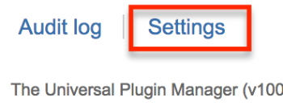
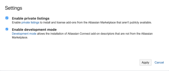
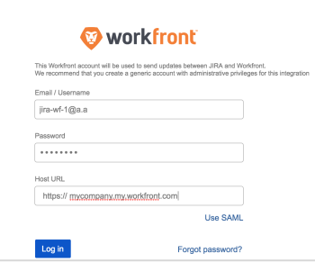

# `Workfront` Add-On for Jira Beta

As a Jira system administrator, you will soon be able to download and configure the `Workfront` add-on for Jira. This will allow you to integrate the two applications.&nbsp;

When you configure the `Workfront` add-on for Jira, you can specify triggers that will create Jira issues when certain criteria for creating items are met in `Workfront`. The items users create in `Workfront` are then linked to issues in Jira. As items update in one application, they become updated in the other application, based on the setup criteria you select in your configuration.&nbsp;

This way, the project managers can continue to work in `Workfront`, while the development users can continue working in Jira. Both entities are able to update just the item in their own environment and both of them see the updates from the other entity on their respective items.

This new functionality has not been generally&nbsp;released yet, but you can participate in our limited beta program to test it.&nbsp;

>[!NOTE]
>
>This beta program has only been made available for the On-Demand version of Jira. The current beta integration is not supported for the On-Premise version of Jira.

If you would like to be part of this beta program and have this functionality enabled in your `Workfront` app on your Jira environment, see [Uploading the Workfront Beta Add-On for Jira](#signing-up-for-the-android-requests-beta).

## Uploading the `Workfront` Beta Add-On for Jira&nbsp;

To join our beta testing and experience the new features:&nbsp;

<ol> 
 <li value="1">Log into Jira as a system administrator.</li> 
 <li value="2">Click Settings in the main Jira menu.</li> 
 <li value="3">Click Add-ons, then Manage add-ons.</li> 
 <li value="4">Click Settings. </li> 
 <li value="5">Ensure that the&nbsp;Enable private listings field is enabled. </li> 
 <li value="6">Click Apply, then click Upload add-on. </li> 
 <li value="7">Copy the following URL and paste it in the field displayed: <a href="https://jira.workfront.com/atlassian-connect.json" data-saferedirecturl="https://www.google.com/url?hl=en&q=https://jira.workfront.com/atlassian-connect.json&source=gmail&ust=1517061032882000&usg=AFQjCNEFSllaLEOzoRTvc_QLSJ5jf_YuSg">https://jira.workfront.<wbr>com/atlassian-connect.json</a></li> 
 <li value="8">Click Upload. The Workfront beta add-on is now available in the list of add-ons in Jira. You can now start configuring your Workfront to Jira integration.&nbsp;</li> 
</ol>

## Configuring the `Workfront` Beta Add-On for Jira

<ol> 
 <li value="1">Log into Jira as a system administrator.</li> 
 <li value="2">Click Settings in the main Jira menu.</li> 
 <li value="3">Click Add-ons, then Manage add-ons.</li> 
 <li value="4">Expand the Workfront add-on.</li> 
 <li value="5">Click Configure.</li> 
 <li value="6">Specify your Workfront credentials and domain information. <note type="note">
    You must log in to 
   Workfront as a system administrator to continue configuring the integration. We recommend that you create a system administrator account designated for the 
   Workfront to Jira integration and not use an existing account which might be connected to another user.&nbsp;
  </note> </li> 
 <li value="7">Select the Triggers tab to configure the automatic creation of Jira items as new Workfront items are created.&nbsp;Creating an item in Workfront and assigning it to a specific entity can automatically create an item in Jira. The two items become linked. Specify the following: 
  <ul>
   <li>Workfront team/user/role: Specify which team, user, or role the item in Workfront must be assigned to in order to trigger the automatic creation of a Jira item.</li>
   <li>The Jira project on which you want to add the new item in Jira.</li>
   <li>The Issue type of the newly created item in Jira.&nbsp;</li>
  </ul></li> 
 <li value="8">Click Save.</li> 
 <li value="9">Select the Setup tab to configure which fields to synchronize between the linked Jira and Workfront items. Consider specifying the following: 
  <ul>
   <li>Synchronize from Workfront to Jira: 
    <ul>
     <li>Name</li>
     <li>Description</li>
     <li>Documents</li>
     <li>Planned Completion Date</li>
    </ul></li>
   <li>Synchronize from Jira to Workfront: 
    <ul>
     <li>Status</li>
     <li>Assignee: When you assign an item in Jira to a user who does not have a Workfront account, the integration creates a new user in Workfront. This user does not occupy a Workfront license.</li>
     <li>Attachments</li>
    </ul></li>
   <li>Other: Specify how you want the updates of the following fields to be recorded in the two applications: 
    <ul>
     <li>Custom Data</li>
     <li>Priority</li>
     <li>Due Date changes</li>
    </ul></li>
  </ul></li> 
 <li value="10">Click Save.&nbsp;</li> 
 <li value="11">(Optional) View the Activity Log tab for any errors that might occur as you are working with the integrated features.&nbsp;</li> 
</ol>

>[!NOTE]
>
>After you complete the configuration, anyone who can create items in `Workfront` can trigger the automatic creation of linked items in Jira, every time the triggers match those you specified. `Workfront` users will not need a Jira license to trigger the creation of items in Jira. Also, any Jira user can immediately start working on items automatically created from `Workfront` and their updates on these items will transfer to the `Workfront` items without them needing a license for `Workfront`.&nbsp;

For more information about configuring the `Workfront` add-on for Jira and updating items, see [Adobe Workfront for Jira](../../workfront-integrations-and-apps/use-workfront-with-jira/workfront-for-jira.md).

To see a demonstration of how to use the `Workfront` add-on for Jira, see the following video:

`<iframe class="mt-media" src="assets/252893646?title=0&byline=0&portrait=0" width="640px" height="360px" frameborder="0" allowfullscreen></iframe>`

## Testing the `Workfront` Beta Add-On for Jira

Depending on how you have configured your integration, and after watching the video, we would like you to test the following features:

* Add comments in Jira and `Workfront` to items.
* Change the Name or Description of an item in `Workfront` and notice the changes in the linked item in Jira.
* Change the Status or Assignee of an item in Jira and notice the changes in the linked item in `Workfront`.
* Review the `Workfront` right panel in Jira and notice the information included there
* Attach a Custom Form to the `Workfront` item and change its Priority then notice the changes, if any, in the `Workfront` right panel in Jira.

* Attach documents to both Jira and `Workfront` items.
* Log time on Jira items.
* Review the tabs available for your items in Jira and the Updates tab in `Workfront` and notice any changes or logs.
* Review the Activity Log at the system level in Jira and notice any errors that might have occurred.&nbsp;

We would like you to answer the following questions as you are testing the new functionality:&nbsp;

* Usefulness: Is automatically creating Jira tickets out of `Workfront` tasks and issues and keeping them synchronized helping you to get things done faster and more efficiently?
* Use cases: Why would you want to create Jira issues when you are creating `Workfront` tasks or issues and link them? Outline your main scenarios when being able to have this type of link can really help you.  
  Consider the following:&nbsp;

  * Triggers: Are assignment-based triggers enough, or would you like to have more trigger types, for example, triggers based on status changes in `Workfront`?
  * Working with documents: Attach files both to `Workfront` and Jira items which are linked, and notice how the synchronization of documents occurs between `Workfront` and Jira.
  
  * Comments: Are you satisfied with how Jira comments are displayed in `Workfront`, and how `Workfront` comments are displayed in Jira? What would you like to see improved?
  
  * Logging time: Does logging hours from the right panel work as expected? Is it intuitive enough? How can we improve the time tracking?

* Relevancy: Is the ability to link items between the two application relevant to you and the workflows in your organization? Is the `Workfront` information shown in Jira sufficient? What else would you like to synchronize between the two platforms?
* Convenience: Is the new ability to have work items linked between Jira and `Workfront` convenient for your developers and project managers?
* Issues: What errors or issues have you encountered when using the `Workfront` add-on for Jira? Was the interface clear enough and intuitive to allow you to navigate and use it freely and easily?
* Improvements: Tell us what you would like to see improved or added to the add-on.
* Satisfaction: On a scale from 1 to 5, with 5 being the most satisfied, how satisfied are you with the new `Workfront` add-on for Jira?

## Sending Feedback to Product&nbsp;Management

To submit feedback about your experience with the `Workfront` add-on for Jira do one of the following:

Submit feedback to Product Management:&nbsp;

1. Navigate to an item in Jira that is linked to an item in `Workfront`.&nbsp;
1. On the `Workfront` panel, click  `Submit Feedback`.

1. Complete the short survey and submit it.  
   The survey is submitted to the Product Management team.&nbsp;

Or:

1. Send an email with your feedback to *haykfalakyan@workfront.com*.

