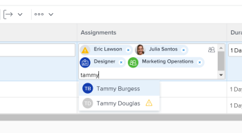

# 21.2 release activity:&nbsp;Week of April 5, 2021

This page describes all *[Product Area]* enhancements made with the *21.2* release to the Preview environment. These enhancements were made available in the Production environment the week of July 21, 2021.

For a list of all changes available with the *21.2* release, see [21.3 Release overview](../../../product-announcements/product-releases/21.3-release-activity/21-3-release-overview.md).

## For group administrators: List improvements in the Groups area

>[!NOTE]
>
>Available only in *the new Adobe Workfront experience*.

Two improvements in the Groups area in Setup make lists consistent with other modernized lists in the new Workfront experience:

* When you select groups, icons represent available functions in the toolbar.
* In the list of groups, columns, sorting, and hierarchy have the newer look and feel you are used to in other lists. Also, by default, lists display up to 2,000 items on a single page instead of 100.

For information about the modernized toolbars in the new Workfront experience, see 

<!--
<a href="../../../workfront-basics/the-new-workfront-experience/new-toolbar-for-lists.md" class="MCXref xref" data-mc-conditions="QuicksilverOrClassic.Quicksilver">Toolbar for lists in the new Adobe Workfront experience</a>
-->

[Toolbar for lists in the new Adobe Workfront experience](../../../workfront-basics/the-new-workfront-experience/new-toolbar-for-lists.md).

For information about the modernized lists throughout Workfront, see 

<!--
<a href="../../../workfront-basics/navigate-workfront/use-lists/modify-list-display.md" class="MCXref xref" data-mc-conditions="QuicksilverOrClassic.Quicksilver">Modify how a list displays</a>
-->

[Modify how a list displays](../../../workfront-basics/navigate-workfront/use-lists/modify-list-display.md).

For information about the Groups area, see 

<!--
<a href="../../../administration-and-setup/manage-groups/manage-groups.md" class="MCXref xref" data-mc-conditions="QuicksilverOrClassic.Quicksilver">Manage groups</a>
-->

[Manage groups](../../../administration-and-setup/manage-groups/manage-groups.md).

`<iframe class="vimeo-player_0" src="assets/534946023?" frameborder="0" allowfullscreen="1" width="560px" height="315px"></iframe>`

[View this video in full-screen mode.](https://vimeo.com/534946023/6d5d89d7b2)

## For group administrators: Create and edit programs from the Groups area in Setup

>[!NOTE]
>
>Available only in *the new Adobe Workfront experience*.

We are continuing to make it easier to manage your groups and their associated objects in one place. Now you can view and work with a group’s programs from the Groups area in Setup. This saves you from having to go to the Programs area to manage your group’s programs. And it keeps the list of group programs you’re working with separate from the other programs in the system.

For more information, see 

<!--
<a href="../../../administration-and-setup/manage-groups/work-with-group-objects/create-and-modify-a-groups-programs.md" class="MCXref xref" data-mc-conditions="QuicksilverOrClassic.Quicksilver">Create, modify, and view a group’s programs</a>
-->

[Create, modify, and view a group’s programs](../../../administration-and-setup/manage-groups/work-with-group-objects/create-and-modify-a-groups-programs.md).

`<iframe class="vimeo-player_0" src="assets/534956912?" frameborder="0" allowfullscreen="1" width="560px" height="315px"></iframe>`

[View this video in full-screen mode.](https://vimeo.com/534956912/61a1c9269b)

## New look and feel for the Assignments field in updated lists and reports

>[!NOTE]
>
>This feature will release to the Production environment on April 29, 2021, prior to the 21.2 Production release. it is available only in *the new Adobe Workfront experience*.

To match the modern look of other areas in the new Workfront experience, the styling has changed for the Assignments field in updated lists and reports. This redesign includes:

* A rounded avatar for the user profile pictures, job roles, and teams
* Initials display for users without profile pictures
* A new Job role icon
* A new People icon for advanced assignments
* A new Restricted Access icon
* Other minor design changes

For more information on assignments in lists, see 

<!--
<a href="../../../manage-work/tasks/assign-tasks/assign-tasks.md" class="MCXref xref" data-mc-conditions="QuicksilverOrClassic.Quicksilver">Assign tasks</a>
-->

[Assign tasks](../../../manage-work/tasks/assign-tasks/assign-tasks.md) or 

<!--
<a href="../../../manage-work/issues/manage-issues/assign-issues.md" class="MCXref xref" data-mc-conditions="QuicksilverOrClassic.Quicksilver">Assign issues</a>
-->

[Assign issues](../../../manage-work/issues/manage-issues/assign-issues.md).

## New look and feel for typeahead fields in updated lists and reports

>[!NOTE]
>
>This feature will release to the Production environment on April 29, 2021, prior to the 21.2 Production release. it is available only in *the new Adobe Workfront experience*.

To match the modern look of other areas in the new Workfront experience, the styling has changed for typeahead fields in updated lists and reports. These changes include:

* The Typeahead icon has been removed from the field.
* When you click a typeahead field, the suggestions menu now displays before you enter text. 
* The suggestions menu is more responsive to the length of values and these values are now truncated at the end when the character limit is met instead of in the middle of the value.

For information on updated lists, see the 

<!--
<a href="../../../workfront-basics/navigate-workfront/use-lists/view-items-in-a-list.md#updated" class="MCXref xref" data-mc-conditions="QuicksilverOrClassic.Quicksilver">The difference between the updated and the legacy lists</a>
-->

[The difference between the updated and the legacy lists](../../../workfront-basics/navigate-workfront/use-lists/view-items-in-a-list.md#updated) section in the article 

<!--
<a href="../../../workfront-basics/navigate-workfront/use-lists/view-items-in-a-list.md" class="MCXref xref" data-mc-conditions="QuicksilverOrClassic.Quicksilver">Get started with lists in&nbsp;Adobe Workfront</a>
-->

[Get started with lists in Adobe Workfront](../../../workfront-basics/navigate-workfront/use-lists/view-items-in-a-list.md).

## Control what type of assignments you make on a new request

>[!NOTE]
>
>Available only in *the new Adobe Workfront experience*.

We have changed the way the Assignments field functions when creating a new request to provide consistency and always show the same field regardless of what types of assignments users can enter.

When you enable the Assigned To, Job Role, or Team fields to be visible when setting up a request queue, requestors will see the same Assignments field that can accommodate all or any of these three assignment types.

There is an indication in the Assignments field about which types of assignments are allowed. For example, when you enabled the Assigned To and Team fields when setting up the request queue, you will be prompted to “Search people or teams” instead of “Search people, roles, or teams.”

For more information, see the following articles:

* [Create and submit Adobe Workfront requests](create-submit-requests.md) 
* [Create a Request Queue](../../../manage-work/requests/create-and-manage-request-queues/create-request-queue.md)

`<iframe class="vimeo-player_0" src="assets/534936462?" frameborder="0" allowfullscreen="1" width="560px" height="315px"></iframe>`

[View this video in full-screen mode.](https://vimeo.com/534936462/5bc0cd18f2)

## Improvements to creating requests and managing drafts

>[!NOTE]
>
>Available only in *the new Adobe Workfront experience*.

As we continue to incorporate your feedback about creating requests in the new Workfront experience, we made several improvements to the new requests workflow. These include:

* Clearly indicate with a Show options icon that the fields for Request Types, Topic Groups, and Queue Topics are drop-down lists from which you can choose an option that was previously defined.
* Clearly indicate with an “x” icon that a choice for Request Type, Topic Group, or Queue Topic can be removed after it’s been selected.
* Provide a Close button when creating a new request to leave the request without losing the draft. In addition to this change, the “Discard” button has been renamed to “Discard draft.”

For information about creating new requests, see [Create and submit Adobe Workfront requests](create-submit-requests.md).

`<iframe class="vimeo-player_0" src="assets/534942833?" frameborder="0" allowfullscreen="1" width="560px" height="315px"></iframe>`

[View this video in full-screen mode.](https://vimeo.com/534942833/015c804c90)

## Relocated the Save and Cancel buttons for the Edit and New Object boxes

>[!NOTE]
>
>Available only in *the new Adobe Workfront experience*.

Based on user feedback, we have moved the Save and Cancel buttons to the lower-left corner of the Edit Object and New Object boxes for projects and tasks.

Prior to this enhancement, these buttons were located in the upper-right corner of these boxes.

For information about editing projects or tasks, see the following articles:

* [Edit projects](../../../manage-work/projects/manage-projects/edit-projects.md) 
* [Edit tasks](../../../manage-work/tasks/manage-tasks/edit-tasks.md)

